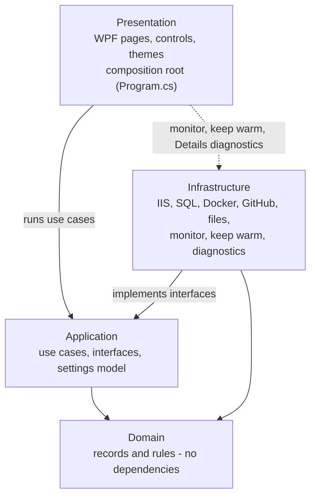
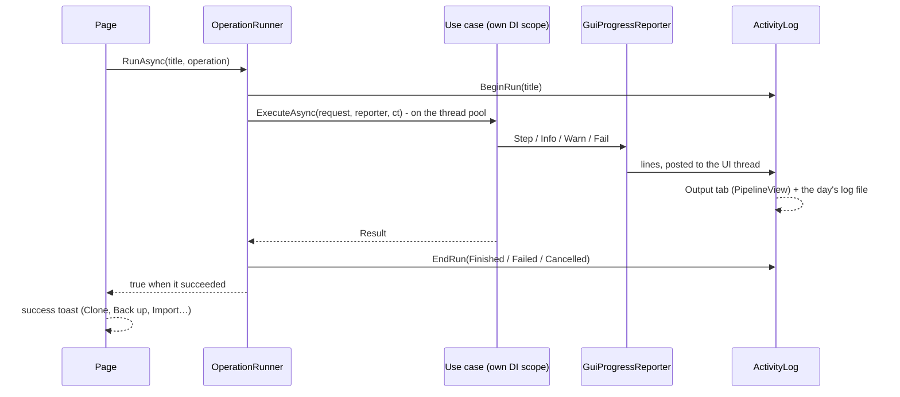
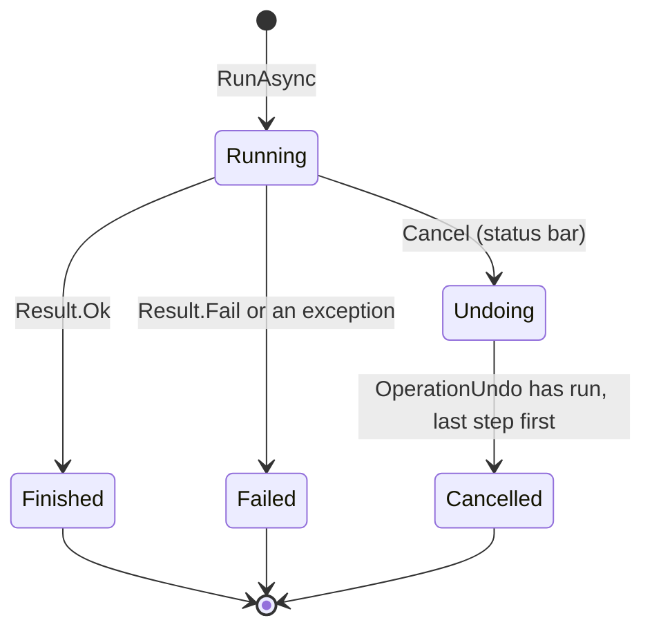
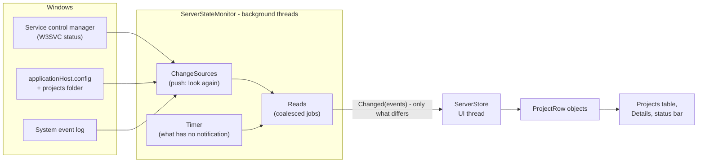

# Architecture

How DNN Manager is built: its layers, how an operation runs, how the window
stays current, where the code lives and why it is built this way. To build, run
and debug it, see [development.md](development.md).

**Contents**

- [Layers](#layers)
- [How an operation runs](#how-an-operation-runs)
- [Live updates](#live-updates)
- [The workspace kept between starts](#the-workspace-kept-between-starts)
- [Project layout](#project-layout)
- [Key design decisions](#key-design-decisions)
- [Control styles](#control-styles)
- [Component map](#component-map)

## Layers

One project (`DnnManager.csproj`), four layers as folders and namespaces under
`src/`. Each layer may use the ones below it:



- **Domain** has no references at all. **Application** references neither WPF
  nor Infrastructure - its use cases see IIS, SQL Server, files and the user
  only through interfaces (`IIisManager`, `IDatabaseProvisioner`,
  `IUserPrompt`, `IProgressReporter`…), which is what lets the tests run them
  with stand-ins.
- **Infrastructure** implements those interfaces; it is registered in
  `Infrastructure/DependencyInjection.cs`.
- **Presentation** runs use cases through `OperationRunner`, and uses three
  Infrastructure parts directly (the dotted arrow), because a use case would
  only pass them through: the live monitor (`ServerStateMonitor`), keep warm
  (`KeepWarmService`) and what a site's Details read (`Infrastructure/Diagnostics`).
- Nothing enforces this in the build - keep to it when adding code.

## How an operation runs


Everything that changes the system - New project, Clone, Remove, Back up, Set up
IIS… - is a use case run by
[`OperationRunner`](../src/DnnManager.Presentation/Services/OperationRunner.cs):
one at a time, on the thread pool, in a DI scope of its own.



- A use case **asks** the user through `IUserPrompt` (a dialog on the UI
  thread) and **reports** through `IProgressReporter`; it never touches WPF.
- A failure becomes a toast with **Show output** (`OperationRunner.Failed`); the
  steps that led to it are in the Output tab and the log file.
- A second operation while one runs is refused with a message.

An operation that is cancelled is **undone**: before each step a use case notes
how to take back what it is about to make in the scope's
[`OperationUndo`](../src/DnnManager.Application/UseCases/OperationUndo.cs), and
what can't be taken back (a dropped database) is noted as such.



## Live updates

The Projects table, the IIS indicator and the status bar's figures show one
shared state that keeps itself current, the way Docker Desktop follows its
engine: take a snapshot, follow the changes as they happen, and reconcile now
and then, because a notification can be missed.

- [`ServerStateMonitor`](../src/DnnManager.Infrastructure/Monitoring/ServerStateMonitor.cs)
  (background threads) is the only thing that reads the projects, IIS and this
  PC's figures. It keeps what it last read and raises one event with what
  differs: a project added, removed or changed - and which part of it: site,
  worker figures, database, size… -, IIS's state, the PC's figures, the
  connection.
- [`ServerStore`](../src/DnnManager.Presentation/Services/ServerStore.cs) (UI
  thread) applies that to the row objects the table is bound to. A row is never
  made again while its project exists, and only the properties of the changed
  part are announced - so one site stopping redraws that row's state, and the
  check boxes, search, sorting, scroll position and open details are not
  touched. It also runs the rows' actions: the row says *Starting…* at once,
  the use case runs, the sites are read again and the row shows what IIS
  reports - the new state, or the old one and a toast when it failed.
- Both are in one process, so the "connection" between them is a .NET event
  handed to the UI thread - no IPC, no WebSocket, no timer in the UI.



A notification never carries the new state - it only makes the monitor read
again, so the reads are the single source of truth.

Windows tells the monitor when to look
([`ChangeSources.cs`](../src/DnnManager.Infrastructure/Monitoring/ChangeSources.cs));
what Windows has no notification for is read on a timer, each at its own pace:

| What | How it is noticed |
|---|---|
| IIS started or stopped | Pushed: the service control manager reports the web service's status. |
| A site or app pool added, removed, started or stopped | Pushed: `applicationHost.config` being written, and what IIS writes to the System event log. Reconciled every 5 s (30 s while Projects isn't on screen) - IIS has no notification for a site's running state. |
| A worker process started or ended | The set of `w3wp` processes, every 2 s ¹ - a change reads the sites again. |
| A folder in the projects folder made, removed or renamed | Pushed: the projects folder is watched - the sites' folders are read again (DNN version, database). |
| What a site's folder holds (DNN version, web.config database) | When the site turns up or serves another folder, and every 30 s ¹. |
| Worker-process CPU, memory and disk I/O | Every 2 s ¹. |
| HTTP traffic per site | Every 5 s ¹, and only while that column is shown. |
| The SQL Server and its databases | Every 10 s ¹. |
| Each project's database (`web.config`) and DNN version | Every 30 s ¹, and after an operation. |
| Folder sizes | Only while the table's *Size* column is shown: every 10 min ¹, and after an operation (one that ends while the window is minimized: once it is restored ²). A site's Details measure that site's folder when they open. |
| This PC's memory and CPU; its disk | Every 2 s; every 10 s - not while the window is minimized ². |
| The PC woke up | Pushed (power event) - or a timer tick that comes half a minute late. Everything is read again. |

¹ Only while the Projects page is on screen and the window isn't minimized;
showing it again reads everything once, at once.
² Paused while the window can't be seen (minimized, hidden or covered) - see
[Efficiency mode](user-guide.md#efficiency-mode-while-the-window-cant-be-seen).

A notification only says "look again" - the monitor then reads the real state,
so a missed or doubled one does no harm. The intervals are counted from when a
read was last asked for or finished, on a clock that doesn't follow the PC's
date and time. What can't be read (IIS's configuration, the projects folder)
is kept as it was and shown as *Reconnecting…*; it is tried again every 5 s,
and a source that stopped notifying is attached again the same way. An IIS
that doesn't answer at all isn't waited for longer than 15 s. The only loading
state is the first snapshot.

## The workspace kept between starts

DNN Manager opens where it was left - after a close, a restart, an update or a
crash ([user guide](user-guide.md#picking-up-where-you-left-off)). Settings are
the `settings` table in [DNN Manager's database](#dnn-managers-database); the
rest is state, kept apart in the `state` table, one row per value by area:

| Area | Holds | Captured / restored by |
|---|---|---|
| `window` | The window's place and size, maximized, the sidebar shown or hidden, the panel's height, open or maximized, the terminal list's width | `MainWindow` |
| `workspace` | The page (Settings or Troubleshoot when one is open over the sidebar page), the sidebar page, the Settings category, the Projects table (search, filter, sorting, expanded and selected rows, scroll) and the open Details with its tab | `MainWindow`, `ProjectsPage.CaptureTable` / `RestoreAsync` |
| `forms` | New project, Host project and unsaved Settings, by field name | [`FormDraft`](../src/DnnManager.Presentation/Services/FormDraft.cs), `SettingsPage.CaptureDraft` / `RestoreDraft` |
| `logs` | The panel's tab, its search, the Logs tab's site and log | `TerminalPanel.CaptureLogs` / `RestoreLogs` |
| `update` | The update under way (from, to, the helper's result file) | `AppUpdater` writes it; `MainWindow` reads and deletes it |
| `palette` | The commands last run from the command palette (the newest 8), listed first as *recently used* | `MainWindow.CommandItems` / `Remember` |
| `version` | The version that ran last - a newer one shows What's new (the release notes since) at its first start | `MainWindow.RestoreWorkspace`, [`ReleaseNotes`](../src/DnnManager.Presentation/Services/ReleaseNotes.cs) |
| `onboarding` | The version of the getting started guide finished or skipped (`Onboarding.Version`) - the very first start shows the guide, a newer guide only its new pages; the version of the first start - still on it, What's new isn't offered (`MainWindow.IsNewUser`) | `MainWindow.ShowGuideAtStart`, [`Onboarding.AtStart`](../src/DnnManager.Presentation/Services/Onboarding.cs) |

- **One place reads and writes them**:
  [`StateStore`](../src/DnnManager.Infrastructure/State/StateStore.cs). A state is a
  class implementing `IStateFile` (its `Area`) - see
  [`WorkspaceStates.cs`](../src/DnnManager.Presentation/Services/WorkspaceStates.cs) -
  made into rows and back by [`ValueRows`](../src/DnnManager.Infrastructure/Data/ValueRows.cs),
  as the settings are ([configuration.md](configuration.md#how-the-settings-are-saved)).
  Each area is written whole - its rows replaced in one transaction, so a crash
  leaves the old ones or the new ones; an unchanged state isn't written. A value
  without a row, or one that can't be read, keeps its default (the log file
  names the latter); the rest of the area is read. It never throws - DNN
  Manager always starts.
- **When it is saved**: [`WorkspaceService`](../src/DnnManager.Presentation/Services/WorkspaceService.cs)
  holds what to capture for each state (`Track`) and saves 2 s after something
  changed (`Changed` - at most once per 2 s, however much changes), and at once as
  the window closes (`SaveNow`, last). `MainWindow` calls `Changed` for anything
  typed, ticked or chosen in the window (routed `TextChanged`, `Checked`,
  `SelectionChanged`), the window moved or sized, and what the Projects page and
  the panel report (`WorkspaceChanged`: Details opened, a sort, a scroll, the
  panel's tab). No timer runs while nothing changes.
- **Restoring** happens once, on `Loaded`: the panel, the pages, the Settings draft, then -
  once the projects are read - the table, the Details and the Logs tab's log.
  Until then the loaded state is what is saved, not the half-restored one. A
  draft for New project / Host project is applied when that page is first made.
  Anything that throws falls back to the Projects page.
- **What isn't kept**, on purpose: passwords (`FormDraft` skips `PasswordBox` and
  `PasswordInput`), dialogs, running operations, messages, and terminals - their
  shells end with the app, so a start begins without any.
- To add a state: a class in `WorkspaceStates.cs`, a `Track` in `MainWindow`, and
  its restore in `RestoreWorkspace`. A property added to a state needs nothing
  more - saved rows without it give it its default; a renamed one starts from
  its default once.

## DNN Manager's database

DNN Manager's own data is one SQLite file, `Documents\DnnManager\dnnmanager.db`
([`AppDatabase`](../src/DnnManager.Infrastructure/Data/AppDatabase.cs)), through
`Microsoft.Data.Sqlite`. Its tables (what each column holds:
[configuration.md](configuration.md#where-your-files-are)):

| Table | Holds | Read and written by |
|---|---|---|
| `settings` | The settings, one row per value (`key`, `value`) | [`SettingsStore`](../src/DnnManager.Infrastructure/Settings/SettingsStore.cs) |
| `state` | The workspace, one row per value by area (`area`, `key`, `value`) | [`StateStore`](../src/DnnManager.Infrastructure/State/StateStore.cs) |
| `projects` | How DNN Manager installed each project it set up | [`ProjectRecords`](../src/DnnManager.Infrastructure/Projects/ProjectRecords.cs) |
| `keep_warm` | The sites kept warm, a row each - how they are kept warm is the settings' | [`KeepWarmRecords`](../src/DnnManager.Infrastructure/Projects/KeepWarmRecords.cs) |
| `dnn_releases` | Each repository's DNN versions as GitHub last listed them, for offline use | [`GitHubDnnReleaseService`](../src/DnnManager.Infrastructure/Github/GitHubDnnReleaseService.cs) |

- **One file, opened for each read or write** and closed after it (no
  connection pool), so nothing holds it open in between; a write waits up to
  30 s for another one (keep warm and the window save from different threads).
  `AppDatabase.Open` brings the tables up to date the first time - and again
  for a file deleted meanwhile: `AppDatabase.Steps` are the numbered steps that
  make each version of the tables from the one before, and `PRAGMA
  user_version` holds how many have run. A change of the tables is a new step
  at the end; the steps before never change.
- **No JSON in the database**: every value is a column or a row of its own.
  The settings and the workspace are objects made into rows by
  [`ValueRows`](../src/DnnManager.Infrastructure/Data/ValueRows.cs) - a key is
  the value's path in camelCase (`projects.sitePort`; a list's items
  `projects.dnnReleaseSources[0]` under a row with their count; a dictionary's
  entries `keyboard.shortcuts{project.start}`, the entry's key %-escaped), a
  value invariant-culture text. A value without a row keeps its default. The
  `sa` password row is DPAPI-encrypted by `SettingsStore`. The rows of
  `projects`, `keep_warm` and `dnn_releases` are plain columns. The only JSON
  left in the app is what other programs speak: GitHub's API, `vswhere`'s
  output, and the update's hand-off files `plan.json` / `result.json` in
  `%TEMP%\DnnManager-update\<version>\` (between the old version's helper and
  the new version).
- **Nothing from earlier versions is read**: the `settings.json`, `state\` and
  `projects\` of 1.7.1 and older stay on disk untouched, and the first start
  of this version begins with the defaults
  ([configuration.md](configuration.md#upgrading-from-171-or-earlier)).
- **The native SQLite**: `Microsoft.Data.Sqlite` brings
  `SQLitePCLRaw.lib.e_sqlite3` 2.1.11, whose SQLite has a known vulnerability
  (GHSA-2m69-gcr7-jv3q), so `DnnManager.csproj` pins 2.1.13. Drop that
  reference once `Microsoft.Data.Sqlite` brings a fixed version itself.
- **Tests** give `AppDataPaths` / `AppDatabase` a folder under `%TEMP%`, so
  each test has its own `dnnmanager.db` and never touches yours.

## Project layout

One `.csproj` at the root; the source is organised by layer under `src/` and
compiled into a single assembly (`DnnManager.exe`).

```
DnnManager.NET/
├── DnnManager.csproj            ← single project (net10.0-windows, WPF WinExe)
├── app.manifest                 ← asInvoker; AdminElevation relaunches elevated
├── tests/
│   └── DnnManager.IntegrationTests/  ← MSTest: fast unit tests, and the automatic DNN setup end to end (IIS Express, LocalDB, Docker) - see testing.md
└── src/
    ├── DnnManager.Domain/
    │   ├── Models.cs            ← DnnProject, DnnRelease, DatabaseConfig, …
    │   ├── ProjectName.cs       ← project name validation
    │   └── Result.cs            ← Result / Result<T> (no exceptions across layers)
    ├── DnnManager.Application/
    │   ├── Abstractions/        ← all interfaces consumed by use cases
    │   ├── Configuration/       ← UserSettings (the settings' layout, defaults, validation), AppOptions
    │   ├── UseCases/            ← one class per top-level action
    │   └── DependencyInjection.cs
    ├── DnnManager.Infrastructure/
    │   ├── Iis/                 ← IIS via Microsoft.Web.Administration
    │   ├── Docker/              ← docker-compose.yml for the shared SQL container, from the settings, and running it
    │   ├── Sql/                 ← sqlcmd in the container, remote backup, SqlPackage, connection test, SiteDatabaseChecks (is a site's database live - the Projects table and Host project); DatabaseProvisioner (Test connection, create, the site's login), LocalDB files, connection strings
    │   ├── Dnn/                 ← DNN's unattended install (Install.aspx), its template and output, the host password's hash
    │   ├── Github/              ← GitHub API + DNN package downloader
    │   ├── Data/                ← AppDatabase (dnnmanager.db, its tables and their steps), ValueRows (an object as key / value rows)
    │   ├── Settings/            ← AppDataPaths (Documents\DnnManager), SettingsStore, AppDataCleaner, WindowsCredentialStore
    │   ├── State/               ← StateStore (the workspace, by area)
    │   ├── Files/               ← file copy, site .zip import / export, daily log file
    │   ├── Projects/            ← file-system project repository; ProjectRecords (how each project was installed), KeepWarmRecords
    │   ├── Prereq/              ← IIS feature checks
    │   ├── WebConfigs/          ← web.config SiteSqlServer read / write
    │   ├── Processes/           ← shared ProcessRunner; the app's own power throttling (EcoQoS)
    │   ├── Terminal/            ← a shell in a Windows pseudo console (ConPTY)
    │   ├── Startup/             ← the "start at sign-in" scheduled task
    │   ├── Monitoring/          ← ServerStateMonitor: the live state of the projects, IIS and this PC - what tells it to look (ChangeSources) and what it measures with
    │   ├── KeepWarm/            ← KeepWarmService (one loop, a channel of messages) with its rules, plan and requester
    │   ├── Diagnostics/         ← what a site's Details show: web.config, folders and permissions, bin assemblies, its database, this PC
    │   ├── SiteLogs/            ← a site's logs (DNN, IIS, event logs) and following one as it is written
    │   └── DependencyInjection.cs
    ├── DnnManager.Installer/    ← not compiled into the app
    │   ├── DnnManager.iss       ← Inno Setup script (per-user install, shortcuts, uninstall)
    │   ├── build.ps1            ← publish + compile the installer
    │   └── bin/                 ← build files (published app, wizard images, Inno Setup) - not in git
    └── DnnManager.Presentation/
        ├── Program.cs           ← composition root (settings + Host + DI, logging to the daily log file), starts WPF
        ├── AdminElevation.cs    ← relaunches elevated when needed
        ├── AppRestart.cs        ← Troubleshoot → Restart, and restarting after a reset
        ├── Shell.cs             ← opens an address, folder or file through Explorer - as the user, not as Administrator
        ├── RunningMarker.cs     ← named mutex while the app runs - the installer checks it before replacing the app
        ├── SingleInstance.cs    ← a second start hands over to the running app, which shows its window; Setup asks it to quit
        ├── App.xaml             ← merges the palette, tokens, icons and control styles; the sidebar's own styles
        ├── MainWindow.xaml      ← sidebar navigation + page host + activity log + status bar; .Layout.cs: Customize Layout, the gear's menu
        ├── Pages/               ← one page per sidebar item, plus Settings and Troubleshoot (opened over the page); AboutInfo (Settings → About)
        │   └── Projects/        ← the Projects table's row, columns and right-click menu; a site's Details (ProjectView, ProjectDiagnostics, Inspector)
        ├── Assets/              ← dnn.ico - the exe and window icon (DNN logo mark)
        ├── Controls/            ← StatusBar, IisStatus, TerminalPanel (Output / Logs / Terminal), PipelineView + PipelineLog (the Output tab), LogView, LogsView, PanelSearch, ToastView, InputDialog, MessageDialog, ExistingFolderOptions, PasswordInput, DatabaseCheckList, HostPasswordDialog, the edit dialogs (RenameProjectDialog, BindingsDialog, AppPoolDialog, DatabaseConnectionDialog, DeploymentExportDialog, IisFeaturesDialog), WhatsNewDialog + MarkdownDocument (the release notes); DockerCard, DatabaseServerCard, IisCard (Settings' Test and set up cards)
        ├── Terminal/            ← the terminal itself: screen buffer + VT parser, the view that draws it, the shell session
        ├── Themes/              ← LightTheme / DarkTheme colour palettes, Tokens (radii, heights, padding), Icons (every icon)
        │   └── Controls/        ← the reusable control styles, one dictionary per kind (see Control styles)
        └── Services/            ← ActivityLog + OutputModel (the Output tab's runs, stages and lines), OperationRunner, ServerStore, EfficiencyMode + WindowOcclusion, TrayIcon (the notification area's icon), LiveSettings, DnnReleaseCatalog, ReleaseNotes (the notes built into the exe), TerminalService, ThemeManager, Toast, IdeLocator, SsmsConnectDialog, SettingsStartup, ByteSize, GUI adapters
```

## Key design decisions

| Decision | Why |
|---|---|
| **Clean Architecture (single project, layered folders)** | Use cases are testable without IIS/Docker; the UI was swapped from a terminal UI to WPF without touching business logic. The layers are a convention (folders and namespaces) - nothing in the build enforces them. Keep Domain and Application free of WPF and of Infrastructure (they are today). Presentation uses Infrastructure directly where a use case would only pass things through: the live monitor (`ServerStateMonitor`), keep warm and the Details diagnostics. |
| **All side-effects behind interfaces** | `IIisManager`, `ISqlServerService`, `IDnnReleaseService`, `IPrerequisiteChecker`, `IWebConfigService`, `ISqlConnectionTester`, `IUserPrompt`, `IProgressReporter`, … Easy to mock in tests. |
| **`Result` / `Result<T>` instead of exceptions across layers** | Use-case outcomes are explicit; unexpected exceptions are still logged and surfaced centrally. |
| **`Microsoft.Extensions.Hosting` + `IOptions<AppOptions>`** | Standard DI, and `ILogger` for the app's own warnings and errors: they go to the daily log file with their stack trace ([`DailyLogFileLoggerProvider`](../src/DnnManager.Infrastructure/Files/DailyLogFileLogger.cs) - Warning and up; the same message at most once in 10 minutes, so a failing background read doesn't fill the file). What the *user* reads goes through `IProgressReporter` (the Output tab and the same file) and toasts or dialogs - never a stack trace. `AppOptions` is made from the settings at startup, with `DNNMANAGER_*` env vars on top. There is one instance, shared: saving on the Settings page puts the new values into it (`LiveSettings`), so they apply without a restart; what caches something made from a setting follows its `Changed` event. |
| **Program and user data apart** | The installer owns the install folder; the app owns `Documents\DnnManager`. The settings are versioned (`UserSettings.CurrentVersion`): settings of a newer version aren't used, a value without a row gets its default from `UserSettings`. A reset to the defaults keeps no copy. |
| **One SQLite database for the app's own data** | Settings, workspace, project records, keep warm and the saved DNN versions in one file (`dnnmanager.db`) instead of folders of JSON files: every write is whole or not at all, and there is one file to back up or delete. Every value is a column or a row of its own, so a SQLite browser shows each setting by itself. See [DNN Manager's database](#dnn-managers-database). |
| **WPF, code-behind pages** | One `UserControl` per sidebar item, made on its first visit and kept, so its lists load once (Settings is made anew each time). |
| **Live state instead of Refresh** | One monitor reads the system and one store holds what the window shows. Windows' own notifications say when to look; timers cover what has none. See [Live updates](#live-updates). |
| **Use cases off the UI thread** | `OperationRunner` runs one use case at a time on the thread pool in its own DI scope, refuses a second one while it runs, and backs the status bar's **Cancel** button. A cancelled operation is undone through the scope's [`OperationUndo`](../src/DnnManager.Application/UseCases/OperationUndo.cs): each step notes how to take back what it is about to make, before it starts. |
| **Adapters for GUI → app layer** | `GuiProgressReporter` (writes to the activity log) and `GuiUserPrompt` (modal dialogs) implement application interfaces, so use cases never know what drives them. |
| **Runtime theming** | Colours live in `LightTheme` / `DarkTheme`; everything references them with `DynamicResource`, and `ThemeManager` swaps the dictionary (and the title bar's dark mode) live. |
| **Reusable control styles** | Every control's look is a style in `Themes/Controls`, not set per page: a plain `<TextBox />` or `<Button />` is already styled, and sizes come from `Tokens.xaml`, so all controls stay alike. See [Control styles](#control-styles). |
| **SQL** | The local container is checked by logging in with `Microsoft.Data.SqlClient` and driven with `sqlcmd` via `docker exec`; remote / Azure SQL uses `Microsoft.Data.SqlClient` and SqlPackage (`.bacpac`). |
| **Centralised error handling** | `OperationRunner` catches per-action exceptions and reports them in the activity log; `App` shows anything escaping a click handler; `Program.cs` catches fatal errors. |
| **Admin enforcement** | `AdminElevation` relaunches the app elevated (UAC prompt) when it isn't. |
| **No hardcoded values** | Container name, SA password, port, GitHub APIs, IIS feature list, hostname suffix, base directory, theme - all in the settings. |

## Control styles

The app's controls are styled in one place, so every page looks the same and a
new page needs no styling of its own. [`App.xaml`](../src/DnnManager.Presentation/App.xaml)
merges, in order: the colour palette (`LightTheme` / `DarkTheme`),
[`Tokens.xaml`](../src/DnnManager.Presentation/Themes/Tokens.xaml),
[`Icons.xaml`](../src/DnnManager.Presentation/Themes/Icons.xaml) and the control
dictionaries in [`Themes/Controls/`](../src/DnnManager.Presentation/Themes/Controls/).

| Dictionary | Default look for | Keyed variants (`Style="{StaticResource …}"`) |
|---|---|---|
| `ButtonStyles` | `Button` | `Primary`, `Danger`, `IconButton`, `IconToggleButton`, `LinkButton`, `ExpandToggle` |
| `InputStyles` | `TextBox`, `PasswordBox`, `ComboBox` (select) | `SearchBox` (the search fields: `Tag` as placeholder) |
| `SelectionStyles` | `CheckBox`, `RadioButton` | `ToggleSwitch`, `TableCheckBox` |
| `MenuStyles` | `ToolTip`, `ContextMenu`, `MenuItem`, menu separators | - |
| `ListStyles` | `ListBox`, `ScrollBar`, `DataGrid` | - |
| `LayoutStyles` | - | `PageTitle`, `PageSubtitle`, `CardTitle`, `FieldLabel`, `Hint`, `ErrorLine`, `Card`, `InfoBanner`, `WarnBanner` |

`Tokens.xaml` holds what the styles share: `ControlRadius` (4 - buttons,
inputs, selects, menus), `SmallRadius` (3 - check boxes), `CardRadius` (6),
`ControlHeight` (30 - buttons, inputs and selects line up side by side) and
`InputPadding`. Change a token and every control using it follows. Colours are
never set in a style directly - always a palette key with `DynamicResource`, so
the theme switch repaints them.

`Icons.xaml` holds every icon the app shows, so one can be changed in one place:

- `Glyph…` - a character of the icon font, `IconFont` (Segoe Fluent Icons, or
  Segoe MDL2 Assets on Windows 10), named after what it shows: `GlyphClose`,
  `GlyphPlay`, `GlyphCheck`…
- the rest - drawn paths (`Geometry`): `Layout…` (the title bar's layout
  buttons and Customize Layout, with a `…Fill` for the part shown or chosen),
  `Step…` (the Output tab's stages), `Shell…` (the terminal's shells),
  `Flame…` (keep warm), `PanelMaximize` / `PanelRestore`, `Columns`.
  `IconStroke` is the style for a line icon.

XAML uses them with `{StaticResource GlyphClose}`, code with
`FindResource("GlyphClose")` or `SetResourceReference`. Glyphs and paths are not
written inline anywhere else.

## Component map

| Area | C# location |
|---|---|
| Main window / navigation / activity log | [`MainWindow.xaml`](../src/DnnManager.Presentation/MainWindow.xaml) |
| Status bar (IIS, resources, running operation, version) | [`Controls/StatusBar.xaml`](../src/DnnManager.Presentation/Controls/StatusBar.xaml.cs), [`Controls/IisStatus.xaml`](../src/DnnManager.Presentation/Controls/IisStatus.xaml.cs), [`UseCases/IisServerUseCase.cs`](../src/DnnManager.Application/UseCases/IisServerUseCase.cs), [`Services/ServerStore.cs`](../src/DnnManager.Presentation/Services/ServerStore.cs), [`Monitoring/HostResourceMonitor.cs`](../src/DnnManager.Infrastructure/Monitoring/HostResourceMonitor.cs) |
| Live state of the projects, IIS and this PC (no Refresh) | [`Monitoring/ServerStateMonitor.cs`](../src/DnnManager.Infrastructure/Monitoring/ServerStateMonitor.cs), [`Monitoring/ChangeSources.cs`](../src/DnnManager.Infrastructure/Monitoring/ChangeSources.cs), [`Monitoring/MonitorModel.cs`](../src/DnnManager.Infrastructure/Monitoring/MonitorModel.cs), [`Services/ServerStore.cs`](../src/DnnManager.Presentation/Services/ServerStore.cs) |
| Projects table, site Details (detected state: [`Pages/Projects/ProjectDiagnostics.cs`](../src/DnnManager.Presentation/Pages/Projects/ProjectDiagnostics.cs), [`Inspector.cs`](../src/DnnManager.Presentation/Pages/Projects/Inspector.cs), [`Infrastructure/Diagnostics/`](../src/DnnManager.Infrastructure/Diagnostics/)), start / stop / restart, remove, export | [`ProjectsPage`](../src/DnnManager.Presentation/Pages/ProjectsPage.xaml.cs), [`Pages/Projects/ProjectView`](../src/DnnManager.Presentation/Pages/Projects/ProjectView.xaml.cs), [`Pages/Projects/`](../src/DnnManager.Presentation/Pages/Projects/), [`Services/ServerStore.cs`](../src/DnnManager.Presentation/Services/ServerStore.cs), [`Monitoring/ProcessSampler.cs`](../src/DnnManager.Infrastructure/Monitoring/ProcessSampler.cs), [`UseCases/ControlSitesUseCase.cs`](../src/DnnManager.Application/UseCases/ControlSitesUseCase.cs), [`UseCases/RemoveProjectUseCase.cs`](../src/DnnManager.Application/UseCases/RemoveProjectUseCase.cs), [`UseCases/ExportProjectUseCase.cs`](../src/DnnManager.Application/UseCases/ExportProjectUseCase.cs) |
| New project | [`SetupPage`](../src/DnnManager.Presentation/Pages/SetupPage.xaml.cs) + [`UseCases/SetupProjectUseCase.cs`](../src/DnnManager.Application/UseCases/SetupProjectUseCase.cs), [`UseCases/ImportProjectUseCase.cs`](../src/DnnManager.Application/UseCases/ImportProjectUseCase.cs) |
| Automatic DNN setup (DNN's install, its output, the host account and password) | [`Dnn/DnnInstaller.cs`](../src/DnnManager.Infrastructure/Dnn/DnnInstaller.cs), [`Dnn/DnnInstallTemplate.cs`](../src/DnnManager.Infrastructure/Dnn/DnnInstallTemplate.cs), [`Dnn/DnnInstallOutput.cs`](../src/DnnManager.Infrastructure/Dnn/DnnInstallOutput.cs), [`Dnn/MembershipPasswords.cs`](../src/DnnManager.Infrastructure/Dnn/MembershipPasswords.cs), [`Abstractions/DnnInstall.cs`](../src/DnnManager.Application/Abstractions/DnnInstall.cs), [`UseCases/ChangeHostPasswordUseCase.cs`](../src/DnnManager.Application/UseCases/ChangeHostPasswordUseCase.cs), [`Controls/HostPasswordDialog.xaml`](../src/DnnManager.Presentation/Controls/HostPasswordDialog.xaml.cs) |
| Databases: Test connection, create, the site's login, LocalDB files | [`Sql/DatabaseProvisioner.cs`](../src/DnnManager.Infrastructure/Sql/DatabaseProvisioner.cs), [`Sql/LocalDbFiles.cs`](../src/DnnManager.Infrastructure/Sql/LocalDbFiles.cs), [`Sql/ConnectionStrings.cs`](../src/DnnManager.Infrastructure/Sql/ConnectionStrings.cs), [`Abstractions/Databases.cs`](../src/DnnManager.Application/Abstractions/Databases.cs), [`Controls/DatabaseCheckList.xaml`](../src/DnnManager.Presentation/Controls/DatabaseCheckList.xaml.cs) |
| Passwords in the Windows Credential Manager; how each project was installed | [`Settings/WindowsCredentialStore.cs`](../src/DnnManager.Infrastructure/Settings/WindowsCredentialStore.cs), [`Projects/ProjectRecords.cs`](../src/DnnManager.Infrastructure/Projects/ProjectRecords.cs) |
| Tests | [`tests/DnnManager.IntegrationTests/`](../tests/DnnManager.IntegrationTests/) |
| Host project (IIS / DB) | [`ExistingFolderPage`](../src/DnnManager.Presentation/Pages/ExistingFolderPage.xaml.cs) + [`UseCases/HostExistingProjectUseCase.cs`](../src/DnnManager.Application/UseCases/HostExistingProjectUseCase.cs) |
| Shared IIS site / SQL container steps | [`UseCases/Provisioning.cs`](../src/DnnManager.Application/UseCases/Provisioning.cs) |
| Clone a project | [`ProjectMenu`](../src/DnnManager.Presentation/Pages/Projects/ProjectMenu.cs) (**Clone…**) + [`UseCases/CloneProjectUseCase.cs`](../src/DnnManager.Application/UseCases/CloneProjectUseCase.cs) |
| Upgrade DNN - one step of DNN's path at a time: backup, the step's files (upgrade package, or from 10.2 the install package as DNN's local upgrade), `Install.aspx?mode=upgrade`, restart (waiting for the worker process to end, then deleting DNN's lock), checks; the step's backup put back on failure | [`ProjectEdits.UpgradeDnn`](../src/DnnManager.Presentation/Pages/Projects/ProjectEdits.cs), [`Controls/UpgradeDnnDialog`](../src/DnnManager.Presentation/Controls/UpgradeDnnDialog.xaml.cs), [`UseCases/UpgradeDnnUseCase.cs`](../src/DnnManager.Application/UseCases/UpgradeDnnUseCase.cs), `DnnInstaller.UpgradeAsync` / `CheckVersionAsync`, `DnnPackageInstaller.ExtractUpgradeAsync` / `ExtractLocalUpgradeAsync`, `IisManager.StopSiteAndWait` |
| DNN's upgrade path, the pre-upgrade analyser and its plan, the checks after each step - see [Upgrading DNN](dnn-upgrades.md) | [`Upgrades/`](../src/DnnManager.Application/Upgrades/) (`DnnUpgradePath`, `DnnUpgradeKnowledge`, `DnnUpgradeAnalyser`, `DnnUpgradeDiagnosis`), [`Dnn/DnnSiteInspector.cs`](../src/DnnManager.Infrastructure/Dnn/DnnSiteInspector.cs), [`Dnn/DnnUpgradeChecks.cs`](../src/DnnManager.Infrastructure/Dnn/DnnUpgradeChecks.cs), [`Dnn/DnnHttpSession.cs`](../src/DnnManager.Infrastructure/Dnn/DnnHttpSession.cs) |
| Restore a backup over its project (files, then the database imported under a name of its own and swapped in) | [`ProjectEdits.RestoreBackup`](../src/DnnManager.Presentation/Pages/Projects/ProjectEdits.cs), [`UseCases/RestoreBackupUseCase.cs`](../src/DnnManager.Application/UseCases/RestoreBackupUseCase.cs), `ProjectFileCopier.RemoveFilesNotInZipAsync` |
| SQL connection test | [`Sql/SqlConnectionTester.cs`](../src/DnnManager.Infrastructure/Sql/SqlConnectionTester.cs) |
| Projects right-click menu / IDE detection | [`Pages/Projects/ProjectMenu.cs`](../src/DnnManager.Presentation/Pages/Projects/ProjectMenu.cs), [`Services/IdeLocator.cs`](../src/DnnManager.Presentation/Services/IdeLocator.cs) |
| Test and set up (Docker, database server, IIS features) | [`DockerCard`](../src/DnnManager.Presentation/Controls/DockerCard.xaml.cs), [`DatabaseServerCard`](../src/DnnManager.Presentation/Controls/DatabaseServerCard.xaml.cs), [`IisCard`](../src/DnnManager.Presentation/Controls/IisCard.xaml.cs) + [`Prereq/WindowsPrerequisiteChecker.cs`](../src/DnnManager.Infrastructure/Prereq/WindowsPrerequisiteChecker.cs) (checks and enables the IIS features - **Set up IIS**) |
| Settings page (Save applies at once) | [`SettingsPage`](../src/DnnManager.Presentation/Pages/SettingsPage.xaml.cs), [`Services/LiveSettings.cs`](../src/DnnManager.Presentation/Services/LiveSettings.cs), [`Configuration/AppOptions.cs`](../src/DnnManager.Application/Configuration/AppOptions.cs) |
| Settings: layout, defaults, validation | [`Configuration/UserSettings.cs`](../src/DnnManager.Application/Configuration/UserSettings.cs) |
| Settings: load, save, the copy before a reset | [`Settings/SettingsStore.cs`](../src/DnnManager.Infrastructure/Settings/SettingsStore.cs), [`Settings/AppDataPaths.cs`](../src/DnnManager.Infrastructure/Settings/AppDataPaths.cs) |
| DNN Manager's database (`dnnmanager.db`), its tables and how an object becomes rows | [`Data/AppDatabase.cs`](../src/DnnManager.Infrastructure/Data/AppDatabase.cs), [`Data/ValueRows.cs`](../src/DnnManager.Infrastructure/Data/ValueRows.cs) |
| Settings error dialog at startup | [`Services/SettingsStartup.cs`](../src/DnnManager.Presentation/Services/SettingsStartup.cs) |
| Installer | [`src/DnnManager.Installer/DnnManager.iss`](../src/DnnManager.Installer/DnnManager.iss), [`src/DnnManager.Installer/build.ps1`](../src/DnnManager.Installer/build.ps1) |
| Bottom panel (Output, Logs, Terminal; search) | [`Controls/TerminalPanel.xaml`](../src/DnnManager.Presentation/Controls/TerminalPanel.xaml.cs), [`Terminal/`](../src/DnnManager.Presentation/Terminal/) (`TerminalBuffer`, `TerminalView`, `TerminalSession`), [`Services/TerminalService.cs`](../src/DnnManager.Presentation/Services/TerminalService.cs), [`Terminal/PseudoConsole.cs`](../src/DnnManager.Infrastructure/Terminal/PseudoConsole.cs) |
| Keep warm (the flame) | [`KeepWarm/KeepWarmService.cs`](../src/DnnManager.Infrastructure/KeepWarm/KeepWarmService.cs), [`KeepWarm/KeepWarmRules.cs`](../src/DnnManager.Infrastructure/KeepWarm/KeepWarmRules.cs) (why sites go cold, the numbers), [`KeepWarm/KeepWarmPlan.cs`](../src/DnnManager.Infrastructure/KeepWarm/KeepWarmPlan.cs), [`KeepWarm/KeepWarmRequester.cs`](../src/DnnManager.Infrastructure/KeepWarm/KeepWarmRequester.cs), [`Projects/KeepWarmRecords.cs`](../src/DnnManager.Infrastructure/Projects/KeepWarmRecords.cs), [`Services/ServerStore.cs`](../src/DnnManager.Presentation/Services/ServerStore.cs) |
| Site tools: clear cache, the Logs tab (a site's logs and DNN Manager's own) | [`UseCases/ClearSiteCacheUseCase.cs`](../src/DnnManager.Application/UseCases/ClearSiteCacheUseCase.cs), [`SiteLogs/SiteLogs.cs`](../src/DnnManager.Infrastructure/SiteLogs/SiteLogs.cs), [`Controls/LogsView.xaml`](../src/DnnManager.Presentation/Controls/LogsView.xaml.cs), [`Controls/PanelSearch.cs`](../src/DnnManager.Presentation/Controls/PanelSearch.cs) |
| Start at sign-in | [`Startup/StartupTask.cs`](../src/DnnManager.Infrastructure/Startup/StartupTask.cs) |
| The workspace kept between starts (window, page, Projects table, Details, form drafts, panel) - see [The workspace kept between starts](#the-workspace-kept-between-starts) | [`State/StateStore.cs`](../src/DnnManager.Infrastructure/State/StateStore.cs), [`Services/WorkspaceService.cs`](../src/DnnManager.Presentation/Services/WorkspaceService.cs), [`Services/WorkspaceStates.cs`](../src/DnnManager.Presentation/Services/WorkspaceStates.cs) (the states), [`Services/FormDraft.cs`](../src/DnnManager.Presentation/Services/FormDraft.cs), `MainWindow` (*The workspace, kept between starts*), `CaptureTable`/`RestoreAsync` in [`ProjectsPage`](../src/DnnManager.Presentation/Pages/ProjectsPage.xaml.cs), `CaptureLogs`/`RestoreLogs` in [`Controls/TerminalPanel.xaml`](../src/DnnManager.Presentation/Controls/TerminalPanel.xaml.cs) |
| Keyboard: commands, shortcuts, command palette, focus ring ([user guide](user-guide.md#keyboard)) | [`Services/AppCommands.cs`](../src/DnnManager.Presentation/Services/AppCommands.cs) (every command and its shortcut, kept in `keyboard.shortcuts`), [`Services/Shortcut.cs`](../src/DnnManager.Presentation/Services/Shortcut.cs), [`MainWindow.Commands.cs`](../src/DnnManager.Presentation/MainWindow.Commands.cs) (the commands, the key dispatch, what each does), [`Controls/CommandPalette.xaml`](../src/DnnManager.Presentation/Controls/CommandPalette.xaml.cs), [`Pages/SettingsPage.Keyboard.cs`](../src/DnnManager.Presentation/Pages/SettingsPage.Keyboard.cs) (Settings → Keyboard shortcuts), [`Services/FocusRing.cs`](../src/DnnManager.Presentation/Services/FocusRing.cs) + the `FocusRing` style in `Themes/Controls/LayoutStyles.xaml`. A new command: one `Add` in `RegisterCommands` - its id is what the settings keep, so never rename it |
| DNN Manager's own update (the title bar's Update button; how it works: [releasing.md](releasing.md#the-in-app-update)) | [`Services/AppUpdater.cs`](../src/DnnManager.Presentation/Services/AppUpdater.cs), `UpdateRecord` in [`Services/WorkspaceStates.cs`](../src/DnnManager.Presentation/Services/WorkspaceStates.cs), [`Updates/`](../src/DnnManager.Infrastructure/Updates/) (`AppReleaseFeed`, `UpdateDownloader`, `UpdateTarget`, `UpdateHelper` - the helper process), [`AppRestart.cs`](../src/DnnManager.Presentation/AppRestart.cs), [`Program.cs`](../src/DnnManager.Presentation/Program.cs) (`--apply-update`) |
| Help: the getting started guide, a page's help (the title bar's ?, F1), the tour, Settings → Help ([user guide](user-guide.md#getting-started-guide-and-help)) | [`Services/Onboarding.cs`](../src/DnnManager.Presentation/Services/Onboarding.cs) (every text of the guide and the page help - change it with the UI it describes; a page added for a release gets `Since` = a raised `Onboarding.Version`), [`Controls/GuideDialog.xaml`](../src/DnnManager.Presentation/Controls/GuideDialog.xaml.cs) (the step-by-step window), [`Controls/GuidedTour.xaml`](../src/DnnManager.Presentation/Controls/GuidedTour.xaml.cs) (the overlay), [`MainWindow.Help.cs`](../src/DnnManager.Presentation/MainWindow.Help.cs) (when the guide shows, the Help menu, the tour's stops and texts) |
| Running in the background (closing hides the window; the notification area's icon) | `MainWindow` (*Running in the background*: `OnClosing`, `Quit`, `ShowFromBackground`), [`Services/TrayIcon.cs`](../src/DnnManager.Presentation/Services/TrayIcon.cs), [`SingleInstance.cs`](../src/DnnManager.Presentation/SingleInstance.cs) (a second start shows the hidden window) |
| Efficiency mode while out of sight | [`Services/WindowOcclusion.cs`](../src/DnnManager.Presentation/Services/WindowOcclusion.cs), [`Services/EfficiencyMode.cs`](../src/DnnManager.Presentation/Services/EfficiencyMode.cs), [`Processes/PowerThrottling.cs`](../src/DnnManager.Infrastructure/Processes/PowerThrottling.cs) (EcoQoS) |
| Themes | [`Themes/`](../src/DnnManager.Presentation/Themes/), [`Services/ThemeManager.cs`](../src/DnnManager.Presentation/Services/ThemeManager.cs) |
| Control styles (buttons, inputs, selects, switches…) | [`Themes/Controls/`](../src/DnnManager.Presentation/Themes/Controls/), [`Themes/Tokens.xaml`](../src/DnnManager.Presentation/Themes/Tokens.xaml) |
| Icons (font glyphs and drawn paths) - see [Control styles](#control-styles) | [`Themes/Icons.xaml`](../src/DnnManager.Presentation/Themes/Icons.xaml) |
| File copy, zip extract / create | [`Files/ProjectFileCopier.cs`](../src/DnnManager.Infrastructure/Files/ProjectFileCopier.cs) |
| GitHub release lookup (releases and pre-releases, the latest release by default) | [`Github/GitHubDnnReleaseService.cs`](../src/DnnManager.Infrastructure/Github/GitHubDnnReleaseService.cs), [`Services/DnnReleaseCatalog.cs`](../src/DnnManager.Presentation/Services/DnnReleaseCatalog.cs) |
| IIS helpers | [`Iis/IisManager.cs`](../src/DnnManager.Infrastructure/Iis/IisManager.cs) |
| sqlcmd | [`Sql/SqlServerService.cs`](../src/DnnManager.Infrastructure/Sql/SqlServerService.cs) |
| Shared SQL container | `docker-compose.yml` made from the settings by [`Docker/DockerComposeService.cs`](../src/DnnManager.Infrastructure/Docker/DockerComposeService.cs) and run by [`UseCases/SetupSqlContainerUseCase.cs`](../src/DnnManager.Application/UseCases/SetupSqlContainerUseCase.cs) (Settings → Docker container → Set up docker-compose); the connection check is `LocalSqlContainer` in [`UseCases/Provisioning.cs`](../src/DnnManager.Application/UseCases/Provisioning.cs) |
