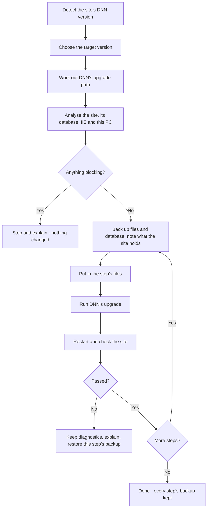

# Upgrading DNN

How DNN Manager upgrades a project's DNN, and why it works this way. Upgrade
DNN behaves like an upgrade assistant, not a zip installer: **detect → analyse
→ plan → back up → upgrade one step → check → continue, or roll back**. Using
it is described in the [user guide](user-guide.md#upgrade-dnn). This page is
for whoever maintains it.

The primary source is DNN's own
[suggested upgrade path](https://docs.dnncommunity.org/content/getting-started/setup/upgrades/suggested-upgrade-path/index.html).
Everything else on this page was checked against DNN's source code, its
release notes and issues, and real upgrades run by DNN Manager's tests. Each
fact gives its source.

## The pieces

| Piece | What it does | Code |
|---|---|---|
| Knowledge base | Every step of DNN's path, with its requirements, warnings, breaking changes, known issues and test results | [`Upgrades/DnnUpgradeKnowledge.cs`](../src/DnnManager.Application/Upgrades/DnnUpgradeKnowledge.cs) |
| Path calculation | Works out the chain of steps from the site's version to the target | [`Upgrades/DnnUpgradePath.cs`](../src/DnnManager.Application/Upgrades/DnnUpgradePath.cs) |
| Site inspector | Reads the site, its database, IIS and this PC into facts, changing nothing | [`Dnn/DnnSiteInspector.cs`](../src/DnnManager.Infrastructure/Dnn/DnnSiteInspector.cs) |
| Analyser | Judges the facts against the chain: Compatible, Warning, Blocking or Unknown | [`Upgrades/DnnUpgradeAnalyser.cs`](../src/DnnManager.Application/Upgrades/DnnUpgradeAnalyser.cs) |
| Upgrade | Runs the plan step by step | [`UseCases/UpgradeDnnUseCase.cs`](../src/DnnManager.Application/UseCases/UpgradeDnnUseCase.cs) |
| A step's files | DNN's upgrade package, or (from 10.2) its install package as DNN's local upgrade puts it in | `DnnPackageInstaller.ExtractUpgradeAsync` / `ExtractLocalUpgradeAsync` in [`Github/GitHubDnnReleaseService.cs`](../src/DnnManager.Infrastructure/Github/GitHubDnnReleaseService.cs) |
| DNN's upgrade | `Install/Install.aspx?mode=upgrade`, followed as it streams; its raw output is kept | `DnnInstaller.UpgradeAsync` in [`Dnn/DnnInstaller.cs`](../src/DnnManager.Infrastructure/Dnn/DnnInstaller.cs), [`DnnInstallOutput.UpgradeOutcome`](../src/DnnManager.Infrastructure/Dnn/DnnInstallOutput.cs) |
| Checks after each step | Version, content, pages per portal, the logs; diagnostics when a step fails | [`Dnn/DnnUpgradeChecks.cs`](../src/DnnManager.Infrastructure/Dnn/DnnUpgradeChecks.cs), [`Dnn/DnnHttpSession.cs`](../src/DnnManager.Infrastructure/Dnn/DnnHttpSession.cs) |
| Diagnosis | Turns a failure into its likely cause and fixes | [`Upgrades/DnnUpgradeDiagnosis.cs`](../src/DnnManager.Application/Upgrades/DnnUpgradeDiagnosis.cs) |
| Rollback | Puts a backup back: files (and those added since are removed), then the database | [`UseCases/RestoreBackupUseCase.cs`](../src/DnnManager.Application/UseCases/RestoreBackupUseCase.cs) |
| Dialog | Version and plan | [`Controls/UpgradeDnnDialog`](../src/DnnManager.Presentation/Controls/UpgradeDnnDialog.xaml.cs), `ProjectEdits.UpgradeDnn` |

## The upgrade path

DNN must be upgraded through each version on its path in turn:

`02.00.04 → 02.01.02 → 03.01.01 → 03.02.02 → 04.03.07 → 04.04.01 → 04.06.02 →
04.09.05 → 05.04.04 → 05.06.08 → 06.02.08 → 07.04.02 → 08.00.04 → 09.01.01 →
09.03.02 → 09.13.09 → 10.02.05 → 10.03.03`

`DnnUpgradePath.Chain(current, target)` builds the steps:

- **Every listed version above the current one and below the target is a
  stop**, then the target itself. 9.1.1 → 10.3.3 becomes 9.1.1 → 9.3.2 →
  9.13.9 → 10.2.5 → 10.3.3.
- **A version between two listed ones goes to the next listed one first**, as
  DNN's page says. 9.5.0 → 10.3.3 starts with 9.5.0 → 9.13.9. It never goes
  straight to DNN 10, even from 9.13.4.
- **A target between listed versions** (9.3.2 → 10.1.0) ends the chain. Its
  last step carries what is known about the listed step it falls in, here DNN
  10's requirements, plus a note that it isn't a listed step.
- **A target past the newest listed version** (10.4.0) is a last step after
  10.3.3, with a note that DNN's path doesn't list it yet.
- **Steps to versions before 7.4.2** are `Manual`. GitHub publishes no DNN
  packages older than 7.4.2, so the analyser blocks them and says to do them by
  hand. A site on 6.2.8 can be upgraded from there on.

To add a version DNN adds to its path, add a step at the end of
`DnnUpgradeKnowledge.Steps`; the rest follows from it.

### How a step's files go in

| Site's version | Method | Why |
|---|---|---|
| Before 10.2 | `UpgradePackage`: the release's `…_Upgrade.zip` over the site, never its `web.config` | DNN's [pre-10.2 guide](https://github.com/DNNCommunity/DNNDocs/blob/main/content/getting-started/setup/upgrades/pre-10.2.0-steps.md) |
| 10.2 and later | `LocalUpgrade`: the release's `…_Install.zip`, as DNN's own local upgrade (*Settings → Servers → System Info → Upgrades*) puts it in | DNN's [post-10.2 guide](https://docs.dnncommunity.org/content/getting-started/setup/upgrades/post-10.2.0-steps.html) and release notes ("do not simply unzip the upgrade package") |

`LocalUpgrade` does what DNN's
[`LocalUpgradeService.StartLocalUpgrade`](https://github.com/dnnsoftware/Dnn.Platform/blob/v10.3.3/DNN%20Platform/Library/Services/Installer/LocalUpgradeService.cs)
does, from outside the site:

1. Each assembly in the package's `bin` is copied in. For a strong-named one,
   web.config's binding redirect is set to its version with
   `oldVersion="0.0.0.0-32767.32767.32767.32767"`. That is DNN's
   `Install/Config/BindingRedirect.config` merge: an existing `dependentAssembly`
   with the same name and token is replaced, otherwise one is added.
2. Every other file is unzipped, except what the package's
   `App_Data/Upgrade/upgrade.json` lists under `upgradeExclude` (`web.config`,
   `robots.txt`, the LocalDB files, `Config/DotNetNuke.config`,
   `Install/InstallWizard.aspx`…). A package whose `minimumDnnVersion` is above
   the site's version is refused.

**Tested here:** the upgrade package unzipped over 10.2.5 leaves web.config's
redirects behind the new assemblies. The site no longer starts (`Could not load
file or assembly 'AngleSharp' … manifest definition does not match`) and the
upgrade can't run. With `LocalUpgrade` the same step passes. DNN Manager
doesn't upload the package through the Persona Bar, so DNN 10.2.3's upload bug
([#7141](https://github.com/dnnsoftware/Dnn.Platform/issues/7141), which needs
the package put in `App_Data\Upgrade` by hand) doesn't affect it.

### DNN's upgrade itself

After the files, DNN Manager requests `Install/Install.aspx?mode=upgrade` on the
site, on this PC, with the site's host name. DNN's
[`Install.aspx.cs`](https://github.com/dnnsoftware/Dnn.Platform/blob/v10.3.3/DNN%20Platform/Website/Install/Install.aspx.cs)
runs the upgrade for any mode but `none` while the files are newer than the
database:

1. its database scripts;
2. the extension packages in `Install/*`;
3. the config merges in `Install/Config`.

It needs no sign-in and doesn't depend on the `AutoUpgrade` appSetting, which
only decides where ordinary visitors are sent
([`Initialize.CheckVersion`](https://github.com/dnnsoftware/Dnn.Platform/blob/v10.3.3/DNN%20Platform/Library/Common/Initialize.cs)).
`UpgradeWizard.aspx` would need a host account.

DNN streams one line per step. DNN Manager shows them as progress and keeps
the whole answer as `dnn-upgrade-output-<version>.html` beside the step's
backup, with passwords left out. The step counts as done when DNN writes
*Upgrade Complete* with nothing it marks as an error. *Error!*, *Upgrade Error*,
*failed to install* and *currently in progress* each count as a failure.

**Tested here: DNN leaves `installBlocker.lock` behind, and holds it open.**
DNN's `InstallBlocker` creates the lock with `File.Create` and never closes the
file. At the end of its upgrade it tries for a minute to delete it
(`RegisterInstallEnd`), fails because it holds the file open itself, and logs an
`IOException … being used by another process`. That minute is the pause after
*Upgrade Complete*. Only the end of the worker process frees the lock. While the
lock is there, DNN takes every visit for an upgrade in progress: *The site was
accessed while an installation/upgrade was in progress*, or HTTP 503.

On IIS, stopping a site returns at once, and the worker process gets up to 90
seconds to finish. A lock deleted right after the stop is still held. That is
how DNN Manager's first version failed on a real site: the restarted site
waited 3 minutes for an upgrade that had already finished. Every step therefore
ends with a restart, done this way:

1. stop the site;
2. wait for its worker process to end, and end it by force after a minute;
3. delete the lock, retrying for 10 seconds;
4. start the site.

If the lock still can't be deleted, the step fails and says so. The checks then
confirm the database is at the new version. The tests stop IIS Express the same
way, so they cover this.

## The pre-upgrade analyser

`DnnSiteInspector` reads facts and changes nothing. Assemblies are read through
their metadata, never loaded.

| Fact | From |
|---|---|
| DNN version of the files / of the database | `bin\DotNetNuke.dll` / the `Version` table |
| `installBlocker.lock` | the site's folder |
| .NET Framework | `HKLM\…\NDP\v4\Full\Release` |
| App pool CLR and pipeline, http binding with a host name | IIS |
| SQL Server version and edition, the database's state | `SERVERPROPERTY`, `DATABASEPROPERTYEX` |
| Portals, users, roles, user roles, pages, modules, permissions, scheduled jobs, extensions | DNN's tables (with its object qualifier) |
| Extensions: name, type, version, owner, DNN's own or not | `Packages` |
| Assemblies in `bin` that aren't DNN's: the DNN version they were built against, Telerik use, registered by an extension or copied in by hand | their references (`DotNetNuke`, `Telerik.Web.UI*`, `DotNetNuke.Web.Deprecated`, `DotNetNuke.Website.Deprecated`) and `Assemblies` |
| `machineKey`, `AutoUpgrade`, appSettings DNN doesn't ship, connection strings | `web.config` |
| Site size, free space for the backups | the disk |

`DnnUpgradeAnalyser.Plan` judges the facts. **Nothing starts while anything is
Blocking.** Unknown means it couldn't be checked; it is shown and doesn't block.

| Finding | Severity |
|---|---|
| A step's target needs a newer .NET Framework or SQL Server (DNN 9.4+: .NET 4.7.2; DNN 10: .NET 4.8 and SQL Server 2017) | Blocking |
| Files and database at different DNN versions (an earlier upgrade didn't finish) | Blocking |
| A LocalDB file database (it can't be backed up as `.bacpac`); no database; the database not ONLINE or unreadable | Blocking |
| No http binding with a host name; an app pool not on CLR v4.0 | Blocking |
| Too little free space for the backups (twice the site plus 500 MB) | Blocking |
| A step DNN Manager can't carry out (before 7.4.2) | Blocking |
| Extensions using Telerik, on the way to DNN 10 (which removes it) | Blocking |
| Extensions built against DNN 7 or older, on the way past 9.2 (which removed deprecated APIs) | Warning |
| Extensions built against DNN 8 or older, on the way to DNN 10 | Warning |
| Third-party extensions, assemblies copied in by hand, appSettings of the site's own, extra connection strings, no machineKey, `installBlocker.lock` | Warning |
| Each step's notes, breaking changes and known issues from the knowledge base | Warning |
| What was checked and is fine | Compatible |

DNN's own Telerik detection
([`TelerikUtils`](https://github.com/dnnsoftware/Dnn.Platform/blob/v10.3.3/DNN%20Platform/DotNetNuke.Maintenance/Telerik/TelerikUtils.cs))
only looks for references starting with "Telerik". DNN Manager also counts
modules built on DNN's Telerik wrappers (`DotNetNuke.Web.Deprecated`,
`DotNetNuke.Website.Deprecated`), which DNN 10 removes too.

The dialog shows the plan before anything changes: the path, the site's
findings, and each step's checks. The Output tab shows it again when the
upgrade starts, and each step's backup folder keeps a copy in `backup.txt`.

## Backups: one before every step

Before **every** step (not just once at the start), DNN Manager writes a dated
backup folder `Documents\DnnManager\backups\<project>\<project>_<yyyyMMdd_HHmmss>\`
containing:

- `<project>.zip` - the site's files, as **Export** makes them (`.git` and
  `_backup.filter` left out);
- `<project>.bacpac` - the database, exported with the site's own login;
- `web.config.before` - web.config as it was, to compare with;
- `backup.txt` - "Before upgrading DNN 09.13.09 → 10.02.05", followed by:
  - the site's content counts;
  - its extensions;
  - the pages checked and how they answered;
  - the whole plan;
  - finally "Result: passed" when the step passes;
- `dnn-upgrade-output-<version>.html` - DNN's raw answer;
- `failed-upgrade\` when the step failed (below).

**Restore backup** lists these folders under their first line, so each step's
backup can be put back later.

## Each step

`UpgradeDnnUseCase.RunStepAsync`:

1. **Back up** (above). If it fails, nothing is changed and the step doesn't
   start. Then the site's state is captured: content counts, extensions, and
   every portal's home page plus up to six pages each, with how they answered.
2. **Register the way back:** a failure or a cancel from here on puts this
   step's backup back.
3. **Files:** the site is stopped and its worker process has ended, a leftover
   `installBlocker.lock` is removed, the step's files go in, and the site
   starts again.
4. **DNN's upgrade:** `Install.aspx?mode=upgrade`, at most 30 minutes, failing
   after 10 minutes without a line from DNN.
5. **Restart:** the site is stopped, its worker process has ended, the lock DNN
   left is removed (above), and the site starts.
   Then the first visit: the home page within 3 minutes, not DNN's installer or
   error page.
6. **Checks** (below). Anything blocking fails the step.
7. **Passed:**
   - DNN's installer pages and its copies of web.config go (they hold the
     connection string);
   - a site that was stopped is stopped again;
   - the project's record gets the new version;
   - this version becomes the next step's starting point.

## The checks after each step

`DnnUpgradeChecks.ValidateAsync` compares the site with what was captured before
the step:

| Check | Fails the step when |
|---|---|
| Version | Files and database aren't both at the step's target |
| Content | Fewer portals, users, roles or user roles. Pages, modules and scheduled jobs are compared one by one (by their ID): one that is gone fails the step, as do fewer permissions on a page or module still there. Exceptions are warnings, named: a module whose extension or module type the upgrade removed, a page that held only such modules, and DNN's own Admin and Host pages (`//Admin…`, `//Host…`) with the modules on them. DNN 8 moved some of those pages into its new admin and DNN 9 replaced them with the Persona Bar (tested: 7.4.2 → 8.0.4 removed ten, 8.0.4 → 9.1.1 removed 47 pages and modules). Console modules (`DotNetNuke.Console`) hold nothing of their own - they list a page's child pages - and DNN 9 removes the *Navigation* ones its template put on the Activity Feed pages; DNN 10 removes the Digital Assets Manager, Admin.Messaging and its Telerik extensions (9.13.9 → 10.2.5: one page and one module) |
| Scheduled jobs | Never fails: a job that is gone is a warning (DNN's upgrade may remove its own) |
| Pages | A page that answered before now returns HTTP ≥ 400, DNN's installer or error page, or a module error (*is currently unavailable*, *A critical error has occurred*). Covers every portal's home page and up to six pages each, requested on the site's own binding |
| Extensions | Never fails: extensions that are gone are a warning (DNN 10 removes its Telerik ones), those added are listed |
| DNN's log | Never fails: `[ERROR]`/`[FATAL]` lines since the step started, and database scripts that logged a problem, are warnings |
| Windows events | Never fails: ASP.NET errors naming the site's folder, worker process crashes, and the app pool's WAS events (recycles, rapid-fail) since the step started are warnings |

The upgrade doesn't sign in to the site. The tests do, as the host, after
each step, and from DNN 9 on check its Persona Bar. HTTP checks run as a
browser does, with cookies and redirects, on 127.0.0.1 with the site's host
name, so they don't depend on DNS.

## When a step fails

The chain stops; DNN Manager never goes on to the next version.

1. **Keep what tells why** in `<step's backup>\failed-upgrade\`:
   - DNN's logs written since the step started (`Portals\_default\Logs`, the
     database scripts' `*.log.resources`, `App_Data`);
   - the Windows events about the site and its app pool (`windows-events.txt`);
   - `what-happened.txt`: the error, the likely cause, the fixes and every
     check's result.

   DNN's raw output is already beside the backup.
2. **Explain:** `DnnUpgradeDiagnosis` matches the error, the checks and the
   logs against known patterns and says the likely cause and fixes on the
   Output tab:
   - binding-redirect mismatches;
   - DNN's lock;
   - the database being unreachable;
   - a failed database script;
   - the CodeDom change;
   - Telerik;
   - lost content;
   - HTTP 503 or 500;
   - timeouts;
   - an upgrade that didn't finish.
   When DNN's page broke off into ASP.NET's error page, the failure says where
   DNN stopped (`stopped at "Executing Script:10.03.00.SqlDataProvider"`) and
   what the page says. A lock error there hides the real one, and DNN's log
   (read for DNN 9's and DNN 10's time formats) gives it.
3. **Roll back:** the step's backup is put back.
   - The site is stopped and its worker process has ended.
   - The files are restored, and those added since are deleted.
   - The backup's database is imported under a name of its own
     (`<name>_restore_<stamp>`). Only then is the site's database renamed aside,
     the imported one given its name, and the one set aside dropped.
   - If the import fails, the site's database was never touched.

   An import under the site's own name would collide with the files of the
   database set aside: a renamed database keeps its file names, and one
   imported earlier from a `.bacpac` uses `<name>_Primary.mdf`. That happened on
   a real site with DNN Manager's first version, and the tests now run the
   failing step on such a database.

   The site is at the version before the step, the last that passed its checks.
   If putting it back fails, the Output tab says so and names the backup to
   restore by hand. The steps before stay done; their backups (and the first
   one, the site as it was) go back further.

**Cancel** works the same way for the step under way. A restore, once started,
runs to the end.

## Knowledge base

`DnnUpgradeKnowledge.Steps`, summarised. Every requirement is checked before
the upgrade; every note is shown in the plan.

| Step | Requirements | Notes, breaking changes, known issues |
|---|---|---|
| 02.00.04 → 06.02.08 (10 steps) | - | Manual: no packages on GitHub. 4.3: ASP.NET 2.0. 4.6.2: xmlmerge. 5.2+: SQL Server 2005, ASP.NET 3.5 SP1; with the XML module, 5.3 fails ("Type 'Web.HttpResponse' is not defined"), so upgrade that module first |
| 06.02.08 → 07.04.02 | .NET Framework 4 | DNN 7 runs on ASP.NET 4 (CLR v4.0) |
| 07.04.02 → 08.00.04 | .NET 4.5.1, SQL Server 2008 R2 ([DNN 8 requirements](http://archive.dnnsoftware.com/docs/85/designers/requirements.html)) | - |
| 08.00.04 → 09.01.01 | .NET 4.5.1, SQL Server 2008 | - |
| 09.01.01 → 09.03.02 | SQL Server 2008 | 9.2 removed about 500 deprecated APIs and renamed SharpZipLib's assembly; check every third-party extension. [#2631](https://github.com/dnnsoftware/Dnn.Platform/issues/2631): 503 after `mode=upgrade` |
| 09.03.02 → 09.13.09 | .NET 4.7.2 (9.4), SQL Server 2008 R2 | Telerik removal optional from 9.8, a TelerikRemoval extension from 9.11. [#5278](https://github.com/dnnsoftware/Dnn.Platform/issues/5278)/[#5336](https://github.com/dnnsoftware/Dnn.Platform/issues/5336): an old Messaging module blocks Telerik removal. [#5862](https://github.com/dnnsoftware/Dnn.Platform/issues/5862): Resource Manager after 9.13 |
| 09.13.09 → 10.02.05 | .NET 4.8, SQL Server 2017 ([requirements](https://docs.dnncommunity.org/content/getting-started/setup/requirements/index.html)) | [DNN 10 breaking changes](https://dnncommunity.org/blogs/Post/20257): Telerik removed (forced), APIs deprecated in 8 and earlier removed, WebSlices gone, Prompt and connectors need DI, HTML module workflow (publish or discard drafts first), the Resource Manager replaces the Digital Assets Manager. [#6448](https://github.com/dnnsoftware/Dnn.Platform/issues/6448): CodeDom 3.6 → 4.1. [#6993](https://github.com/dnnsoftware/Dnn.Platform/issues/6993): System.Memory, fixed in 10.2.3. Tested: DNN's lock left behind |
| 10.02.05 → 10.03.03 | .NET 4.8, SQL Server 2017 | From 10.2 on, DNN's local upgrade with the install package (tested: the upgrade package breaks the site). [#7141](https://github.com/dnnsoftware/Dnn.Platform/issues/7141): 10.2.3 upload. [#7069](https://github.com/dnnsoftware/Dnn.Platform/issues/7069): `<add key="AllowDnnUpgradeUpload" value="true" />` missing after 10.2.0–10.2.3. [#7158](https://github.com/dnnsoftware/Dnn.Platform/issues/7158), [#7305](https://github.com/dnnsoftware/Dnn.Platform/issues/7305) |

Two things are documented by DNN but not enforced by its upgrade:

- **DNN 10's SQL Server 2017 minimum:** DNN only checks it for new installs
  ([`InstallControllerImpl`](https://github.com/dnnsoftware/Dnn.Platform/blob/v10.3.3/DNN%20Platform/Library/Services/Upgrade/Internals/InstallControllerImpl.cs)).
  DNN Manager blocks on it before upgrading, as the documentation requires.
- **SQL Server 2022 support for DNN 9.13.9:** not stated officially; the tests
  below ran 9.x on SQL Server 2022.

## Tested

The tests use real sites: DNN Manager's own code, real DNN packages from
GitHub, IIS Express and SQL Server 2022 in a Docker container, on .NET
Framework 4.8.1. See [testing.md](testing.md) for how to run them.

| Transition | Scenario | Result |
|---|---|---|
| 09.03.02 → 09.13.09 → 10.02.05 → 10.03.03 | `DnnUpgradeTests`: DNN Manager's whole process on a 9.3.2 site with three users, a role, two pages, an HTML module, a child portal and an appSetting of its own; host and user signing in after each step | PASS (8 minutes): every step's checks passed, nothing lost, Telerik gone after DNN 10, the setting kept, the child portal answering, three named backups |
| 07.04.02 → 08.00.04 → 09.01.01 → 09.03.02 → 09.13.09 → 10.02.05 → 10.03.03 | `DnnUpgradeTests`: **New project** at 7.4.2, then **Upgrade DNN** | PASS (12 minutes, 6 steps). DNN 8 removes ten of its Admin and Host pages and eleven extensions; DNN 9 about 50 pages and modules more and the Console modules on the Activity Feed pages - reported as expected |
| 08.00.04 → … → 10.03.03 | New project at 8.0.4, then Upgrade DNN | PASS (14 minutes, 5 steps) |
| 09.01.01 → … → 10.03.03 | New project at 9.1.1, then Upgrade DNN | PASS (8 to 13 minutes, 4 steps) |
| 09.13.09 → 10.02.05 → 10.03.03 | New project at 9.13.9, then Upgrade DNN | PASS (6 minutes) |
| 10.02.05 → 10.03.03 | New project at 10.2.5, then Upgrade DNN | PASS (3 minutes) |
| 09.13.09 → 10.02.05 → (10.03.03) | `DnnUpgradeTests`: a trigger refuses DNN 10.3's version row, on a database exported and imported again (SqlPackage's file names) | Step 1 PASS; step 2 fails as it should - the diagnosis names the database script and its error, the backup's database goes back in, the site is back at 10.2.5, answers and signs in |
| 09.13.09 → 10.02.05 | Clean install, upgrade package + `mode=upgrade` | PASS in every run; DNN left its lock - removed by the restart. DNN removes its TelerikRemoval page and module - reported as expected |
| 10.02.05 → 10.03.03 | DNN Manager 1.7.5's first version, on a real IIS site | FAIL, fixed since: the lock was deleted while IIS's worker process still held it, so the site waited for an upgrade that had finished; putting the backup back then collided with the database's file names (`<name>_Primary.mdf`). Both are covered by the tests above |
| 10.02.05 → 10.03.03 | Upgrade package unzipped | FAIL: AngleSharp binding redirect, the site doesn't start |
| 10.02.05 → 10.03.03 | DNN's local upgrade (install package) | PASS: home page, restart, host sign-in with Persona Bar, version |
| 09.03.02 → 09.13.09 | Upgrade package + `mode=upgrade` | PASS; Telerik stays (removed only by DNN 10) |

What the tests found that DNN's documentation doesn't say - all handled now:

- **DNN leaves `installBlocker.lock` behind, held open by its worker
  process,** after a successful upgrade. It takes every visit for an upgrade in
  progress until the process has ended and the lock is deleted.
- **When a database step fails, DNN abandons its upgrade without an *Error!*
  marker, then fails on its own lock.** Its page shows only the lock error. The
  real error is in DNN's log (`Portals\_default\Logs`, the line after the
  `[ERROR]`), which DNN Manager reads and keeps.
- **DNN 9 and DNN 10 write their log times differently**
  (`2026-10-04 23:37:54,504` and `2026-10-04 23:37:54.504+02:00`).
- **DNN removes pages and modules of its own** - DNN 8 and 9 their Admin and
  Host pages and the Console modules, DNN 10 its Digital Assets Manager and
  Telerik - so counting pages isn't enough to tell lost content. Pages and
  modules are compared one by one.
- **On IIS, a stopped site's worker process lives on** for up to 90 seconds,
  and DNN's lock with it. DNN Manager waits for it to end.

Not tested, and why:

- **2.x–6.x:** no packages on GitHub, and they need .NET 1.1–3.5 and SQL Server
  2000–2005.
- **SQL Server older than 2017:** Microsoft's Linux container images start at
  2017.
- **An older .NET Framework, file permissions:** the PC has .NET 4.8.1, and IIS
  Express runs as the current user.
- **Real IIS:** the tests run IIS Express and stop it the way IIS stops a site.
  DNN Manager's own IIS code for this (`IisManager.StopSiteAndWait`) needs
  administrator rights, which the test runs don't have.

These are covered by the analyser's unit tests instead.
