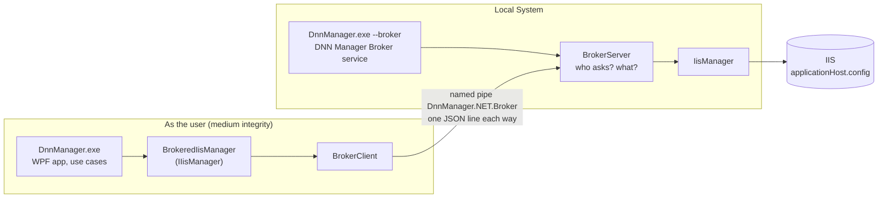

# Privileged broker (experiment)

**Status: experiment** on the branch `experiments/privileged-service` - nothing here is
released, and DNN Manager still runs elevated by default. This page is the design of
splitting DNN Manager into a user-level app and a privileged service, what the spike on
this branch proves, and what a full migration would take.

**Contents**

- [Why](#why)
- [The design](#the-design)
- [What the spike does](#what-the-spike-does)
- [Security model](#security-model)
- [What was verified](#what-was-verified)
- [Try it](#try-it)
- [A full migration](#a-full-migration)
- [Conclusion](#conclusion)

## Why

DNN Manager always runs as Administrator ([security.md](security.md#administrator-rights)):
[`Program.cs`](../src/DnnManager.Presentation/Program.cs) relaunches itself through UAC,
because IIS (`Microsoft.Web.Administration`), folder permissions, worker processes and IIS
features need it. That rules out the Microsoft Store as an MSIX package - Microsoft:
*"apps that require elevation for any part of their functionality won't be accepted into
the Store"* ([Prepare to package a desktop application](https://learn.microsoft.com/en-us/windows/msix/desktop/desktop-to-uwp-prepare)).

The question for this experiment: can the UI run as the user, with only a small service
holding the Administrator rights - and does that make MSIX, or the Store, possible?

- **MSIX installed outside the Store: yes** - proven below. The package installs the
  service itself (`packagedServices`, `localSystemServices`).
- **The Microsoft Store: still no.** Those two capabilities are restricted, and Microsoft
  says for both: *"We don't recommend that you declare this capability in applications that
  you submit to the Microsoft Store. In most cases, the use of this capability won't be
  approved"* ([restricted capabilities](https://learn.microsoft.com/en-us/windows/apps/package-and-deploy/app-capability-declarations#restricted-capabilities)).
  A service installed apart from the package doesn't help either: Store policy 10.2.4 -
  *"dependency on non-Microsoft provided drivers or NT services is not allowed"*
  ([Store policies](https://learn.microsoft.com/en-us/windows/apps/publish/store-policies)).
- **Signing:** MSIX outside the Store must be signed by a certificate Windows trusts - the
  split doesn't remove the need for a code-signing certificate. Only Store-distributed
  packages are signed by Microsoft.

What the split does give, Store or not: **the UI no longer runs as Administrator**. The
browser-like surface (web.config editing, terminals, IDEs, downloaded DNN packages) runs
with the user's rights, and the code with Administrator rights shrinks to a handful of
checked operations.

## The design



- **One exe, two roles.** The service is `DnnManager.exe --broker` - like the update helper
  (`--apply-update`), a mode of the same program, so the app and the service are always one
  build and the single-file publish stays one file.
- **The seam is `IIisManager`.** The use cases already see IIS only through it
  ([architecture.md](architecture.md#layers)); without Administrator rights it is
  [`BrokeredIisManager`](../src/DnnManager.Infrastructure/Broker/BrokeredIisManager.cs),
  which sends what the broker knows to the service and runs the rest as before. Nothing in
  Application or the pages changes.
- **The protocol** ([`BrokerProtocol`](../src/DnnManager.Infrastructure/Broker/BrokerProtocol.cs)):
  one request per connection, one line of JSON each way -
  `{"version":1,"operation":"site.stop","site":"mysite"}` →
  `{"success":true,"error":null,"data":null}`. A request of another `version` is refused, so
  a DNN Manager and a service of different releases say so instead of misreading each other.

## What the spike does

| Part | Where |
|---|---|
| Protocol, request and answer | [`Broker/BrokerProtocol.cs`](../src/DnnManager.Infrastructure/Broker/BrokerProtocol.cs) |
| The service's pipe: access rules, who may ask, the operations | [`Broker/BrokerServer.cs`](../src/DnnManager.Infrastructure/Broker/BrokerServer.cs) |
| DNN Manager's side, checks it talks to the service | [`Broker/BrokerClient.cs`](../src/DnnManager.Infrastructure/Broker/BrokerClient.cs) |
| `IIisManager` through the broker | [`Broker/BrokeredIisManager.cs`](../src/DnnManager.Infrastructure/Broker/BrokeredIisManager.cs) |
| The Windows service, `--broker install / uninstall / call` | [`Broker/BrokerService.cs`](../src/DnnManager.Infrastructure/Broker/BrokerService.cs) |
| Running from a package, no self-update then | [`Updates/PackageIdentity.cs`](../src/DnnManager.Infrastructure/Updates/PackageIdentity.cs), [`AppUpdater`](../src/DnnManager.Presentation/Services/AppUpdater.cs) |
| The switch: packaged, or `--unelevated` | [`Program.cs`](../src/DnnManager.Presentation/Program.cs) |
| The MSIX package with the service (`build.ps1 -Broker`) | [`src/DnnManager.Package`](../src/DnnManager.Package) (`AppxManifest.xml`, `build.ps1`) |
| Tests | [`BrokerTests.cs`](../tests/DnnManager.IntegrationTests/BrokerTests.cs) |

The broker's operations - what the Projects table needs:

| Operation | Does |
|---|---|
| `ping` | Answers with its protocol version |
| `sites.states` | Every site's state (`IIisManager.GetSiteStates`) |
| `sites.runtimes` | Every site's ID, state, pool, worker processes, bindings, folder (`GetSiteRuntimes`) |
| `site.start`, `site.stop`, `site.restart` | `StartSite`, `StopSite`, `RestartSite` |
| `site.stop-and-wait` | `StopSiteAndWait`, waiting 1-300 seconds |

**How DNN Manager decides:** started without Administrator rights *and* with
`--unelevated` or from an MSIX package whose broker service runs, it doesn't relaunch
itself through UAC - it uses the broker (with `--unelevated` and no service it says so and
stops). Otherwise it elevates as before - the release's package too. Every other IIS call (creating, removing, renaming a site, permissions, pool
settings, `iisreset`) still runs in the app and fails without the rights - moving them over
is the [full migration](#a-full-migration).

## Security model

The service runs as Local System; who can make it act is the whole security question.

- **Who may ask:** an administrator of this PC - also without its Administrator rights
  (UAC's filtered token keeps the Administrators group, for deny only). The service reads
  the caller's token while impersonating it at the Identification level - enough to read
  its groups, not to act as it ([`BrokerServer.Refusal`](../src/DnnManager.Infrastructure/Broker/BrokerServer.cs)).
  Anyone else is refused, and so is any token with the NETWORK group.
- **The pipe's access rules:** Local System and Administrators full control; interactive
  users read and write but may not create an instance; the NETWORK group denied.
- **No impostor service.** The service opens the pipe as its first instance
  (`FirstPipeInstance`) - when another process made it first, the service stops instead
  of sharing the name. DNN Manager in turn checks that the pipe's server process is the
  service's process (`GetNamedPipeServerProcessId` against the Service Control Manager)
  before it sends anything.
- **Where the service's exe is:** in a folder only administrators can change -
  `Program Files\DnnManager\Broker` (`--broker install` copies it there) or the package's
  `WindowsApps` folder. A Local System service running from the per-user install folder
  (`%LOCALAPPDATA%\Programs`) would hand Local System to anything running as the user.
- **Narrow:** a fixed list of operations on IIS sites by name; requests over 16 KB, without
  a site name or with control characters are refused; 10 seconds to send a request.
- **Logged:** every request, with the calling account, in the Windows Application event log
  (source `DnnManagerBroker`).

**The trade-off - accepted for the experiment, to decide before it ships:** any program
running as an administrator account can now start and stop IIS sites without a UAC
prompt. Microsoft doesn't treat UAC as a security boundary, and the operations are narrow,
but every operation added to the broker widens this. A full migration should keep the
broker's operations to DNN Manager's own sites (e.g. only sites whose folder is under the
projects folder - the service would need to know it) and leave destructive ones
(removing a site, a profile) to an elevated step with a UAC prompt. In exchange, the
[open risk](security.md#known-open-risks) of start at sign-in goes away: an unelevated DNN
Manager needs no highest-rights scheduled task.

## What was verified

On Windows 11 (IIS running, four sites), 2026-10-06, from an **unelevated** shell
(Administrators deny-only - the same shell couldn't read `applicationHost.config`):

| Check | Inno Setup way (`--broker install`) | MSIX (sideloaded, test-signed) |
|---|---|---|
| Service installed, Local System, automatic, from a protected folder | ✅ `Program Files\DnnManager\Broker` | ✅ `WindowsApps\Albadit.DnnManager_1.7.9.0_x64__…` |
| `ping`, `sites.states`, `sites.runtimes` | ✅ | ✅ |
| `site.stop` then `site.start` of a real site | ✅ Stopped, then Started | ✅ Stopped, then Started |
| An unknown operation refused | ✅ | - |
| Logged with the caller in the event log | - | ✅ |
| Another process can't make an instance of the pipe | - | ✅ access denied |
| No service: a clear error | ✅ "The DNN Manager Broker service isn't running." | - |
| Removed cleanly (service, folder / package) | ✅ | ✅ |

The fast tests cover who may ask (including this machine's real filtered token), the
operations, the messages, the pipe's rules and that `BrokeredIisManager` implements every
member of `IIisManager` itself. `The_installed_service_answers_and_reads_IIS` (category
Integration) runs against an installed service.

**Not verified:** the UI itself running unelevated (`--unelevated`, or started from the
package) - DNN Manager was running at the time and a second start hands over to it. Expect
the Projects table and Start / Stop / Restart to work, and everything else that changes IIS,
folders or processes to fail with access denied.

## Try it

Build first (`dotnet build -c Release`, or the package below), then in a terminal **opened
as Administrator**:

```powershell
.\bin\Release\net10.0-windows\DnnManager.exe --broker install    # copies to Program Files\DnnManager\Broker, starts the service
```

In a normal terminal:

```powershell
$dm = '.\bin\Release\net10.0-windows\DnnManager.exe'
& $dm --broker call ping | Out-String
& $dm --broker call sites.states | Out-String
& $dm --broker call site.stop mysite | Out-String
& $dm --unelevated                                                # the app without Administrator rights (quit a running one first)
```

Remove it, as Administrator: `DnnManager.exe --broker uninstall` - it stops and deletes
the service and `Program Files\DnnManager\Broker` (run from that folder, it says to delete
the folder once it has exited).

### Try the package

The broker's package is `build.ps1 -Broker` - without `-Broker` (and in the VS Code task)
it builds the release's package, which elevates instead ([releasing.md](releasing.md#the-msix-package)):

```powershell
.\src\DnnManager.Package\build.ps1 -Broker -TestCertificate       # publish\DnnManager_<version>_x64.msix, test-signed
```

`-TestCertificate` makes a self-signed certificate `CN=DnnManager Test` in your
`CurrentUser\My` store and exports it to `src\DnnManager.Package\bin\DnnManager-test.cer`.
As Administrator, trust it and install the package (a package with a service needs
Administrator rights to install):

```powershell
Import-Certificate -FilePath .\src\DnnManager.Package\bin\DnnManager-test.cer -CertStoreLocation Cert:\LocalMachine\TrustedPeople
Add-AppxPackage .\publish\DnnManager_<version>_x64.msix
```

Quit a running DNN Manager, then start **DNN Manager** from the Start menu. Remove it
all, as Administrator:

```powershell
Get-AppxPackage Albadit.DnnManager | Remove-AppxPackage
Get-ChildItem Cert:\LocalMachine\TrustedPeople, Cert:\CurrentUser\TrustedPeople, Cert:\CurrentUser\My |
    Where-Object Subject -eq 'CN=DnnManager Test' | Remove-Item
```

For real users the package needs a certificate Windows trusts
(`build.ps1 -CertificateThumbprint <thumbprint>` - the publisher is taken from it).

## A full migration

What runs with Administrator rights today
([security.md](security.md#administrator-rights)), and where it would go:

| Today, in the elevated app | In the broker | Notes |
|---|---|---|
| IIS sites and pools: create, remove, start, stop, rename, bindings, pool settings, recycle, user profile | ✅ operations per `IIisManager` member | Most of the work; `IIisManager` is already the seam |
| `iisreset` start / stop / restart | ✅ | |
| Reading IIS: site details, traffic and request counters, log folder | ✅ | The performance counters and HTTPERR / IIS logs need admin to read |
| Watching `inetsrv\config` and the W3SVC service | ✅ as a change notification on the pipe | Today `FolderChangeSource` silently gets nothing without the rights |
| Enabling IIS's Windows features (PowerShell `Enable-WindowsOptionalFeature`) | ✅ | Long-running: needs progress on the pipe |
| Folder permissions for IIS (`GrantPermissions`), LocalDB file permissions | ✅ limited to the projects folder | |
| Ending w3wp / processes holding files, reading other processes (file locks, debugger check) | ✅ limited to the site's worker processes and folder | |
| Removing an app pool's Windows profile, delete-at-reboot (`MoveFileEx`) | ✅ or an elevated step with UAC | Destructive - see the trade-off above |
| `CREATE LOGIN [IIS APPPOOL\x]` (SQL Server) | ❌ stays in the app | SQL Server's own permissions, not Windows' |
| Start at sign-in (scheduled task, highest rights) | ❌ no longer needed | A normal task, or the package's `StartupTask` |
| Terminals and IDEs started elevated | ❌ they run as the user | An "elevated terminal" would need a UAC prompt (not verified from a package) |
| SSMS sign-in by UI Automation | ❌ stays | Works unelevated when SSMS is too |
| docker, SqlPackage, `dotnet tool`, winget, SqlLocalDB | ❌ stay in the app | Don't need Administrator rights (winget asks itself) |
| Self-update | Installer: Setup must update the service too (needs admin); package: updated as a package | The service and the app must stay one release - the protocol version catches a mismatch |

Also needed:

- **Setup** installs the service, so it needs Administrator rights - per-machine instead of
  today's per-user install without them (`PrivilegesRequired=lowest`), and the service
  binary in Program Files.
- **Progress and cancel** across the pipe for long operations (IIS features, stopping a busy
  site), which today report through `IProgressReporter` in-process.
- **The use cases' undo** (`OperationUndo`) keeps working - it calls the same `IIisManager`.

## Conclusion

- **Technically, the split works** - with an Inno Setup install and as an MSIX package
  installed outside the Store, verified with a real IIS.
- **It doesn't open the Microsoft Store**: the packaged service needs restricted
  capabilities Microsoft says it generally won't approve for the Store, and an outside
  service is against policy 10.2.4. So it doesn't remove the need for a code-signing
  certificate either - an MSIX outside the Store must be signed.
- **Its own value** is a DNN Manager whose UI doesn't run as Administrator - weighed against
  a larger installer and update story, and an always-running Local System service that
  administrator accounts can drive without UAC.
