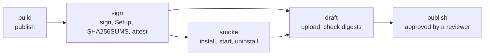

# Releasing

Making a new version: the steps, releasing from VS Code, the release workflow, code signing, setting up GitHub, the build workflow, the portable exe and the installer.

## Steps

There is no version number to raise: the release's tag is its version. A release
build gets it from the tag (`v1.7.2` → 1.7.2), and every other build from the
newest version tag in git that the commit includes - after 1.7.1 is released, a
local build, the portable exe's name, the installer and Settings → About say 1.7.1
until 1.7.2 is tagged ([`DnnManager.csproj`](../DnnManager.csproj), target
`VersionFromGitTag`; without git or a tag it is 0.0.0, with a build warning).

1. In [`CHANGELOG.md`](../CHANGELOG.md), turn **Unreleased** into
   `## vX.Y.Z` (with an *Upgrading* note when settings or behaviour change).
2. Run the fast tests and the integration tests ([testing.md](testing.md)).
3. Write the release notes as `.docs/release-notes/vX.Y.Z.md` - the file's name is
   the release's tag and title. Every release uses the structure of
   [v1.6.0](release-notes/v1.6.0.md): a bold summary, *Highlights*, *Other changes*,
   *Upgrading*, *Tested*. With Claude Code, ask for "the release notes for X.Y.Z" -
   the `release-notes` skill (`.claude/skills/release-notes`) writes them from the
   changelog, the commits and the test results. By hand, start from the draft:
   `.github\scripts\release-notes.ps1 -Version X.Y.Z -OutFile .docs\release-notes\vX.Y.Z.md`.
   The notes are built into the exe (What's new after an update shows them), so
   they must be committed before the release is built.
4. Commit and push, then run the task **release (GitHub)** (see
   [Release from VS Code](#release-from-vs-code)). It pushes the version tag, and
   GitHub's [release workflow](#the-release-workflow) builds the release from that
   tag: `DnnManager_Portable-X.Y.Z-x64.exe`, `DnnManager_Setup-X.Y.Z-x64.exe` and
   `SHA256SUMS.txt`, signs them once signing is set up, tries them, and puts them
   on a draft release. It runs no tests: [CI](#the-build-workflow) tests every
   commit you push, and the task runs the fast tests on your PC before it tags.
5. **Approve the job *Publish the release*** on the run's page on GitHub (the
   `publish` environment's required reviewer). It checks the tag and the files
   again and publishes the release. Every running DNN Manager then offers it
   with its **Update** button (see [The in-app update](#the-in-app-update)).

## Release from VS Code

**Ctrl+Shift+B → release (GitHub)** (or **Terminal → Run Task…**) asks two
questions in VS Code's picker, then runs
[`.github/scripts/publish-release.ps1`](../.github/scripts/publish-release.ps1) in
the terminal. The pickers are filled fresh each time - from `.docs/release-notes`
and from GitHub - by the extension
[Tasks Shell Input](https://marketplace.visualstudio.com/items?itemName=augustocdias.tasks-shell-input)
(`augustocdias.tasks-shell-input`); VS Code offers to install it, as it's in
`.vscode/extensions.json`.

1. **Pick the release notes** from `.docs/release-notes`. Files without a tag come
   first, marked *next release*; released ones are marked *already released*.
   `v1.7.0.md` makes the tag and the release title `v1.7.0` (`v1.7.0-rc.1.md`
   makes a pre-release).
2. **Pick the commit** from the 20 newest on GitHub (`origin/<current branch>`,
   fetched first) - the newest is on top.
3. It stops when the tag is on GitHub already (or here, on another commit), when
   GitHub has published that version, or when the commit doesn't have its release
   notes or the release workflow (`.github/workflows/release.yml`). The release is
   built from that commit, and its notes are built into the exe.
4. In a temporary worktree of that commit - your working copy isn't touched - it
   restores the packages in locked mode and runs the fast tests, so a problem shows
   up before the tag exists.
5. **After you confirm**, it tags the commit and pushes the tag. Nothing built on
   this PC is uploaded: the release workflow builds, tests, signs (once
   [code signing](#code-signing) is set up), attests, tries and drafts it, and
   publishes it once you approve.
6. It stops once the tag is pushed and names the workflow's page on GitHub:
   follow the run there, and approve *Publish the release* once the draft is
   ready. Answer *N* at step 5 and nothing is tagged.

The only credential it uses is the one Git pushes the tag with (see
[Set up GitHub](#set-up-github)). It asks GitHub's public API, without signing in,
whether the version is published
([`ReleaseCommon.psm1`](../.github/scripts/ReleaseCommon.psm1), which it shares
with the redo script). Outside VS Code,
`.github\scripts\publish-release.ps1` asks the same two questions in the terminal;
`-NotesFile .docs\release-notes\v1.7.0.md -Commit <hash>` answers them. `-SkipTests`
skips the fast tests here (the release workflow runs none - only CI, on the pushed commit).
You have to confirm before it releases a
commit that isn't on GitHub yet.

The release's notes are `.docs/release-notes/vX.Y.Z.md` as
[`.github/scripts/release-notes.ps1`](../.github/scripts/release-notes.ps1) gives
them to GitHub: its relative links pointed at the tag's files. Without that file it
writes a draft in the same structure, from the version's `CHANGELOG.md` entry
(*Added* → *Highlights*, *Fixed* → `Fixed:` lines in *Other changes*, *Upgrading*,
*Tested*) or, without an entry, from the commit subjects since the previous tag
(`new:` → *Highlights*, `fix:` and `update:` → *Other changes*). Preview them with
`.github\scripts\release-notes.ps1 -Version 1.7.0 -OutFile notes.md`.

## Redo a release

When a release's workflow failed or the release needs more changes before it is
published, commit and push them, then **Ctrl+Shift+B → release: redo (GitHub)**
runs [`.github/scripts/redo-release.ps1`](../.github/scripts/redo-release.ps1):

1. The version is the newest version tag (`-Version` for another).
2. **It refuses a version GitHub has published** - a pre-release too, and also when
   GitHub can't be asked. A published version gets a new version number (see
   [A bad release](#a-bad-release)). It also refuses while a release workflow run
   on the tag hasn't ended - queued, running, or waiting for the publish job's
   approval: wait for it, or cancel it (reject *Publish the release*), first.
3. It lists the commits of the branch since the tag's - the newest first, Enter
   takes it (`-Commit <hash>` picks one without asking). That commit is released
   **as it is**: nothing is amended or pushed, and changes you haven't committed
   aren't in it (the plan says so). A commit that isn't on GitHub yet is named
   too - push it first.
4. It shows the plan and asks once, then deletes the tag here and on GitHub and
   releases the version from that commit, as **release (GitHub)** does: the fast
   tests, then the tag, and GitHub builds and publishes it. A draft release that
   the failed run left stays on GitHub: the next run on the tag reuses it and
   replaces its files and notes.

`-DryRun` shows the plan and changes nothing; `-SkipTests` is passed on to
**release (GitHub)**.

## A bad release

A release that turns out broken once it is published - people may have updated to
it already:

1. **Stop new updates to it at once:** on GitHub, edit the release and tick *Set as
   a pre-release*. DNN Manager and Setup offer only the latest release that isn't a
   pre-release, so nobody else gets it; its files stay for those who have it.
2. **Fix it as the next version** (`vX.Y.Z+1`) - a revert is enough - with the
   changelog and release notes saying what was wrong and that it is fixed, and
   release it as usual. Those who updated to the bad one are offered the fix;
   nobody is offered an older version, and a published version is never redone.
3. **A release that wasn't yours** (the GitHub credential or this PC
   compromised): revoke the credential Git uses (GitHub → Settings → Developer
   settings → Personal access tokens, or Applications), delete the release, and
   release a fixed version from a PC you trust; say what happened in its notes.
   A release the workflow didn't build has no attestation from it
   (`gh attestation verify <file> --repo Albadit/DnnManager.NET` fails).

## The release workflow

[`.github/workflows/release.yml`](../.github/workflows/release.yml) ("Release") runs
when a tag `vX.Y.Z` (or `vX.Y.Z-suffix`) is pushed - one run per tag at a time,
never cancelled half way. Its jobs run in this order:



- **Build** (on the `windows-2025` image) - checks the runner has Visual Studio's
  C++ build tools (the launcher's Native AOT needs them), restores in locked mode
  (the app's tests and the launcher), stamps the tag's version into the manifest,
  publishes the portable exe, and publishes the app and the launcher for Setup
  (`build.ps1 -PublishOnly`) - all unsigned. It runs the packages' code, so it gets
  no OpenID Connect token: it may only read the repository. No tests run in the
  release workflow - [CI](#the-build-workflow) runs them on every commit pushed.
- **Sign, package and attest** (environment `release`) - takes the build's files;
  it restores no package and runs no test. When [code signing](#code-signing) is
  set up, it signs in to Azure just before the first file is signed, signs the
  portable exe, then builds Setup with the pinned Inno Setup (`build.ps1
  -SkipPublish -PinnedInno -SignScript …`), which signs `DnnManager.exe` and the
  launcher before they go in and has Inno sign Setup and its uninstaller; then it
  signs out of Azure. It checks that both exes and the launcher report the
  version (and are signed), writes `SHA256SUMS.txt` and the notes, and attests
  the provenance of both exes (`actions/attest-build-provenance`, signed by GitHub
  through Sigstore): which workflow built them, from which tag and commit.
- **Try the files** (smoke) - on a fresh runner,
  [`smoke-test.ps1`](../.github/scripts/smoke-test.ps1) installs Setup silently
  into a temporary folder, checks `DnnManager.exe` and the launcher (a Native AOT
  build, no DLL beside it) report the version, starts DNN Manager through the
  launcher and waits for its window to stay up, uninstalls, then starts the
  portable exe the same way. A release whose files don't start isn't offered.
- **Draft the release** - only once CI, the signing and the smoke test have
  passed. [`upload-release.ps1 -Stage Draft`](../.github/scripts/upload-release.ps1)
  checks the files against `SHA256SUMS.txt` and creates the release as a draft
  for the commit the workflow built (`target_commitish` = `GITHUB_SHA`), with the
  notes and the files' SHA-256 under them. If a failed run left a draft for the
  tag, it reuses that draft and replaces its files. It uploads the files and
  checks each one's size and GitHub's own SHA-256 of it (its `digest`, what every
  DNN Manager checks an update against). A published release of the tag fails
  the job and changes nothing.
- **Publish the release** - in the environment `publish`: it waits until a
  required reviewer approves it on the run's page. Then `upload-release.ps1
  -Stage Publish` checks again that the tag still points at the commit that was
  built (`GITHUB_SHA`), that each file on the draft has the digest in
  `SHA256SUMS.txt` and that the draft has no other file, and publishes it - as the
  latest release only when its version is newer than the latest one (a fix to an
  older line doesn't become what every DNN Manager is offered), or as a
  pre-release for `vX.Y.Z-rc.1`.

A failure anywhere leaves at most a draft, which nobody is offered; a pushed tag
alone never publishes anything. Each job has only the permissions it needs. CI,
build and smoke only read the repository. Only the sign job may get an OpenID
Connect token and write attestations - for the attestation's certificate and for
Azure's sign-in when signing. Only the draft and publish jobs may write to the
repository, and that is for the release. The workflow's own `GITHUB_TOKEN` is its
only GitHub credential - no personal token is stored in the repository. Its
actions are pinned to commits, like CI's, check-outs leave no token in
`.git/config`, and `${{ }}` values reach its scripts only through environment
variables.

**Check a downloaded file** came from the workflow:
`gh attestation verify DnnManager_Setup-1.9.0-x64.exe --repo Albadit/DnnManager.NET`
shows the workflow, tag and commit that built it. Releases up to 1.8.1 were built
on the publisher's PC and have no attestation.

## Code signing

The exes aren't signed until a code-signing service is set up. The workflow is
ready for [Azure Artifact Signing](https://learn.microsoft.com/azure/artifact-signing/)
(formerly Trusted Signing). **Until its variables are set, signing is off** and
every release is built unsigned. Once they are, the sign job signs in to Azure
with OpenID Connect - no secret is stored - right before the first file is
signed, and [`.github/scripts/sign.ps1`](../.github/scripts/sign.ps1) signs with
`signtool` and the Artifact Signing client (a pinned NuGet package, checked
against its SHA-512), timestamped. It signs the portable exe, the published
`DnnManager.exe` and the launcher before they go into Setup, and - through Inno's
`SignTool` - Setup and its uninstaller. With the variables set, a file that comes
out unsigned fails the run instead of being published; so does a half set-up
(some variables missing). Set the variable `REQUIRE_SIGNING` to `true` once
signing works: from then on a run without the signing variables fails rather
than release unsigned files.

To set it up:

1. **In Azure**: an Artifact Signing account and a certificate profile (Public
   Trust, after the publisher's identity validation). Note the account's endpoint
   (`https://<region>.codesigning.azure.net`), its name and the profile's name.
2. **In Microsoft Entra ID**: an app registration with a *federated credential*
   for GitHub Actions - organization `Albadit`, repository `DnnManager.NET`, entity
   *Environment*, name `release` (subject
   `repo:Albadit/DnnManager.NET:environment:release`). Give it the role
   *Artifact Signing Certificate Profile Signer* on the certificate profile.
3. **On GitHub, Settings → Environments**: open `release` (the first run makes it) or
   create it, and under *Deployment branches and tags* allow only the tag pattern
   `v*`. Then only a release run can get the Azure token.
4. **Settings → Secrets and variables → Actions → Variables** (of the repository or
   of the `release` environment): `AZURE_CLIENT_ID`, `AZURE_TENANT_ID`,
   `AZURE_SUBSCRIPTION_ID`, `ARTIFACT_SIGNING_ENDPOINT`, `ARTIFACT_SIGNING_ACCOUNT`
   and `ARTIFACT_SIGNING_PROFILE`. They are identifiers, not secrets. Then
   `REQUIRE_SIGNING` = `true`.

Nothing else to change for the installer: `build.ps1 -SignScript <script>` defines
Inno's sign tool `dnnsign` and passes `/DSignToolName=dnnsign`, and `DnnManager.iss`
then sets `SignTool` and `SignedUninstaller=yes`. Inno refuses a file the sign tool
left unsigned, and `build.ps1` checks Setup's signature once more.

## Set up GitHub

Do these once, before the first release with the workflow, in the repository's
**Settings**:

- **Actions → General**: *Workflow permissions* - *Read repository contents and
  packages permissions* (each job asks for more itself), and *Allow GitHub Actions
  to create and approve pull requests* off. Under *Actions permissions*, tick
  *Require actions to be pinned to a full-length commit SHA*.
- **General → Releases**: turn on *release immutability*. Once a release is published,
  its files and tag can't change any more - a draft still can, which is how the
  workflow uploads them. This is what the scripts' refusal to redo a published
  version relies on.
- **Rules → Rulesets**:
  - a *branch* ruleset for the default branch (`main`): *Restrict deletions*,
    *Block force pushes* and *Require status checks to pass* (CI's **Build and
    test**);
  - a *tag* ruleset for `refs/tags/v*`: *Restrict creations*, *Restrict updates*,
    *Restrict deletions* and *Block force pushes*.

  Add the *Repository admin* role to both bypass lists: **release (GitHub)** creates
  the tag, and **release: redo (GitHub)** deletes it and force-pushes the amended
  release commit. Nobody else can push or move a version tag, so nobody else can
  start a release.
- **Environments** (the first release run makes both; set them up before it):
  - `publish` - under *Required reviewers* add yourself, and under *Deployment
    branches and tags* allow only the tag pattern `v*`. **Without a required reviewer the
    publish job runs as soon as the draft is ready** - this is the step that makes
    a person approve every release.
  - `release` - *Deployment branches and tags*: only `v*` (see
    [Code signing](#code-signing)).
- **Secrets and variables → Actions → Variables**: `REQUIRE_SIGNING` (`true`
  once signing is set up), and `CI_MAX_SKIPPED_TESTS` - the number of skipped
  integration tests the build workflow accepts ([below](#the-build-workflow)).
- **The Git credential on this PC** is all that releases need here: it pushes the
  branch and the tag, and no script reads it from Git or calls the API with it.
  Make it a *fine-grained personal access token* for this repository only
  (GitHub → Settings → Developer settings → Fine-grained tokens): *Contents: Read and
  write*, plus *Workflows: Read and write* only while you push changes to
  `.github/workflows`. Store it in Git Credential Manager in place of a broader
  sign-in, and give it an expiry date.

## The build workflow

[`.github/workflows/ci.yml`](../.github/workflows/ci.yml) ("CI") runs on every commit
pushed to a branch and by hand (**Actions → CI → Run workflow**) - not for a version
tag: the [release workflow](#the-release-workflow) doesn't run it or wait for it.
It has two jobs: **Test**, then **Build** once the tests passed. Build restores in
locked mode (exactly the packages
`packages.lock.json` names, with their hashes - the app's tests' and the
launcher's), builds in Release (the version from the newest tag, as every local
build) **with warnings as errors** (`-warnaserror`, XML-comment warnings
included: `DnnManager.csproj` has the compiler read its XML comments
(`GenerateDocumentationFile`), so a misplaced or broken one fails the build -
without asking a comment for every public member: CS1591 and CS1573 are off),
builds the launcher as
plain .NET (the release publishes it with Native AOT). Test runs the whole test
suite. It publishes nothing.

**Skipped tests are counted.** The integration tests are skipped (inconclusive)
where the runner lacks IIS Express, LocalDB or Linux containers. The step
*Count skipped tests* reads the results (`TestResults/tests.trx`), lists the
skipped ones in the run's summary, and fails the run when a test outside
`TestCategory=Integration` was skipped - a fast test must run everywhere - or
when more were skipped than the repository variable `CI_MAX_SKIPPED_TESTS`
allows (14 when it isn't set). Set it to the count the summary shows, so a newly
skipped integration test fails the run too.

What makes a build the same each time:

- **The .NET SDK** is exactly the one [`global.json`](../global.json) names
  (`10.0.401`, `rollForward: disable` - no newer patch) - both workflows install
  it from there, and a local build needs it too.
- **The runner** is a pinned image (`windows-2025`), not `windows-latest`: moving to
  a newer image is a change in review.
- **The packages** are in `packages.lock.json` (the app's and the tests') - a
  package change is a change to the lock file, in review. A restore that would
  change them fails in CI, in the release workflow, and in **release (GitHub)**
  before it tags anything. After a package change, update the lock files with
  `dotnet restore tests/DnnManager.IntegrationTests --force-evaluate`. A build and
  a single-file publish restore the same packages: `DnnManager.csproj` turns on
  the single-file analyzer for every build, and with it the SDK's
  `Microsoft.NET.ILLink.Tasks`, which a single-file publish adds otherwise.
- **Where packages come from**: [`nuget.config`](../nuget.config) clears every other
  package source (a machine-wide or user NuGet.Config) and maps every package to
  nuget.org, so a package of the same name on another feed is never used.
- **The actions** are pinned to commits, not tags that can move;
  [Dependabot](../.github/dependabot.yml) proposes updates for them and the NuGet
  packages each month, which CI builds and tests.
- **Inno Setup** for a release is the pinned `Tools.InnoSetup` package, checked
  against its SHA-512 and extracted again on every build
  ([Build the installer](#build-the-installer)).

## The in-app update

Every DNN Manager from 1.7.0 on updates itself from GitHub's **latest release** (never a
draft or a pre-release - a `vX.Y.Z-rc.1` tag isn't offered) - see
[Update](user-guide.md#update). A release must keep what it relies on:

- **The file names**: `DnnManager_Setup-<version>-x64.exe` updates an installed DNN
  Manager, `DnnManager_Portable-<version>-x64.exe` a portable one
  ([`AppRelease.AssetFor`](../src/DnnManager.Infrastructure/Updates/AppRelease.cs)).
  Releases up to 1.7.6 had `DnnManagerSetup-<version>-x64.exe` and
  `DnnManager-<version>-x64.exe` - the only names DNN Manager 1.7.6 and older
  (and their Setups) look for. 1.7.7 was released under both names, so those
  versions could update to it; later releases have only the new names, so 1.7.6
  and older can't update past 1.7.7 by themselves - install a newer version by
  hand once. 1.7.7 and newer (and Setup, for **Repair** of an old version) find
  either name.
- **The version inside both files**: their *ProductVersion* must be the tag's version
  (the release workflow checks it before publishing) - a download whose version differs is refused.
- **GitHub's SHA-256** of each file (the asset's `digest`): a file GitHub lists no
  SHA-256 for isn't installed - by DNN Manager or by Setup. The release workflow
  checks GitHub's digest of every file it uploads.
- **Silent Setup**: the update runs Setup with `/SILENT /SUPPRESSMSGBOXES /NORESTART
  /NOCANCEL /SP- /CURRENTUSER` (or `/ALLUSERS`) - `DnnManager.iss` must keep
  installing without questions that way, and keep its `AppId`.
- **Setup's hand-over**: a Setup newer than 1.7.1 asks GitHub for the latest release as
  it starts. A new install and **Update** install that one, **Repair** the installed
  version (the release `v<installed version>`); for any version but its own, Setup
  downloads that release's `DnnManager_Setup-<version>-x64.exe` (`DnnManagerSetup-…` up to 1.7.6; GitHub's
  SHA-256, and a *file version* of `<version>.0`), checks the SHA-256 again right
  before it runs it from its own temporary folder (`{tmp}` - only administrators may
  write there when Setup is elevated), with `/SP- /HandedOver=1 /ALLUSERS` (or
  `/CURRENTUSER`) and `/Again=<n>`, and waits for it, its own wizard hidden. A Setup
  newer than 1.8.1 also gets `/ReturnToCaller=1`: it doesn't start itself again when
  done - the waiting one shows its first page. A newer Setup must keep `/HandedOver=1`
  meaning: don't ask GitHub, skip the license and the Repair / Uninstall page, and use
  a Setup mutex of its own
  (`SetupMutex=DnnManager.NET.Setup{param:HandedOver|}{param:Done|}{param:Again|}`) - the
  calling one is still running. Setup's log (`/LOG=<file>`) records what GitHub answered.
- **Back to Setup's first page**: after Repair or Update (from 1.7.6 on) Setup skips its
  Finished page and starts itself again with `/SP- /Done=Repaired` (or `Updated`,
  or `Uninstalled` after the uninstaller), plus `/CURRENTUSER` or `/ALLUSERS`. A
  Setup it hands over to gets `/Back=Repaired` (or `Updated`) to do the same; an
  older one ignores it and shows its Finished page. `/Done` and `/Back` accept only
  `Updated`, `Repaired` and `Uninstalled` - anything else counts as none -, since they
  go on the command line of a Setup with administrator rights. Setup starts its own
  exe again only while its SHA-256 is still the one it started with: directly once
  the installation has started, before that through `cmd /d /v:off /c start` (Inno's
  `Exec` refuses Setup's own exe until then), with the path checked for quotes,
  `%`, `!` and control characters.
- **A running DNN Manager**: Setup has no `AppMutex`, so it opens while DNN Manager
  runs. Just before replacing or removing the files (`PrepareToInstall`, and the
  uninstaller's `usUninstall` step - after its confirmation) it sets the event
  `DnnManager.NET.Quit`, which DNN Manager 1.7.6 and newer listen to
  ([`SingleInstance`](../src/DnnManager.Presentation/SingleInstance.cs)) and quit on
  without asking (an open dialog is closed, a running operation cancelled, the
  workspace saved), and waits up to 10 seconds for the mutex `DnnManager.NET.Running`
  to go. Still there (an older version, or no answer): it ends the process with
  PowerShell started through `runas` - with Setup's own administrator rights, or one
  UAC prompt for a `/CURRENTUSER` Setup - only `DnnManager.exe` in the install folder
  (a plain path, quoted as a PowerShell string), never the update helper
  (`DnnManager-update.exe`) - and waits 5 more seconds. Only then does it ask the
  user to quit it and **Retry**.
- **Uninstall**: the uninstaller removes the sign-in task (the one that starts this
  `DnnManager.exe` or the launcher beside it - asking for administrator rights when
  it must), then, unless it is silent, lists what stays and asks - *No* by default -
  whether to remove `Documents\DnnManager`, `%ProgramData%\DnnManager` (for all
  users only) and the saved credentials (`DnnManager/…`); never Docker's container
  or volume, the projects, IIS or the hosts file.

How it works: the running DNN Manager downloads and checks the file into
`%ProgramData%\DnnManager\temp\update\<version>\` - a folder only administrators can
change, as the helper runs from it with their rights ([security.md](security.md#updates)) -
notes the update (the `update` area of the `state` table in
`Documents\DnnManager\dnnmanager.db` - where the user is, the workspace saves as DNN
Manager closes), copies its own exe to `helper-…\` there and closes, starting that
copy with `--apply-update plan.json`. The copy
([`UpdateHelper`](../src/DnnManager.Infrastructure/Updates/UpdateHelper.cs)) waits for it
to exit, checks the downloaded file's size and SHA-256 again (the plan carries
them) while holding it open, runs Setup or swaps the portable exe (with a backup it
puts back if anything fails - an older backup left behind is deleted first), and
starts DNN Manager again; the new version restores the workspace and checks it is
the version the update meant to install. The helper waits for Setup however long it
takes. When the update fails, its log and Setup's are copied to
`Documents\DnnManager\logs\update-failed-<version>.log` (the newest two kept) - the
update folder is cleaned up - and **Show log** opens that file. DNN Manager 1.8.0 and older used
`%TEMP%\DnnManager-update\`; a newer one leaves that folder alone - deleting in
`%TEMP%` with administrator rights would follow wherever another program pointed it.
The helper is the *old* version's code, so a release can change the helper only for
the updates after it.

**Try it** with the VS Code task **publish (update test, one version below the release)**
([`.github/scripts/build-update-test.ps1`](../.github/scripts/build-update-test.ps1)): it
builds the working copy as a portable exe one version below GitHub's newest release
(1.6.0 → 1.5.9, 1.7.0 → 1.6.9, 2.0.0 → 1.9.9) into
`publish\update-test\DnnManager_Portable-<version>-x64.exe`. Start it and click **Update**: it
installs the real release over itself. `-Version 1.5.9` picks the version by hand.

## Publish the portable exe

One file, no .NET runtime needed on the target machine:

```bash
dotnet publish -c Release -r win-x64 --self-contained true -p:PublishSingleFile=true -p:IncludeNativeLibrariesForSelfExtract=true -p:EnableCompressionInSingleFile=true -p:PortableExe=true -o publish
```

`-p:PortableExe=true` names the exe `publish\DnnManager_Portable-<version>-x64.exe`
(without it, it's `DnnManager.exe`). The publish output holds only the program - no
launcher: a portable DNN Manager relaunches itself elevated directly, and extracts
its native DLLs to `%TEMP%\.net` when it starts (an accepted risk -
[security.md](security.md#known-open-risks)). Settings live in
`Documents\DnnManager` and are created on first start (see
[configuration.md](configuration.md)).

> **"Access to the path '...\publish\DnnManager.exe' is denied"** when publishing
> means the app is still running from `publish\`. Close it and publish again.

## Build the installer

```powershell
.\src\DnnManager.Installer\build.ps1
```

Publishes the app (self-contained, single file) into
`src\DnnManager.Installer\bin\app` and the launcher
([`src/DnnManager.Launcher`](../src/DnnManager.Launcher/DnnManager.Launcher.csproj),
`DnnManager-launcher.exe`, Native AOT) into `bin\launcher`, then compiles
[`src/DnnManager.Installer/DnnManager.iss`](../src/DnnManager.Installer/DnnManager.iss) with Inno Setup
into `publish\DnnManager_Setup-<version>-x64.exe`. The version
is the newest version tag in git, as for every local build (see [Steps](#steps)). It uses an installed Inno Setup 6
when there is one, otherwise - and always with `-PinnedInno`, as a release does - a
pinned copy (the `Tools.InnoSetup` package from nuget.org) - no admin rights needed.
Only the package is kept between builds, in `src\DnnManager.Installer\bin\tools`. On
every build it is checked against the SHA-512 nuget.org lists for it (`$innoSha512` in
`build.ps1`), and the compiler is extracted again from the bytes just checked. A
cached `ISCC.exe`, `Setup.e32` or `SetupLdr.e64` that something changed since the last
build is never run. To
move to a newer Inno Setup, change `$innoVersion` and `$innoSha512` together (the
hash is the `packageHash` of the version's entry in nuget.org's catalog). Everything made along the way (the published app, wizard images,
Inno Setup) is in `src\DnnManager.Installer\bin`; the finished Setup is in
`publish\`.
`-SkipPublish` reuses the last publish (`bin\app` and `bin\launcher`);
`-PublishOnly` only publishes them, unsigned, and stops (the release workflow's
build job); `-Iscc <path>` picks the compiler; `-Version 1.7.0` builds that version
instead of the tag's (the release workflow passes the tag's); `-SignScript <script>`
signs the published `DnnManager.exe` and the launcher and has Inno sign Setup and
its uninstaller (see [Code signing](#code-signing)).

**The launcher needs Visual Studio's C++ build tools** (*Desktop development with
C++*, or the Build Tools for Visual Studio with it): Native AOT links with them.
Without them, `-NoLauncher` builds a Setup without the launcher - DNN Manager then
starts as up to 1.8.1, and a launcher an earlier version installed is removed.
Never for a release.

The installer's `AppId` in `DnnManager.iss` identifies the installation for
upgrades and uninstall - never change it.

VS Code tasks for build, publish and the installer are in `.vscode/tasks.json`.
