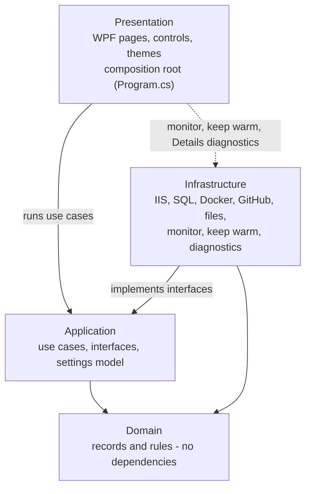
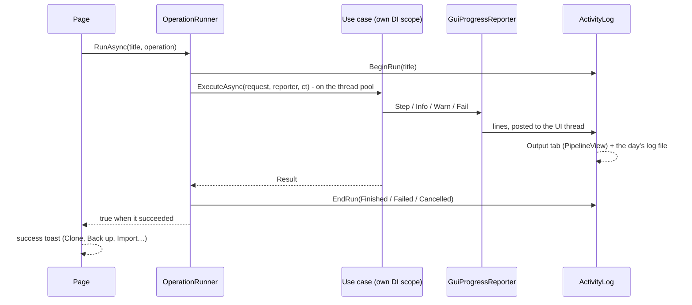
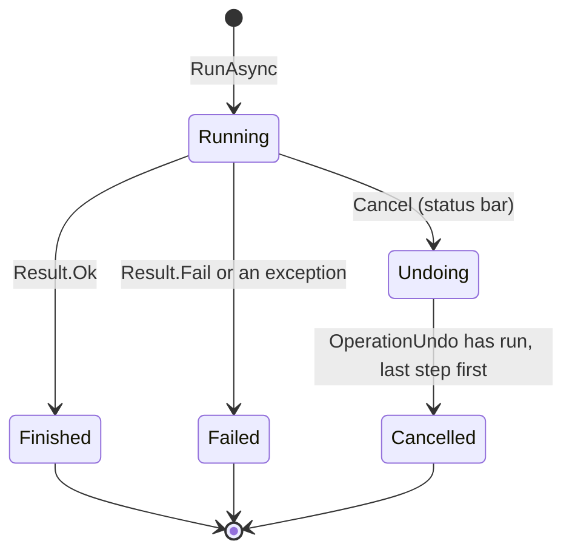
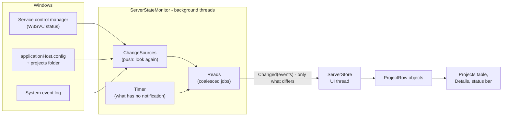

# Architecture

How DNN Manager is built: its layers, how an operation runs, how the window
stays current, where the code lives and why it is built this way. To build, run
and debug it, see [development.md](development.md).

**Contents**

- [Layers](#layers)
- [How an operation runs](#how-an-operation-runs)
- [Live updates](#live-updates)
- [Project layout](#project-layout)
- [Key design decisions](#key-design-decisions)
- [Control styles](#control-styles)
- [Component map](#component-map)

## Layers

One project (`DnnManager.csproj`), four layers as folders and namespaces under
`src/`. Each layer may use the ones below it:



- **Domain** has no references at all. **Application** references neither WPF
  nor Infrastructure - its use cases see IIS, SQL Server, files and the user
  only through interfaces (`IIisManager`, `IDatabaseProvisioner`,
  `IUserPrompt`, `IProgressReporter`…), which is what lets the tests run them
  with stand-ins.
- **Infrastructure** implements those interfaces; it is registered in
  `Infrastructure/DependencyInjection.cs`.
- **Presentation** runs use cases through `OperationRunner`, and uses three
  Infrastructure parts directly (the dotted arrow), because a use case would
  only pass them through: the live monitor (`ServerStateMonitor`), keep warm
  (`KeepWarmService`) and what a site's Details read (`Infrastructure/Diagnostics`).
- Nothing enforces this in the build - keep to it when adding code.

## How an operation runs


Everything that changes the system - New project, Clone, Remove, Back up, Set up
IIS… - is a use case run by
[`OperationRunner`](../src/DnnManager.Presentation/Services/OperationRunner.cs):
one at a time, on the thread pool, in a DI scope of its own.



- A use case **asks** the user through `IUserPrompt` (a dialog on the UI
  thread) and **reports** through `IProgressReporter`; it never touches WPF.
- A failure becomes a toast with **Show output** (`OperationRunner.Failed`); the
  steps that led to it are in the Output tab and the log file.
- A second operation while one runs is refused with a message.

An operation that is cancelled is **undone**: before each step a use case notes
how to take back what it is about to make in the scope's
[`OperationUndo`](../src/DnnManager.Application/UseCases/OperationUndo.cs), and
what can't be taken back (a dropped database) is noted as such.



## Live updates

The Projects table, the IIS indicator and the status bar's figures show one
shared state that keeps itself current, the way Docker Desktop follows its
engine: take a snapshot, follow the changes as they happen, and reconcile now
and then, because a notification can be missed.

- [`ServerStateMonitor`](../src/DnnManager.Infrastructure/Monitoring/ServerStateMonitor.cs)
  (background threads) is the only thing that reads the projects, IIS and this
  PC's figures. It keeps what it last read and raises one event with what
  differs: a project added, removed or changed - and which part of it: site,
  worker figures, database, size… -, IIS's state, the PC's figures, the
  connection.
- [`ServerStore`](../src/DnnManager.Presentation/Services/ServerStore.cs) (UI
  thread) applies that to the row objects the table is bound to. A row is never
  made again while its project exists, and only the properties of the changed
  part are announced - so one site stopping redraws that row's state, and the
  check boxes, search, sorting, scroll position and open details are not
  touched. It also runs the rows' actions: the row says *Starting…* at once,
  the use case runs, the sites are read again and the row shows what IIS
  reports - the new state, or the old one and a toast when it failed.
- Both are in one process, so the "connection" between them is a .NET event
  handed to the UI thread - no IPC, no WebSocket, no timer in the UI.



A notification never carries the new state - it only makes the monitor read
again, so the reads are the single source of truth.

Windows tells the monitor when to look
([`ChangeSources.cs`](../src/DnnManager.Infrastructure/Monitoring/ChangeSources.cs));
what Windows has no notification for is read on a timer, each at its own pace:

| What | How it is noticed |
|---|---|
| IIS started or stopped | Pushed: the service control manager reports the web service's status. |
| A site or app pool added, removed, started or stopped | Pushed: `applicationHost.config` being written, and what IIS writes to the System event log. Reconciled every 5 s (30 s while Projects isn't on screen) - IIS has no notification for a site's running state. |
| A worker process started or ended | The set of `w3wp` processes, every 2 s ¹ - a change reads the sites again. |
| A folder in the projects folder made, removed or renamed | Pushed: the projects folder is watched - the sites' folders are read again (DNN version, database). |
| What a site's folder holds (DNN version, web.config database) | When the site turns up or serves another folder, and every 30 s ¹. |
| Worker-process CPU, memory and disk I/O | Every 2 s ¹. |
| HTTP traffic per site | Every 5 s ¹, and only while that column is shown. |
| The SQL Server and its databases | Every 10 s ¹. |
| Each project's database (`web.config`) and DNN version | Every 30 s ¹, and after an operation. |
| Folder sizes | Only while the table's *Size* column is shown: every 10 min ¹, and after an operation (one that ends while the window is minimized: once it is restored ²). A site's Details measure that site's folder when they open. |
| This PC's memory and CPU; its disk | Every 2 s; every 10 s - not while the window is minimized ². |
| The PC woke up | Pushed (power event) - or a timer tick that comes half a minute late. Everything is read again. |

¹ Only while the Projects page is on screen and the window isn't minimized;
showing it again reads everything once, at once.
² With **Save resources while the window can't be seen** on (the default) - see
[Efficiency mode](user-guide.md#efficiency-mode-while-the-window-cant-be-seen).

A notification only says "look again" - the monitor then reads the real state,
so a missed or doubled one does no harm. The intervals are counted from when a
read was last asked for or finished, on a clock that doesn't follow the PC's
date and time. What can't be read (IIS's configuration, the projects folder)
is kept as it was and shown as *Reconnecting…*; it is tried again every 5 s,
and a source that stopped notifying is attached again the same way. An IIS
that doesn't answer at all isn't waited for longer than 15 s. The only loading
state is the first snapshot.

## Project layout

One `.csproj` at the root; the source is organised by layer under `src/` and
compiled into a single assembly (`DnnManager.exe`).

```
DnnManager.NET/
├── DnnManager.csproj            ← single project (net10.0-windows, WPF WinExe)
├── app.manifest                 ← asInvoker; AdminElevation relaunches elevated
├── tests/
│   └── DnnManager.IntegrationTests/  ← MSTest: fast unit tests, and the automatic DNN setup end to end (IIS Express, LocalDB, Docker) - see testing.md
└── src/
    ├── DnnManager.Domain/
    │   ├── Models.cs            ← DnnProject, DnnRelease, DatabaseConfig, …
    │   ├── ProjectName.cs       ← project name validation
    │   └── Result.cs            ← Result / Result<T> (no exceptions across layers)
    ├── DnnManager.Application/
    │   ├── Abstractions/        ← all interfaces consumed by use cases
    │   ├── Configuration/       ← UserSettings (settings.json, defaults, validation), AppOptions
    │   ├── UseCases/            ← one class per top-level action
    │   └── DependencyInjection.cs
    ├── DnnManager.Infrastructure/
    │   ├── Iis/                 ← IIS via Microsoft.Web.Administration
    │   ├── Docker/              ← docker-compose.yml for the shared SQL container, from the settings, and running it
    │   ├── Sql/                 ← sqlcmd in the container, remote backup, SqlPackage, connection test; DatabaseProvisioner (Test connection, create, the site's login), LocalDB files, connection strings
    │   ├── Dnn/                 ← DNN's unattended install (Install.aspx), its template and output, the host password's hash
    │   ├── Github/              ← GitHub API + DNN package downloader
    │   ├── Settings/            ← AppDataPaths (Documents\DnnManager), SettingsStore, SettingsMigrations, WindowsCredentialStore
    │   ├── Files/               ← file copy, site .zip import / export, daily log file
    │   ├── Projects/            ← file-system project repository; ProjectRecords (how each project was installed)
    │   ├── Prereq/              ← IIS feature checks
    │   ├── WebConfigs/          ← web.config SiteSqlServer read / write
    │   ├── Processes/           ← shared ProcessRunner; the app's own power throttling (EcoQoS)
    │   ├── Terminal/            ← a shell in a Windows pseudo console (ConPTY)
    │   ├── Startup/             ← the "start at sign-in" scheduled task
    │   ├── Monitoring/          ← ServerStateMonitor: the live state of the projects, IIS and this PC - what tells it to look (ChangeSources) and what it measures with
    │   ├── KeepWarm/            ← KeepWarmService (one loop, a channel of messages) with its rules, plan and requester
    │   ├── Diagnostics/         ← what a site's Details show: web.config, folders and permissions, bin assemblies, its database, this PC
    │   ├── SiteLogs/            ← a site's logs (DNN, IIS, event logs) and following one as it is written
    │   └── DependencyInjection.cs
    ├── DnnManager.Installer/    ← not compiled into the app
    │   ├── DnnManager.iss       ← Inno Setup script (per-user install, shortcuts, uninstall)
    │   ├── build.ps1            ← publish + compile the installer
    │   └── bin/                 ← build files (published app, wizard images, Inno Setup) - not in git
    └── DnnManager.Presentation/
        ├── Program.cs           ← composition root (settings + Host + DI, logging to the daily log file), starts WPF
        ├── AdminElevation.cs    ← relaunches elevated when needed
        ├── AppRestart.cs        ← Troubleshoot → Restart, and restarting after a reset
        ├── Shell.cs             ← opens an address, folder or file through Explorer - as the user, not as Administrator
        ├── RunningMarker.cs     ← named mutex while the app runs - the installer checks it before replacing the app
        ├── SingleInstance.cs    ← a second start hands over to the running app, which shows its window
        ├── App.xaml             ← merges the palette, tokens and control styles; the sidebar's own styles
        ├── MainWindow.xaml      ← sidebar navigation + page host + activity log + status bar
        ├── Pages/               ← one page per sidebar item, plus Settings and Troubleshoot (whole-window pages); AboutInfo (Settings → About)
        │   └── Projects/        ← the Projects table's row, columns and right-click menu; a site's Details (ProjectView, ProjectDiagnostics, Inspector)
        ├── Assets/              ← dnn.ico - the exe and window icon (DNN logo mark)
        ├── Controls/            ← StatusBar, IisStatus, TerminalPanel (Output / Logs / Terminal), PipelineView + PipelineLog (the Output tab), LogView, LogsView, PanelSearch, ToastView, InputDialog, MessageDialog, ExistingFolderOptions, PasswordInput, DatabaseCheckList, HostPasswordDialog; DockerCard, DatabaseServerCard, IisCard (Settings' Test and set up cards)
        ├── Terminal/            ← the terminal itself: screen buffer + VT parser, the view that draws it, the shell session
        ├── Themes/              ← LightTheme / DarkTheme colour palettes, Tokens (radii, heights, padding)
        │   └── Controls/        ← the reusable control styles, one dictionary per kind (see Control styles)
        └── Services/            ← ActivityLog + OutputModel (the Output tab's runs, stages and lines), OperationRunner, ServerStore, EfficiencyMode + WindowOcclusion, LiveSettings, DnnReleaseCatalog, TerminalService, ThemeManager, Toast, IdeLocator, SsmsConnectDialog, SettingsStartup, ByteSize, GUI adapters
```

## Key design decisions

| Decision | Why |
|---|---|
| **Clean Architecture (single project, layered folders)** | Use cases are testable without IIS/Docker; the UI was swapped from a terminal UI to WPF without touching business logic. The layers are a convention (folders and namespaces) - nothing in the build enforces them. Keep Domain and Application free of WPF and of Infrastructure (they are today). Presentation uses Infrastructure directly where a use case would only pass things through: the live monitor (`ServerStateMonitor`), keep warm and the Details diagnostics. |
| **All side-effects behind interfaces** | `IIisManager`, `ISqlServerService`, `IDnnReleaseService`, `IPrerequisiteChecker`, `IWebConfigService`, `ISqlConnectionTester`, `IUserPrompt`, `IProgressReporter`, … Easy to mock in tests. |
| **`Result` / `Result<T>` instead of exceptions across layers** | Use-case outcomes are explicit; unexpected exceptions are still logged and surfaced centrally. |
| **`Microsoft.Extensions.Hosting` + `IOptions<AppOptions>`** | Standard DI, and `ILogger` for the app's own warnings and errors: they go to the daily log file with their stack trace ([`DailyLogFileLoggerProvider`](../src/DnnManager.Infrastructure/Files/DailyLogFileLogger.cs) - Warning and up; the same message at most once in 10 minutes, so a failing background read doesn't fill the file). What the *user* reads goes through `IProgressReporter` (the Output tab and the same file) and toasts or dialogs - never a stack trace. `AppOptions` is made from `settings.json` at startup, with `DNNMANAGER_*` env vars on top. There is one instance, shared: saving on the Settings page puts the new values into it (`LiveSettings`), so they apply without a restart; what caches something made from a setting follows its `Changed` event. |
| **Program and user data apart** | The installer owns the install folder; the app owns `Documents\DnnManager`. `settings.json` is versioned: `SettingsStore` backs it up and runs `SettingsMigrations` when its format is older, and fills in new keys from `UserSettings`' defaults. |
| **WPF, code-behind pages** | One `UserControl` per sidebar item, made on its first visit and kept, so its lists load once (Settings is made anew each time). |
| **Live state instead of Refresh** | One monitor reads the system and one store holds what the window shows. Windows' own notifications say when to look; timers cover what has none. See [Live updates](#live-updates). |
| **Use cases off the UI thread** | `OperationRunner` runs one use case at a time on the thread pool in its own DI scope, refuses a second one while it runs, and backs the status bar's **Cancel** button. A cancelled operation is undone through the scope's [`OperationUndo`](../src/DnnManager.Application/UseCases/OperationUndo.cs): each step notes how to take back what it is about to make, before it starts. |
| **Adapters for GUI → app layer** | `GuiProgressReporter` (writes to the activity log) and `GuiUserPrompt` (modal dialogs) implement application interfaces, so use cases never know what drives them. |
| **Runtime theming** | Colours live in `LightTheme` / `DarkTheme`; everything references them with `DynamicResource`, and `ThemeManager` swaps the dictionary (and the title bar's dark mode) live. |
| **Reusable control styles** | Every control's look is a style in `Themes/Controls`, not set per page: a plain `<TextBox />` or `<Button />` is already styled, and sizes come from `Tokens.xaml`, so all controls stay alike. See [Control styles](#control-styles). |
| **SQL** | The local container is checked by logging in with `Microsoft.Data.SqlClient` and driven with `sqlcmd` via `docker exec`; remote / Azure SQL uses `Microsoft.Data.SqlClient` and SqlPackage (`.bacpac`). |
| **Centralised error handling** | `OperationRunner` catches per-action exceptions and reports them in the activity log; `App` shows anything escaping a click handler; `Program.cs` catches fatal errors. |
| **Admin enforcement** | `AdminElevation` relaunches the app elevated (UAC prompt) when it isn't. |
| **No hardcoded values** | Container name, SA password, port, GitHub APIs, IIS feature list, hostname suffix, base directory, theme - all in `settings.json`. |

## Control styles

The app's controls are styled in one place, so every page looks the same and a
new page needs no styling of its own. [`App.xaml`](../src/DnnManager.Presentation/App.xaml)
merges, in order: the colour palette (`LightTheme` / `DarkTheme`),
[`Tokens.xaml`](../src/DnnManager.Presentation/Themes/Tokens.xaml) and the control
dictionaries in [`Themes/Controls/`](../src/DnnManager.Presentation/Themes/Controls/).

| Dictionary | Default look for | Keyed variants (`Style="{StaticResource …}"`) |
|---|---|---|
| `ButtonStyles` | `Button` | `Primary`, `Danger`, `IconButton`, `IconToggleButton`, `LinkButton`, `ExpandToggle` |
| `InputStyles` | `TextBox`, `PasswordBox`, `ComboBox` (select) | `SearchBox` (magnifier, `Tag` as placeholder, ✕ to clear) |
| `SelectionStyles` | `CheckBox`, `RadioButton` | `ToggleSwitch`, `TableCheckBox` |
| `MenuStyles` | `ToolTip`, `ContextMenu`, `MenuItem`, menu separators | - |
| `ListStyles` | `ListBox`, `ScrollBar`, `DataGrid` | - |
| `LayoutStyles` | - | `PageTitle`, `PageSubtitle`, `CardTitle`, `FieldLabel`, `Hint`, `ErrorLine`, `Card`, `InfoBanner`, `WarnBanner` |

`Tokens.xaml` holds what the styles share: `ControlRadius` (4 - buttons,
inputs, selects, menus), `SmallRadius` (3 - check boxes), `CardRadius` (6),
`ControlHeight` (30 - buttons, inputs and selects line up side by side) and
`InputPadding`. Change a token and every control using it follows. Colours are
never set in a style directly - always a palette key with `DynamicResource`, so
the theme switch repaints them.

## Component map

| Area | C# location |
|---|---|
| Main window / navigation / activity log | [`MainWindow.xaml`](../src/DnnManager.Presentation/MainWindow.xaml) |
| Status bar (IIS, resources, running operation, version) | [`Controls/StatusBar.xaml`](../src/DnnManager.Presentation/Controls/StatusBar.xaml.cs), [`Controls/IisStatus.xaml`](../src/DnnManager.Presentation/Controls/IisStatus.xaml.cs), [`UseCases/IisServerUseCase.cs`](../src/DnnManager.Application/UseCases/IisServerUseCase.cs), [`Services/ServerStore.cs`](../src/DnnManager.Presentation/Services/ServerStore.cs), [`Monitoring/HostResourceMonitor.cs`](../src/DnnManager.Infrastructure/Monitoring/HostResourceMonitor.cs) |
| Live state of the projects, IIS and this PC (no Refresh) | [`Monitoring/ServerStateMonitor.cs`](../src/DnnManager.Infrastructure/Monitoring/ServerStateMonitor.cs), [`Monitoring/ChangeSources.cs`](../src/DnnManager.Infrastructure/Monitoring/ChangeSources.cs), [`Monitoring/MonitorModel.cs`](../src/DnnManager.Infrastructure/Monitoring/MonitorModel.cs), [`Services/ServerStore.cs`](../src/DnnManager.Presentation/Services/ServerStore.cs) |
| Projects table, site Details (detected state: [`Pages/Projects/ProjectDiagnostics.cs`](../src/DnnManager.Presentation/Pages/Projects/ProjectDiagnostics.cs), [`Inspector.cs`](../src/DnnManager.Presentation/Pages/Projects/Inspector.cs), [`Infrastructure/Diagnostics/`](../src/DnnManager.Infrastructure/Diagnostics/)), start / stop / restart, remove, export | [`ProjectsPage`](../src/DnnManager.Presentation/Pages/ProjectsPage.xaml.cs), [`Pages/Projects/ProjectView`](../src/DnnManager.Presentation/Pages/Projects/ProjectView.xaml.cs), [`Pages/Projects/`](../src/DnnManager.Presentation/Pages/Projects/), [`Services/ServerStore.cs`](../src/DnnManager.Presentation/Services/ServerStore.cs), [`Monitoring/ProcessSampler.cs`](../src/DnnManager.Infrastructure/Monitoring/ProcessSampler.cs), [`UseCases/ControlSitesUseCase.cs`](../src/DnnManager.Application/UseCases/ControlSitesUseCase.cs), [`UseCases/RemoveProjectUseCase.cs`](../src/DnnManager.Application/UseCases/RemoveProjectUseCase.cs), [`UseCases/ExportProjectUseCase.cs`](../src/DnnManager.Application/UseCases/ExportProjectUseCase.cs) |
| New project | [`SetupPage`](../src/DnnManager.Presentation/Pages/SetupPage.xaml.cs) + [`UseCases/SetupProjectUseCase.cs`](../src/DnnManager.Application/UseCases/SetupProjectUseCase.cs), [`UseCases/ImportProjectUseCase.cs`](../src/DnnManager.Application/UseCases/ImportProjectUseCase.cs) |
| Automatic DNN setup (DNN's install, its output, the host account and password) | [`Dnn/DnnInstaller.cs`](../src/DnnManager.Infrastructure/Dnn/DnnInstaller.cs), [`Dnn/DnnInstallTemplate.cs`](../src/DnnManager.Infrastructure/Dnn/DnnInstallTemplate.cs), [`Dnn/DnnInstallOutput.cs`](../src/DnnManager.Infrastructure/Dnn/DnnInstallOutput.cs), [`Dnn/MembershipPasswords.cs`](../src/DnnManager.Infrastructure/Dnn/MembershipPasswords.cs), [`Abstractions/DnnInstall.cs`](../src/DnnManager.Application/Abstractions/DnnInstall.cs), [`UseCases/ChangeHostPasswordUseCase.cs`](../src/DnnManager.Application/UseCases/ChangeHostPasswordUseCase.cs), [`Controls/HostPasswordDialog.xaml`](../src/DnnManager.Presentation/Controls/HostPasswordDialog.xaml.cs) |
| Databases: Test connection, create, the site's login, LocalDB files | [`Sql/DatabaseProvisioner.cs`](../src/DnnManager.Infrastructure/Sql/DatabaseProvisioner.cs), [`Sql/LocalDbFiles.cs`](../src/DnnManager.Infrastructure/Sql/LocalDbFiles.cs), [`Sql/ConnectionStrings.cs`](../src/DnnManager.Infrastructure/Sql/ConnectionStrings.cs), [`Abstractions/Databases.cs`](../src/DnnManager.Application/Abstractions/Databases.cs), [`Controls/DatabaseCheckList.xaml`](../src/DnnManager.Presentation/Controls/DatabaseCheckList.xaml.cs) |
| Passwords in the Windows Credential Manager; how each project was installed | [`Settings/WindowsCredentialStore.cs`](../src/DnnManager.Infrastructure/Settings/WindowsCredentialStore.cs), [`Projects/ProjectRecords.cs`](../src/DnnManager.Infrastructure/Projects/ProjectRecords.cs) |
| Tests | [`tests/DnnManager.IntegrationTests/`](../tests/DnnManager.IntegrationTests/) |
| Host project (IIS / DB) | [`ExistingFolderPage`](../src/DnnManager.Presentation/Pages/ExistingFolderPage.xaml.cs) + [`UseCases/HostExistingProjectUseCase.cs`](../src/DnnManager.Application/UseCases/HostExistingProjectUseCase.cs) |
| Shared IIS site / SQL container steps | [`UseCases/Provisioning.cs`](../src/DnnManager.Application/UseCases/Provisioning.cs) |
| Clone a project | [`ProjectMenu`](../src/DnnManager.Presentation/Pages/Projects/ProjectMenu.cs) (**Clone…**) + [`UseCases/CloneProjectUseCase.cs`](../src/DnnManager.Application/UseCases/CloneProjectUseCase.cs) |
| SQL connection test | [`Sql/SqlConnectionTester.cs`](../src/DnnManager.Infrastructure/Sql/SqlConnectionTester.cs) |
| Projects right-click menu / IDE detection | [`Pages/Projects/ProjectMenu.cs`](../src/DnnManager.Presentation/Pages/Projects/ProjectMenu.cs), [`Services/IdeLocator.cs`](../src/DnnManager.Presentation/Services/IdeLocator.cs) |
| Test and set up (Docker, database server, IIS features) | [`DockerCard`](../src/DnnManager.Presentation/Controls/DockerCard.xaml.cs), [`DatabaseServerCard`](../src/DnnManager.Presentation/Controls/DatabaseServerCard.xaml.cs), [`IisCard`](../src/DnnManager.Presentation/Controls/IisCard.xaml.cs) + [`Prereq/WindowsPrerequisiteChecker.cs`](../src/DnnManager.Infrastructure/Prereq/WindowsPrerequisiteChecker.cs) (checks and enables the IIS features - **Set up IIS**) |
| Settings page (Save applies at once) | [`SettingsPage`](../src/DnnManager.Presentation/Pages/SettingsPage.xaml.cs), [`Services/LiveSettings.cs`](../src/DnnManager.Presentation/Services/LiveSettings.cs), [`Configuration/AppOptions.cs`](../src/DnnManager.Application/Configuration/AppOptions.cs) |
| settings.json: format, defaults, validation | [`Configuration/UserSettings.cs`](../src/DnnManager.Application/Configuration/UserSettings.cs) |
| settings.json: load, save, backups, migrations | [`Settings/SettingsStore.cs`](../src/DnnManager.Infrastructure/Settings/SettingsStore.cs), [`Settings/SettingsMigrations.cs`](../src/DnnManager.Infrastructure/Settings/SettingsMigrations.cs), [`Settings/AppDataPaths.cs`](../src/DnnManager.Infrastructure/Settings/AppDataPaths.cs) |
| Settings error dialog at startup | [`Services/SettingsStartup.cs`](../src/DnnManager.Presentation/Services/SettingsStartup.cs) |
| Installer | [`src/DnnManager.Installer/DnnManager.iss`](../src/DnnManager.Installer/DnnManager.iss), [`src/DnnManager.Installer/build.ps1`](../src/DnnManager.Installer/build.ps1) |
| Bottom panel (Output, Logs, Terminal; search) | [`Controls/TerminalPanel.xaml`](../src/DnnManager.Presentation/Controls/TerminalPanel.xaml.cs), [`Terminal/`](../src/DnnManager.Presentation/Terminal/) (`TerminalBuffer`, `TerminalView`, `TerminalSession`), [`Services/TerminalService.cs`](../src/DnnManager.Presentation/Services/TerminalService.cs), [`Terminal/PseudoConsole.cs`](../src/DnnManager.Infrastructure/Terminal/PseudoConsole.cs) |
| Keep warm (the flame) | [`KeepWarm/KeepWarmService.cs`](../src/DnnManager.Infrastructure/KeepWarm/KeepWarmService.cs), [`KeepWarm/KeepWarmRules.cs`](../src/DnnManager.Infrastructure/KeepWarm/KeepWarmRules.cs) (why sites go cold, the numbers), [`KeepWarm/KeepWarmPlan.cs`](../src/DnnManager.Infrastructure/KeepWarm/KeepWarmPlan.cs), [`KeepWarm/KeepWarmRequester.cs`](../src/DnnManager.Infrastructure/KeepWarm/KeepWarmRequester.cs), [`Projects/KeepWarmRecords.cs`](../src/DnnManager.Infrastructure/Projects/KeepWarmRecords.cs), [`Services/ServerStore.cs`](../src/DnnManager.Presentation/Services/ServerStore.cs) |
| Site tools: clear cache, the Logs tab | [`UseCases/ClearSiteCacheUseCase.cs`](../src/DnnManager.Application/UseCases/ClearSiteCacheUseCase.cs), [`SiteLogs/SiteLogs.cs`](../src/DnnManager.Infrastructure/SiteLogs/SiteLogs.cs), [`Controls/LogsView.xaml`](../src/DnnManager.Presentation/Controls/LogsView.xaml.cs), [`Controls/PanelSearch.cs`](../src/DnnManager.Presentation/Controls/PanelSearch.cs) |
| Start at sign-in | [`Startup/StartupTask.cs`](../src/DnnManager.Infrastructure/Startup/StartupTask.cs) |
| Efficiency mode while out of sight | [`Services/WindowOcclusion.cs`](../src/DnnManager.Presentation/Services/WindowOcclusion.cs), [`Services/EfficiencyMode.cs`](../src/DnnManager.Presentation/Services/EfficiencyMode.cs), [`Processes/PowerThrottling.cs`](../src/DnnManager.Infrastructure/Processes/PowerThrottling.cs) (EcoQoS) |
| Themes | [`Themes/`](../src/DnnManager.Presentation/Themes/), [`Services/ThemeManager.cs`](../src/DnnManager.Presentation/Services/ThemeManager.cs) |
| Control styles (buttons, inputs, selects, switches…) | [`Themes/Controls/`](../src/DnnManager.Presentation/Themes/Controls/), [`Themes/Tokens.xaml`](../src/DnnManager.Presentation/Themes/Tokens.xaml) |
| File copy, zip extract / create | [`Files/ProjectFileCopier.cs`](../src/DnnManager.Infrastructure/Files/ProjectFileCopier.cs) |
| GitHub release lookup (releases and pre-releases, the latest release by default) | [`Github/GitHubDnnReleaseService.cs`](../src/DnnManager.Infrastructure/Github/GitHubDnnReleaseService.cs), [`Services/DnnReleaseCatalog.cs`](../src/DnnManager.Presentation/Services/DnnReleaseCatalog.cs) |
| IIS helpers | [`Iis/IisManager.cs`](../src/DnnManager.Infrastructure/Iis/IisManager.cs) |
| sqlcmd | [`Sql/SqlServerService.cs`](../src/DnnManager.Infrastructure/Sql/SqlServerService.cs) |
| Shared SQL container | `docker-compose.yml` made from the settings by [`Docker/DockerComposeService.cs`](../src/DnnManager.Infrastructure/Docker/DockerComposeService.cs) and run by [`UseCases/SetupSqlContainerUseCase.cs`](../src/DnnManager.Application/UseCases/SetupSqlContainerUseCase.cs) (Settings → Docker container → Set up docker-compose); the connection check is `LocalSqlContainer` in [`UseCases/Provisioning.cs`](../src/DnnManager.Application/UseCases/Provisioning.cs) |
