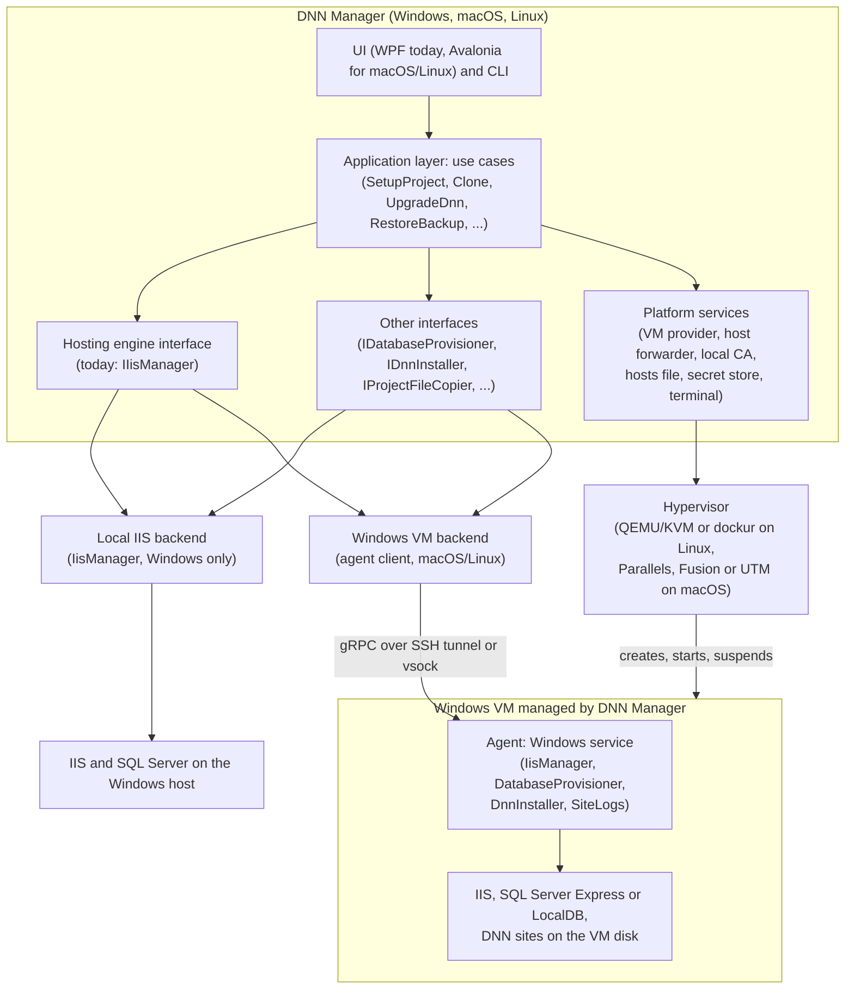
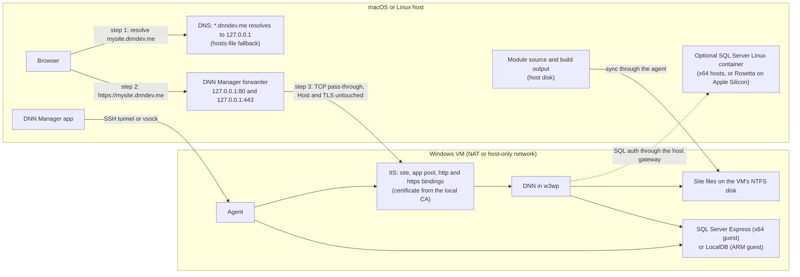
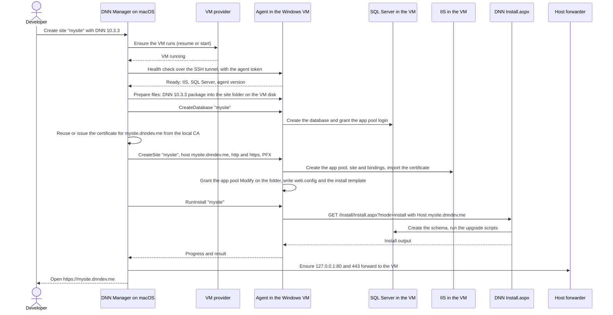
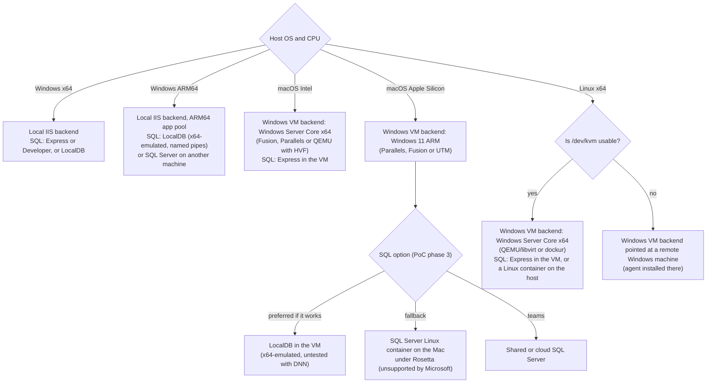

# Hide IIS behind DNN Manager, don't replace it

*Research as of 5 October 2026, for DNN Manager's owner and developers deciding whether and how to build cross-platform
support. Every claim carries one of three evidence levels: **verified** means we observed it in an experiment run for
this research or in this repository; **documented** means a cited source states it; **inferred** means it is our
reasoning and was not tested.*

## Summary

**DNN 10 cannot be hosted natively on macOS or Linux, and no IIS-like hosting engine can change that.** DNN Manager can
still feel native on all three platforms if it keeps IIS and moves it out of sight. DNN 10.3.3 is a .NET Framework 4.8
System.Web application. It refuses to install outside the IIS Integrated Pipeline and reads its install scripts through a
Win32-only file library. We ran it on Linux under Mono with 15 workarounds, including binary patches to Mono and to
`DotNetNuke.dll`, and it never created a database table (verified).

The closest practical design is a **hosting engine** interface with two backends:

- The **Local IIS backend** on Windows is today's `IisManager`, unchanged.
- The **Windows VM backend** on macOS and Linux provisions and runs a headless Windows VM: Windows Server Core on x64
  hosts, Windows 11 ARM on Apple Silicon. DNN Manager installs an **agent** in the VM, built from the same
  `IisManager`, `DatabaseProvisioner` and `DnnInstaller` code. It forwards `127.0.0.1:80/443` into the VM and issues
  certificates from its own name-constrained local CA, so `https://mysite.dnndev.me` works in the host browser.

The core of this design is already proven:

- DNN 10.3.3 runs on IIS in a Windows Server 2022 VM that runs in a container on Linux/KVM, built with no manual
  step: install, home page from the Linux host, host sign-in with the Persona Bar, an extension installed through the
  Persona Bar API, and the site back after a Windows reboot - 7 of 7 steps on GitHub's Ubuntu runner. Locally, on
  Ubuntu in WSL2, everything but the reboot passed: once, the app pool stayed stopped after the reboot until the next
  boot. DNN answered 6-8 minutes after Windows was up.
- One rule surfaced on the way: the port the browser uses must be the port IIS listens on inside the VM. With the
  host's 8080 forwarded to the guest's 80, every page failed (section 10).
- A TLS proxy on the host added no latency we could measure.
- A DNN module built on Linux with the plain .NET SDK.

Docker alone is not enough, because Windows containers need a Windows kernel and Windows Pro or Enterprise. Docker
remains useful for SQL Server on x64 hosts.

Four problems remain:

- SQL Server on Apple Silicon. The only options are Rosetta containers that Microsoft does not support, or LocalDB
  running under x64 emulation in Windows 11 ARM.
- Porting the WPF UI, which has 43 XAML files.
- Debugging .NET Framework code from macOS or Linux. Rider support for this is unconfirmed.
- Licensing Windows for a VM that is built automatically.

## What was tested

Local runs used Windows 11 Home 10.0.26300 with 24 logical CPUs (AMD), 61.4 GB RAM, Docker Desktop 29.8.0 (Linux engine
on WSL2, containerd store) and .NET SDK 10.0.401. IIS was running, with a DNN site that DNN Manager manages at
`http://test.dnndev.me/`. All runs, on GitHub Actions and locally, took place on 2026-10-05.

| # | Experiment | Where | Result | Evidence |
|---|---|---|---|---|
| 1 | DNN on IIS plus SQL Server Express, both in Windows containers | GitHub Actions `windows-2022` (Server 2022 Datacenter, 4 vCPU, 16 GB, process isolation), runs 3-6 | Images built in 405-440 s (`dnn` 6.73 GB, `sqlexpress` 6.29-6.32 GB). Both containers started in 13-14 s and the site answered on `:8080`. **DNN's unattended install fails**: "Could not connect to database specified in connectionString for SqlDataProvider" (open, see below). File change notification on a bind-mounted host folder: **pass** (17-18 s). | [test-results/windows-2022/results.md](test-results/windows-2022/results.md), [Dockerfile](Dockerfile), [sql/Dockerfile](sql/Dockerfile), [docker-compose.yml](docker-compose.yml), [scripts/test.ps1](scripts/test.ps1), [../../.github/workflows/docker-dnn-experiment.yml](../../.github/workflows/docker-dnn-experiment.yml) |
| 2 | A Windows image on a Linux Docker engine | GitHub Actions `ubuntu-latest` (Ubuntu 24.04, Docker 28.0.4) | Refused, both with and without `--platform windows/amd64` | [test-results/ubuntu/results.md](test-results/ubuntu/results.md), [scripts/test-linux.ps1](scripts/test-linux.ps1) |
| 3 | SQL Server 2022 in a Linux container | same runner | Works. Ready in 20 s (16.0.4295.3, CU27). `/dev/kvm` is present on the runner. | [test-results/ubuntu/results.md](test-results/ubuntu/results.md) |
| 4 | A Windows Server 2022 VM in a container (`dockurr/windows`, QEMU/KVM), provisioned with IIS, SQL Server Express and DNN | GitHub Actions `ubuntu-latest` with KVM (4 CPU, 15.6 GB; guest 4 vCPU, 8 GB), runs 1-8 | **Run 8 (`dd6b416`): 7 of 7 steps pass.** Windows answered after 6.1 min (5.4-7.1 min over 8 runs). IIS with ASP.NET 4.8: 45-65 s. SQL Server 2022 Express up at 251-378 s. DNN's `Install.aspx?mode=install`: schema 10.00.00 and every upgrade script through 10.03.03 "Success", 41-72 s. First visit from inside the VM: HTTP 200 at 490 s. Home page from the Linux host: 200 (21.6 s, first compile). Host sign-in with the Persona Bar. Google sign-in provider installed through the Persona Bar API (package 149). Windows reboot: site back after 3 min. Runs 1-7 failed on script bugs, and runs 3-7 on the port rule in section 10: the host's 8080 went to the guest's 80, DNN found no portal for `localhost` and every page threw in `PortalSettingsController.ConfigureActiveTab`. | [test-results/ubuntu-vm/results.md](test-results/ubuntu-vm/results.md), [test-results/ubuntu-vm/install-output.html](test-results/ubuntu-vm/install-output.html), [test-results/ubuntu-vm/provisioning-status.txt](test-results/ubuntu-vm/provisioning-status.txt), [vm/docker-compose.yml](vm/docker-compose.yml), [vm/oem/provision.ps1](vm/oem/provision.ps1), [scripts/test-vm.ps1](scripts/test-vm.ps1), [../../.github/workflows/docker-dnn-vm.yml](../../.github/workflows/docker-dnn-vm.yml) |
| 5 | Windows containers on Windows 11 Home with Docker Desktop | local | Not available. Home lacks the Hyper-V and Containers features. | this report, section 6 |
| 6 | A Windows image on Docker Desktop's Linux engine (containerd store) | local | Pulling `nanoserver:ltsc2022` succeeds (428 MB). Running it fails: "unable to find user ContainerUser". | this report, section 5 |
| 7 | `/dev/kvm` inside Docker Desktop | local | Absent ("no such file or directory"), even though the CPU flag `svm` is visible. `dockur/windows` cannot run under Docker Desktop. | this report, section 5 |
| 8 | Resolving `*.dnndev.me` and `*.localhost` | local | `mysite.dnndev.me` and `anything.else.dnndev.me` resolve to `127.0.0.1` (TTL 3600, no AAAA record). `foo.localhost` resolves to `::1` and `127.0.0.1` on Windows 11. | section 10 |
| 9 | A reverse proxy with a local CA in front of a DNN site on IIS (Caddy) | local | Works. The proxy overhead is too small to measure. Without DNN's SSL offload setting, DNN downgrades links and redirects to http. | section 11, [Appendix A](#appendix-a-proxy-poc) |
| 10 | Building a DNN module (Web Forms control and Web API) on Linux | local, `mcr.microsoft.com/dotnet/sdk:10.0` | `linux/amd64`: build succeeded in 14.5 s. `linux/arm64` (emulated): succeeded in 39 s. | section 14, [Appendix B](#appendix-b-build-poc) |
| 11 | DNN 10.3.3 on Linux under Mono 6.12 and 5.20 | local, Docker Linux engine | **Fails.** The app starts after 8 workarounds. The install wizard renders on Mono 5.20 after 15 workarounds. The install then stops in QuickIO with 0 tables created. Mono's SqlClient against SQL Server 2022 for Linux worked. | section 2, [Appendix C](#appendix-c-mono-poc) |
| 12 | An Ubuntu VM in VMware Workstation 26.0.1 with nested virtualization, on the same Windows 11 host | local | **Refused at power-on**: "Virtualized AMD-V/RVI is not supported on this platform". Windows' hypervisor runs (WSL2, Docker Desktop, VBS), so VMware runs on top of it (monitor mode ULM) without nested virtualization. | section 7 |
| 13 | KVM in WSL2 | local, WSL 2.7.14, kernel 6.18.33.2 | **Works.** The WSL kernel builds KVM as modules; `modprobe kvm_amd` gives `/dev/kvm`, using Hyper-V's nested virtualization. Docker Desktop's distro simply never loads it. | section 5 |
| 14 | The Windows VM experiment on Ubuntu 24.04 in WSL2 (own distro, Docker Engine 29.1.3, KVM loaded at boot) | local, 24 CPUs; guest 4 vCPU, 8 GB | Reproduced the port failure, diagnosed it over SSH into the guest (`Host: localhost:8080` was redirected to `http://localhost/...`), and confirmed the fix: with IIS on 8080, home page and login page 200, host sign-in 1.3 s, from Linux (0.04 s per page) and from the Windows browser through WSL's port forwarding (0.02 s). Then the full `test-vm.ps1` from a fresh Windows install: **6 of 7 steps pass** - Windows ready after 5.3 min, DNN serving at 340 s, home page from the host 200 (12.4 s first compile), host sign-in, extension installed. After the reboot step, IIS answered 503 on both sites for 20 minutes (app pool stopped); one more boot brought everything back in 153 s. Cause not established. | section 10, [test-results/wsl-ubuntu/results.md](test-results/wsl-ubuntu/results.md) |

**State of the Windows-container experiment (row 1): open, and off the recommended path.** DNN's unattended install
fails with "Could not connect to database specified in connectionString for SqlDataProvider", although the container's
own entrypoint connected to the SQL container `sql` with the same credentials and created the database. The log lines
captured so far are a fresh site's usual noise (`System.Web.Http` and the CKEditor provider arrive with the install
packages). The harness now records the connection string DNN has and whether it opens from the container, but the
runs since 18:30 UTC stopped before any step: the `windows-2022` runner's Docker engine did not answer within
2 minutes.

It is not the encryption default of `Microsoft.Data.SqlClient`. The 10.3.3 package ships no
`Microsoft.Data.SqlClient.dll` (its `bin` has PetaPoco on top of the framework's client), and its `web.config` names
`providerName="System.Data.SqlClient"`, the same client the entrypoint used successfully (verified in the release zip).
The VM run, which did install, connected to the local `.\SQLEXPRESS` instance instead of a second container.

DNN's `develop` branch does list `Microsoft.Data.SqlClient` 7.0.3
([Directory.Packages.props](https://github.com/dnnsoftware/Dnn.Platform/blob/develop/Directory.Packages.props)). If a
later release switches to it, its encrypt-by-default behaviour will reject SQL Server Express's self-signed certificate
unless connection strings carry `TrustServerCertificate=True`, as DNN Manager's own connection strings already do
(inferred).

### Running the experiments

The GitHub experiments run on every push to the `experiments/docker-dnn` branch that touches their files, or by hand
(`workflow_dispatch`). Each run commits its results to `test-results/<environment>/`. Passwords are generated per run
and never written to the results.

| Experiment | Workflow | Script | Needs |
|---|---|---|---|
| Windows containers (row 1) | [docker-dnn-experiment.yml](../../.github/workflows/docker-dnn-experiment.yml), job `windows` | `pwsh -File scripts/test.ps1 -Name windows-2022` | A Windows-containers Docker engine: Windows Server 2022, or Windows 10/11 Pro/Enterprise switched to Windows containers |
| Linux checks (rows 2, 3) | the same workflow, job `linux` | `pwsh -File scripts/test-linux.ps1 -Name ubuntu` | Linux with Docker |
| Windows VM on Linux (row 4) | [docker-dnn-vm.yml](../../.github/workflows/docker-dnn-vm.yml) | `pwsh -File scripts/test-vm.ps1 -Name ubuntu-vm -Storage /mnt/dnn-vm` | Linux with `/dev/kvm`, about 64 GB free disk. Not Docker Desktop. |
| Windows VM on Linux, locally on Windows 11 (rows 13-14) | none | the same `test-vm.ps1`, inside the distro | A WSL2 distro of its own (`wsl --import`) with `systemd=true`, Docker Engine (`docker.io`, `docker-compose-v2`), PowerShell 7, and `kvm_amd` or `kvm_intel` in `/etc/modules-load.d/`. Keep one `wsl.exe` session open for the whole run: WSL stops an idle distro, and the VM with it. |

To keep a setup running by hand instead, the usage is in the header comments of [docker-compose.yml](docker-compose.yml)
(Windows containers, `SA_PASSWORD` set first) and [vm/docker-compose.yml](vm/docker-compose.yml) (the VM;
`vm/oem/settings.json` holds the passwords and is written by `scripts/test-vm.ps1`). The local experiments (rows 5-11)
are described in the appendices.

## 1. How DNN depends on IIS and Windows: .NET Framework, System.Web and the Integrated Pipeline

**DNN 10 is a .NET Framework 4.8 System.Web application through and through.**

- **Versions.** Release 10.0.0 (2025-04-09) moved every project from .NET 4.7.2 to 4.8 and raised the SQL Server
  minimum to 2017 ([v10.0.0 release](https://github.com/dnnsoftware/Dnn.Platform/releases/tag/v10.0.0)). The latest
  stable release is 10.3.3 (2026-07-23), and 10.4.0-rc3 came out on 2026-09-30
  ([releases](https://github.com/dnnsoftware/Dnn.Platform/releases)).
- **Frameworks.** One application runs Web Forms, MVC 5.3, Web API 5.3 (System.Web-hosted) and ASP.NET Web Pages 3.3
  side by side
  ([Directory.Packages.props](https://github.com/dnnsoftware/Dnn.Platform/blob/develop/Directory.Packages.props)).
- **No ASP.NET Core version.** The only step away from Web Forms is an opt-in MVC 5 page pipeline. Its settings were
  merged on 2026-09-23 ([PR #7290](https://github.com/dnnsoftware/Dnn.Platform/pull/7290)), and it still runs on
  System.Web.
- **No .NET migration roadmap.** The community has discussed moving DNN to modern .NET as a consultation, with no
  roadmap or date
  ([Migration to .NET Core? Things to Consider](https://dnncommunity.org/blogs/Post/20703/Migration-to-NET-Core-Things-to-Consider)).
  Our estimate is that a cross-platform DNN is more than two years away, if it comes at all (inferred).

The official requirements list Windows 10, Windows 11, Windows Server 2016 or later, or Azure App Service, with "the
Microsoft IIS feature" enabled. They do not mention Linux, containers or ARM
([DNN requirements](https://docs.dnncommunity.org/content/getting-started/setup/requirements/index.html)).

The specific dependencies, read from the `develop` source at commit `6348a192` (documented) and confirmed where noted by
the Mono run (verified):

| Dependency | Where in DNN | What it means |
|---|---|---|
| IIS Integrated Pipeline | All 13 HTTP modules (URL rewriting, membership, services, request filter, output cache and the others) and all 9 handlers are registered **only** under `system.webServer`. `system.web/httpModules` has none ([release.config](https://github.com/dnnsoftware/Dnn.Platform/blob/develop/DNN%20Platform/Website/release.config)). `IISVerificationStep` aborts the install when `HttpRuntime.UsingIntegratedPipeline` is false ([IISVerificationStep.cs](https://github.com/dnnsoftware/Dnn.Platform/blob/develop/DNN%20Platform/Library/Services/Upgrade/Internals/Steps/IISVerificationStep.cs)). | Only IIS-family hosts can run DNN: full IIS, IIS Express and Hostable Web Core. |
| Extensionless URLs | Replaces `ExtensionlessUrl-Integrated-4.0` with `TransferRequestHandler`, and re-adds `UrlRoutingModule-4.0` | `/API/...` routes and friendly URLs rely on IIS's integrated handler mapping. |
| In-process installer | `Install.aspx` runs the install steps inside the site. It rewrites `web.config` (machine key, `fcnMode`, binding redirects), copies DLLs into `bin` and relies on ASP.NET restarting the app domain ([Config.cs](https://github.com/dnnsoftware/Dnn.Platform/blob/develop/DNN%20Platform/Library/Common/Utilities/Config.cs), [Installer.cs](https://github.com/dnnsoftware/Dnn.Platform/blob/develop/DNN%20Platform/Library/Services/Installer/Installer.cs)) | The host process must be able to write to the whole site folder. |
| Folder permissions | Probes by creating and deleting a file. It never reads or sets ACLs ([FileSystemPermissionVerifier.cs](https://github.com/dnnsoftware/Dnn.Platform/blob/develop/DNN%20Platform/Library/Common/Utilities/FileSystemPermissionVerifier.cs)) | The tool must grant the app pool identity Modify rights, as DNN Manager does today. |
| Windows registry | Reads `HKLM\...\NDP\v4\Full\Release` and requires at least 528040 (.NET 4.8). The read has no null check | Throws where there is no Windows registry (verified on Mono). |
| Win32 file I/O | Core file access goes through **SchwabenCode.QuickIO**, which P/Invokes `kernel32`, `advapi32` and `netapi32` ([FileSystemUtils.cs](https://github.com/dnnsoftware/Dnn.Platform/blob/develop/DNN%20Platform/Library/Common/Utilities/FileSystemUtils.cs), [QuickIO](https://github.com/SchwabenCode/QuickIO)). `DotNetNuke.dll` makes 43 distinct QuickIO member references (verified) | A hard blocker anywhere but Windows. |
| Windows path conventions | About 180 backslash path literals in the source. Our binary scan found 622 literals in 358 methods (verified, an upper bound). Some paths are written in lower case although the folders are mixed case (`desktopmodules` against `DesktopModules`) | Breaks on case-sensitive file systems and anywhere `/` is the separator. |
| GDI+ | About 31 files use `System.Drawing`: image handler, thumbnails, captcha | Needs libgdiplus off Windows. |
| ASP.NET internals | Reflects into private System.Web file-change-monitor fields (the failure is caught) ([DotNetNukeShutdownOverload.cs](https://github.com/dnnsoftware/Dnn.Platform/blob/develop/DNN%20Platform/DotNetNuke.Web/Common/DotNetNukeShutdownOverload.cs)) | Soft. It only affects shutdown logging. |
| Runtime compilation | The Roslyn CodeDOM provider runs `bin\roslyn\csc.exe` to compile App_Code, Razor and `.aspx` files | Needs a Windows process launch, which the VM provides. |
| Database | SQL Server only (`SqlDataProvider`), version 2017 or later | See section 12. |
| Scheduler | Runs in process inside `w3wp` | Stops when the app pool idles or recycles. Dev app pools should not idle out. |

DNN core does **not** use the Windows Event Log (DNN's "event log" is a database table), performance counters, DPAPI,
P/Invoke of its own, `Microsoft.Web.Administration`, the IIS URL Rewrite module, Windows authentication (it is commented
out in `release.config`) or Application Initialization (documented, by grep of the source). For hosting, this keeps the
IIS requirement narrow: one site, one Integrated-mode app pool, host-name bindings and a writable folder.

## 2. Blockers for native Linux/macOS hosting: five are structural, and the Mono run hit all of them

A blocker is structural when no amount of configuration removes it. Only a change to DNN or to the runtime does. The
Mono experiment ([Appendix C](#appendix-c-mono-poc)) ran into the blockers in this order, so the table below is verified,
not theoretical.

| Blocker | Structural? | What happened on Mono (verified) |
|---|---|---|
| .NET Framework 4.7.2+ System.Web APIs | Yes | Mono's System.Web stops at about ASP.NET 4.5. Missing pieces: `fcnMode`, `HttpRuntime.WebObjectActivator` (DNN's dependency injection), `HttpContextBase.AddOnRequestCompleted`, `System.Web.DataVisualization`. Eleven DNN controls need constructor injection, which Mono's page compiler cannot do, so `Default.aspx` cannot compile. |
| IIS Integrated Pipeline | Yes | Mono hard-codes `UsingIntegratedPipeline` to `false` and reads modules and handlers only from `system.web` ([Mono HttpRuntime.cs](https://raw.githubusercontent.com/mono/mono/main/mcs/class/System.Web/System.Web/HttpRuntime.cs), [Mono HttpApplication.cs](https://raw.githubusercontent.com/mono/mono/main/mcs/class/System.Web/System.Web/HttpApplication.cs)). None of DNN's modules load, and the installer aborts until the getter is patched to lie. |
| Win32 file I/O (QuickIO) | Yes | The install stopped at "Unable to parse path" when DNN read its first SQL script. Fixing it would mean rewriting QuickIO or patching DNN. |
| Windows path and case assumptions | Yes | `ApplicationMapPath` became `\site` (not a rooted path). A directory literally named `\site` was created, and `Install.aspx` was not found because the file is `install.aspx`. `MONO_IOMAP` was removed in Mono 6. |
| Registry check | Soft | Got past it by faking the value in Mono's file-based registry. |
| Ecosystem | Yes | Every third-party module is compiled against the same .NET Framework System.Web stack (section 14). |

The alternatives to Mono fail for the same root cause, because none of them runs System.Web in Integrated mode off
Windows:

- **Framework Mono.** It now lives at WineHQ. 6.14.1 (May 2025) is the latest tag, and it is a source-only release. The
  `xsp` and `mod_mono` hosts have been archived on GitHub since 2021, and Mono's own compatibility page lists the
  ASP.NET 4.5 async pipeline as "not done" ([Mono compatibility](https://www.mono-project.com/docs/about-mono/compatibility/)).
- **Wine.** Wine's http.sys/HTTPAPI is a partial stub, and installing `dotnet48` into a 64-bit prefix is fragile
  ([WineHQ forum](https://forum.winehq.org/viewtopic.php?t=40891)). Nobody reports running IIS under Wine.
- **Managed ASP.NET hosts** (`ApplicationHost.CreateApplicationHost`, Cassini). These run Classic mode only.
- **Web Forms ports to ASP.NET Core.** [WebFormsForCore](https://github.com/simonegli8/WebFormsForCore) ran the FuseCP
  panel on Linux. [CoreWebForms](https://github.com/CoreWebForms/CoreWebForms), at 0.2.1, excludes the System.Web hosting
  model. Either would mean recompiling DNN and every extension, which is a fork of DNN, not a hosting option.
- **Oqtane.** It shares DNN's data model but runs Blazor modules, so DNN modules do not run on it
  ([Oqtane blog](https://www.oqtane.org/Resources/Blog/PostId/539/migrating-from-dnn-to-oqtane)).
- **History.** No DNN version has a documented successful Mono deployment. The best report, from 2008, called it "one
  hack layered upon another" ([DNN forum](https://www.dnnsoftware.com/forums/threadid/268935/scope/posts/dnn-on-mono)).

## 3. IIS features to emulate: none, because both backends run real IIS

In the recommended design, **nothing in IIS is emulated**. Both backends run the real IIS, so DNN sees exactly what it
sees on a Windows developer's machine today. On macOS and Linux the work moves to the edges around IIS:

- reachability: the host forwarder;
- name resolution: `*.dnndev.me` or the hosts file;
- certificate trust: the local CA;
- file access: sync through the agent.

The table maps each IIS concept to what DNN needs and to how each backend provides it.

| IIS concept | What DNN needs | Local IIS backend (Windows) | Windows VM backend (macOS/Linux) |
|---|---|---|---|
| Site | One IIS site per DNN install. Its physical path is the DNN root. | `IisManager.CreateSite` and `RemoveSite`, as today | The same code, running in the agent. The physical path is a path on the VM's disk that the host never touches directly. |
| App pool | CLR v4.0 in Integrated mode. An identity with Modify rights on the site folder. No idle timeout for dev. A loaded user profile when the database is LocalDB. | `SetPoolSettings`, `EnableUserProfile` and `icacls`, as today | The same, in the agent. On Windows 11 ARM the agent also chooses between a native ARM64 pool and an x64-emulated pool (`enableEmulationOnWinArm64`, see section 14). |
| Binding | A host header equal to the DNN portal alias. DNN keeps the port in the alias, so ports 80 and 443 keep aliases portless. | `http/*:80:mysite.dnndev.me` and `https/*:443:mysite.dnndev.me` with SNI | The same bindings in the VM. The host forwarder passes `127.0.0.1:80/443` through to the VM without touching the Host header. |
| HTTPS certificate | `Request.IsSecureConnection` must be true. Otherwise DNN needs the `SSLOffloadHeader` host setting. | A leaf certificate from DNN Manager's local CA in `LocalMachine\My` | The same PFX, imported by the agent. The root is trusted on the host. TLS ends in IIS (section 11). |
| Integrated-pipeline modules and handlers | Everything in `system.webServer` | IIS | IIS in the VM |
| Request limits | `maxAllowedContentLength` of 28 MB and `maxRequestLength` | `web.config` | `web.config`. A TCP-level forwarder imposes no body limit of its own. |
| File change notification and app domain restart | Changes to `bin`, `web.config` and `App_Code` restart the app | Local NTFS | Site files live on the VM's NTFS disk. Host-side edits arrive through the agent (section 13). |
| Worker process | `w3wp` per app pool, used for recycling and for attaching a debugger | `GetSiteRuntimes` and `RecycleAppPool` | The same, in the agent. It reports the process ID to the host (section 15). |
| Logs | W3C request logs, failed-request tracing, DNN's log4net files, the Event Log | `GetLogDirectory` and `SiteLogs` (local paths) | The agent streams log lines to the host. No VM paths leak to the host. |
| Server control | Start, stop and restart W3SVC | `ControlServerAsync` | The agent handles IIS. DNN Manager's VM provider handles VM start, stop and suspend. |
| SQL identity | The app pool's Windows login, when SQL Server runs in the same Windows | `GrantSiteAccessAsync(connection, IIS APPPOOL\x)` | Windows authentication for SQL Server in the VM. SQL authentication for a container on the host (section 12). |
| Not needed | URL Rewrite, Windows authentication/ADSI, Application Initialization, `httpErrors`, compression | | |

## 4. A custom IIS-like hosting engine: no as a web server, yes as a control surface

"IIS-like hosting engine" can mean two different things, and the answer differs for each.

**An engine that replaces IIS on Linux or macOS is not realistic.** Section 2 explains why: the missing piece is
System.Web in Integrated mode, not a web server.

**An engine that replaces IIS on Windows is possible but buys nothing.** The only hosts that provide the Integrated
Pipeline are IIS itself, IIS Express and Hostable Web Core (`hwebcore.dll`) (documented):

- **Hostable Web Core.**
  - It supports one application pool per process.
  - `WebCoreActivate` can be called only once per process lifetime, so recycling means restarting the process
    ([Microsoft Learn: WebCoreActivate](https://learn.microsoft.com/en-us/iis/web-development-reference/native-code-api-reference/pfn-web-core-activate-function)).
  - Cloud Foundry's [`hwc`](https://github.com/cloudfoundry/hwc) shows that a custom HWC host runs Web Forms, MVC and Web
    API ([HWC buildpack](https://docs.cloudfoundry.org/buildpacks/hwc/index.html)).
  - It still loads IIS's native modules from the system, so it is IIS under another name. It is no more portable than
    IIS.
- **IIS Express.** It has no WAS and keeps its configuration per user
  ([IIS Express overview](https://learn.microsoft.com/en-us/iis/extensions/introduction-to-iis-express/iis-express-overview)).
  It has crashed for Parallels users on Windows 11 ARM
  ([Parallels forum](https://forum.parallels.com/threads/windows-11-arm-visual-studio-iis-express-crash.358771/)).

Full IIS is available even on Windows 11 Home: this research ran on Home, with IIS serving a DNN site managed by DNN
Manager (verified). Building on HWC or IIS Express would add a process manager and a config generator, and remove nothing
DNN needs.

**An IIS-like control surface over real IIS is realistic, and DNN Manager already has one.** `IIisManager` in
[../../src/DnnManager.Application/Abstractions/Interfaces.cs](../../src/DnnManager.Application/Abstractions/Interfaces.cs)
already covers:

- the site, app pool and binding lifecycle;
- start, stop and recycle;
- bindings with certificates;
- app pool settings;
- worker process IDs, traffic and log locations.

In this report, the **hosting engine** is that interface, generalised, with one backend per platform. Section 17 covers
the changes it needs.

## 5. Is Docker sufficient? No, because it cannot run the Windows half

**A Linux Docker engine cannot run Windows containers.** The GitHub Ubuntu runner refused the image outright (verified).
Locally, Docker Desktop's containerd store pulled `nanoserver:ltsc2022` and then failed to run it with "unable to find user
ContainerUser" (verified). The successful pull is misleading: a Windows image needs a Windows kernel.

Docker is still useful in three supporting roles:

- **SQL Server for Linux on x64 hosts** (verified: ready in 20 s; 1.19-1.23 GiB of RAM idle with an empty database).
  DNN Manager already runs a shared SQL Server Linux container through `IDockerComposeService`
  ([../../src/DnnManager.Infrastructure/Docker/DockerComposeService.cs](../../src/DnnManager.Infrastructure/Docker/DockerComposeService.cs),
  compose project `dnn-mssql`). The SQL half of the cross-platform design exists today.
- **Packaging the Windows VM on Linux** with [`dockur/windows`](https://github.com/dockur/windows). This is QEMU/KVM in
  a container, and it handles the ISO download, the unattended install, the virtio drivers and an OEM hook. Our VM run
  used it (verified). Two limits apply:
  - It needs `/dev/kvm`, and Docker Desktop does not expose it. We verified that on Windows. The dockur README documents
    that Docker Desktop on Linux and macOS is unsupported as well. On a Windows 11 machine the same experiment runs in
    an ordinary WSL2 distro with its own Docker Engine: WSL's kernel has KVM as modules and Hyper-V passes nested
    virtualization through (verified, rows 13-14). That is a test bench, not a product path, since Windows users get
    the Local IIS backend.
  - Its defaults (web console on port 8006, a fixed password, ports published on `0.0.0.0`) must be hardened (section 16).
- **Running a proxy**, as the Caddy experiment did. A product would embed the forwarder instead (section 10).

**Docker should therefore be an optional dependency.** DNN Manager needs it only when the user picks the SQL-container
option. The VM backend can drive QEMU/libvirt or a desktop hypervisor directly. Whether the Linux backend wraps dockur or
drives libvirt itself is a decision for PoC phase 1 (inferred).

## 6. Windows containers from macOS/Linux: not possible, and marginal even on Windows

**Windows containers need a Windows host.** Microsoft supports Windows Server 2016 and later, and Windows 10/11 Pro or
Enterprise, as hosts
([Windows container requirements](https://learn.microsoft.com/en-us/virtualization/windowscontainers/deploy-containers/system-requirements)).
Docker Desktop's Windows-containers mode needs Pro or Enterprise
([Docker docs](https://docs.docker.com/desktop/setup/install/windows-install/)). Process isolation requires the container
to match the host's OS build, and Hyper-V isolation does not exist on macOS
([Docker forum](https://forums.docker.com/t/redo-windows-containers-on-macos/70078)).

From a Mac or a Linux machine, the only way to run a Windows container is a Windows VM that runs a container engine. At
that point it is simpler to run IIS in the VM directly. **Windows 11 Home cannot run Windows containers at all**
(verified on the machine used for this research, which is also the project owner's development machine).

On a Windows Server 2022 runner the container experiment worked mechanically, but it was heavy:

- 13 GB of images and a 440 s build.
- Microsoft publishes SQL Server images for Linux only, so SQL Server Express had to be installed into Server Core, as
  Microsoft's retired `mssql-server-windows-express` image used to do.
- The DNN install has not yet succeeded (see [What was tested](#what-was-tested)).
- File change notifications through a bind mount did work (verified).

**Windows containers are not a candidate backend for developers on macOS or Linux.** They could later serve CI on Windows
Server runners, or Windows Pro users who want throwaway sites. Neither is on the critical path.

## 7. A lightweight Windows VM is required on macOS and Linux

**Every working route from macOS or Linux ends in a real Windows instance.** That instance can be a local VM, a remote
machine or a cloud PC. GitHub Codespaces has no Windows option
([GitHub community #9977](https://github.com/orgs/community/discussions/9977)). Microsoft Dev Box stopped taking new
customers on 1 November 2025
([Licensing School](https://www.licensingschool.co.uk/licensing-blog/2025/11/04/dev-box-capabilities-coming-to-windows-365/)).

The VM depends on the host:

| Host | Guest | Hypervisor options | Status |
|---|---|---|---|
| Linux x64 with KVM | Windows Server 2022/2025 evaluation. Server Core is the recommended target; the experiment used dockur's `VERSION: "2022"` image. | QEMU/libvirt directly, or `dockur/windows` | **Verified**: DNN 10.3.3 installed, served, signed in and installed an extension in Server 2022 under dockur, on GitHub's Ubuntu runner and on Ubuntu in WSL2; it survived a reboot on GitHub, and locally after a second boot |
| Linux ARM64 with KVM | Windows 11 ARM only | `dockur/windows-arm` ([README](https://github.com/dockur/windows-arm)) | Documented |
| macOS Intel | Windows Server x64 | VMware Fusion (free, `vmrun`), Parallels, QEMU with HVF, VirtualBox | Documented. A shrinking platform: macOS 26 Tahoe is the last Intel release, with security updates until about autumn 2028 ([MacTech](https://www.mactech.com/2026/06/03/macos-tahoe-will-be-the-last-release-for-intel-based-macs/)). |
| macOS Apple Silicon | **Windows 11 ARM64 only**. Microsoft said on 13 Feb 2026: "Windows Server 2025 is not available for ARM64, and there are currently no plans for that" ([Tech Community](https://techcommunity.microsoft.com/discussions/windowsserverinsiders/windows-server-2025-arm64/4492308)). | See the list below | Documented. DNN has not been tested on Windows 11 ARM. |
| Any host without virtualization | An existing Windows machine | none, because the agent is installed on that machine | Inferred |

A Linux VM inside a Windows desktop hypervisor is no shortcut for testing: on a Windows 11 machine where Windows' own
hypervisor runs (WSL2, Docker Desktop, VBS), VMware Workstation 26 runs on top of it and refuses nested virtualization
("Virtualized AMD-V/RVI is not supported on this platform", verified). WSL2 itself does pass it through (row 13).

On Apple Silicon there are five hypervisor choices:

- **Parallels.** The only solution Microsoft authorises, for Windows 11 Pro/Enterprise on M1-M3 with Parallels 18-20
  ([Microsoft Support](https://support.microsoft.com/en-us/windows/options-for-using-windows-11-with-mac-computers-with-apple-m1-m2-and-m3-chips-cd15fd62-9b34-4b78-b0bc-121baa3c568c)).
  Its CLI, `prlctl`, is in the Pro edition, at about USD 120 a year according to an aggregator
  ([SoftwareSuggest](https://www.softwaresuggest.com/parallels-desktop/pricing)).
- **VMware Fusion.** Free, including for commercial use, and includes `vmrun`/`vmcli`
  ([Parallels blog](https://www.parallels.com/blogs/vmware-fusion-free/)).
- **UTM.** Free, with `utmctl` and a headless mode ([UTM docs](https://docs.getutm.app/advanced/headless/)).
- **VirtualBox 7.2.** Runs Windows 11 ARM guests ([Oracle](https://blogs.oracle.com/developers/oracle-virtualbox-72)).
- **Tart on Virtualization.framework.** A hack published on 1 Oct 2026 makes it run Windows, but it depends on private
  APIs and pre-release Server ISOs, and suspend does not work
  ([Mustafa Akın](https://mustafaakin.dev/blog/windows-on-tart/)). It is not product material.

**"Lightweight" means Server Core, not Nano Server.** Nano Server cannot run .NET Framework or ASP.NET 4.x
([IIS on Nano Server](https://blogs.iis.net/davidso/iisnano/)). Server 2025 needs a 32 GB disk, which covers Server Core
with IIS, and 2 GB of RAM. Setup itself needs at least 1,280 MB
([hardware requirements](https://learn.microsoft.com/en-us/windows-server/get-started/hardware-requirements)).

Suggested VM sizes (inferred):

| Guest | Sites | vCPU / RAM |
|---|---|---|
| Server Core with SQL Server Express in the guest | 1-2 | 2 vCPU / 4 GB (dockur's default) |
| Server Core | several | 6-8 GB |
| Windows 11 ARM | any | at least 4 GB, 6 GB to be comfortable |

The feature set that provisioned IIS in our VM is
`Install-WindowsFeature Web-Server, Web-Asp-Net45, Web-Default-Doc, Web-Static-Content, Web-Http-Errors`, verified on
Server 2022 ([vm/oem/provision.ps1](vm/oem/provision.ps1)). The names are not yet verified on Server 2025.

**Licensing shapes the lifecycle.**

- **Free evaluations.** Windows Server 2025 runs 180 days, x64 only. Windows 11 Enterprise runs 90 days and comes as
  both x64 and ARM64 ISOs ([Evaluation Center](https://www.microsoft.com/en-us/evalcenter/evaluate-windows-11-enterprise)).
- **Extending the evaluation.** Sources disagree on how many times the Server 2025 evaluation can be rearmed: up to 5-6,
  or only 1. A Microsoft Q&A thread reports evaluations expiring early
  ([M.SALLAL](https://blog.msallal.com/2025/07/how-to-extend-evaluation-period-of-windows-server-2025/),
  [Microsoft Q&A](https://learn.microsoft.com/en-us/answers/questions/5724072/windows-server-2025-evaluation-edition-prematurely)).
- **Prebuilt VMs are gone.** Microsoft withdrew its prebuilt Windows 11 developer VMs in October 2024
  ([Neowin](https://www.neowin.net/news/microsofts-official-windows-11-virtual-machines-are-no-longer-available/)).

DNN Manager should therefore build the VM on the user's machine from Microsoft's ISO, never ship an image (inferred; we
did not read the EULA). It should treat the system disk as disposable, keep sites and databases on a separate data disk,
and offer bring-your-own-licence for users who have one.

## 8. Existing tools and projects that could help

No existing product wraps a *Windows* guest behind a native developer UX. The pieces exist, though, and so do Linux-guest
products whose patterns transfer.

| Area | Tool | Use in this design | Status (Oct 2026) |
|---|---|---|---|
| VM on Linux | [dockur/windows](https://github.com/dockur/windows), QEMU/libvirt | Windows VM backend on Linux x64. dockur for the PoC, libvirt as the alternative | dockur verified in our run. Needs `/dev/kvm`. |
| VM on macOS | Parallels `prlctl`, VMware Fusion `vmrun`, UTM `utmctl`, VirtualBox 7.2 | `IVmProvider` implementations | Documented. Only Parallels is Microsoft-authorised. |
| VM images | [gusztavvargadr/packer](https://github.com/gusztavvargadr/packer), [rgl/windows-vagrant](https://github.com/rgl/windows-vagrant), Quickemu | Reference unattended templates | Quickemu has no Windows Server automation ([wiki](https://github.com/quickemu-project/quickemu/wiki/04-Create-Windows-virtual-machines)). |
| Guest control | OpenSSH on Windows plus PowerShell 7 over SSH | Bootstrap channel, and the transport for the agent's tunnel | Documented. Server 2025 ships OpenSSH, stopped by default ([Microsoft Learn](https://learn.microsoft.com/en-us/windows-server/administration/openssh/openssh_install_firstuse)). |
| Guest control | virtio-vsock (`viosock`) and [Ookii.VmSockets](https://github.com/SvenGroot/Ookii.VmSockets) | An agent channel that needs no IP network | Documented for QEMU/KVM ([virtio-win](https://virtio-win.github.io/Knowledge-Base/SSH-over-VSock.html)). Not checked for macOS hypervisors. |
| IIS remote APIs | `ServerManager.OpenRemote`, [IIS Administration API](https://github.com/Microsoft/IIS.Administration/issues/305) | **Not usable.** `OpenRemote` is DCOM and needs a Windows client ([mvolo](https://mvolo.com/connecting-to-iis-70-configuration-remotely-with-microsoftwebadministration/)). The REST API is unmaintained (6.0.0, Sept 2023, .NET 6). | Documented |
| Windows IIS hosts | IIS Express, Hostable Web Core, Cloud Foundry `hwc` | Not needed (section 4) | Documented |
| Forwarder and proxy | [YARP](https://learn.microsoft.com/en-us/aspnet/core/fundamentals/servers/yarp/yarp-overview), Caddy | YARP as an embedded HTTP-level option. Caddy is proven in our PoC. | Caddy verified |
| Certificates | mkcert, `dotnet dev-certs`, .NET `CertificateRequest` | DNN Manager's own CA built on `CertificateRequest` (section 11) | mkcert has no name constraints. dev-certs covers localhost only. |
| UI | Avalonia, Avalonia XPF, Uno, Photino | Port of the WPF UI (section 17) | Documented |
| Terminal | [Porta.Pty](https://github.com/tomlm/Porta.Pty), vs-pty.net | Replaces ConPTY on macOS/Linux | Documented |
| Patterns | OrbStack, DDEV, Laravel Valet/Herd, Podman machine, Lima/Colima, Docker Desktop | Tray status, a one-time `machine init`, loopback-only ports, wildcard dev domains behind a proxy, a CA trusted once, resource sliders, CLI parity | Documented ([Podman on Mac](https://www.redhat.com/en/blog/podman-mac-machine-architecture), [Lima ports](https://lima-vm.io/docs/config/port/), [OrbStack HTTPS](https://docs.orbstack.dev/features/https), [DDEV](https://docs.ddev.com/en/stable/users/usage/architecture/)) |
| Not hosting options | Mono, Wine, WebFormsForCore, CoreWebForms, Oqtane | none | See section 2 |

## 9. Performance and resource usage: one VM's RAM is the real cost

| Measurement | Value | Evidence |
|---|---|---|
| Windows Server 2022 in dockur, until it answered | 5.4-7.1 min over 8 runs, on a 4-CPU runner with KVM | Verified ([results](test-results/ubuntu-vm/results.md)) |
| IIS with ASP.NET 4.8 in the VM | 45-65 s | Verified |
| SQL Server 2022 Express installed in the VM | 3.4-5.3 min (up at 251-378 s) | Verified |
| DNN 10.3.3 unattended install (`Install.aspx`) | 41-72 s, including the first compile. About 10 s of that was SQL. | Verified |
| First page after the install | 40 s for the first visit inside the VM (DNN finishes its modules), then 21.6 s from the Linux host (compiling the page), then 0.02-0.04 s | Verified |
| From container start to a working DNN | About 14.5 min (6.1 min + 493 s in run 8), plus the one-time ISO download (about 5 GB) | Verified |
| Windows reboot until the site answers again | 3 min on GitHub, 2.5 min locally - but in one local run of two the app pool stayed stopped (503) for 20+ minutes until the next boot | Verified; the stuck pool's cause is open |
| The running VM (guest 4 vCPU, 8 GB) with IIS, SQL Server Express and one DNN site | 8.1 GiB RAM (QEMU holds all the guest's RAM), 2.7-4.0 % CPU idle, 11 GB disk | Verified (`docker stats`, `du`) |
| Windows container images | 6.73 GB (DNN) + 6.29 GB (SQL Express). Build 413-440 s, start 14 s. | Verified |
| SQL Server 2022 Linux container | Ready in 10-20 s, 1.19-1.23 GiB RAM idle | Verified |
| Host TLS proxy overhead | `https` through Caddy took 0.023-0.037 s. Direct `http` took 0.023-0.031 s, for a 21.9 KB page. | Verified |
| Module build on Linux | 14.5 s on amd64, 39 s on arm64 under emulation | Verified |
| DNN `w3wp` memory | About 100 MB after start, growing with use | Documented ([DNN forum](https://dnncommunity.org/forums/aft/411)) |
| Server Core minimums | 2 GB RAM, 32 GB disk | Documented |
| QEMU+HVF compared with Virtualization.framework (Windows on an M4 Pro) | QEMU reached 90-93 % of the CPU throughput. Disk writes: 1.8-2.2 GB/s on QEMU against 5.5-6 GB/s | Documented ([Mustafa Akın](https://mustafaakin.dev/blog/windows-on-tart/)) |

Not measured, and needed before sizing defaults: the guest's own working set (QEMU reports the whole 8 GB it reserved),
whether 4 GB is enough, resume times per hypervisor, and DNN page times inside a Windows 11 ARM guest.

**What this means.** Creating a site in an existing VM costs about what it costs natively: a minute, dominated by DNN's
own install. The one-time cost is building the VM, about 15 minutes unattended on KVM plus the ISO download. Steady
state is the VM's reserved RAM, 4-6 GB, which is affordable on a 16 GB laptop and tight on an 8 GB one (inferred).
Parallels Standard caps a VM at 8 GB of RAM (documented by an aggregator,
[SoftwareSuggest](https://www.softwaresuggest.com/parallels-desktop/pricing)).

Three things keep the VM tolerable (inferred):

- One VM for all sites, rather than a VM per site.
- Suspending and resuming the VM instead of cold-booting it (supported by `prlctl`, `utmctl` and libvirt's managed save).
- Keeping SQL Server inside the VM on x64 hosts.

On Apple Silicon, a Rosetta-translated SQL container adds a second translation layer whose cost nobody has measured. The
proxy layer does not matter for performance.

## 10. Networking and local domain handling: keep `*.dnndev.me` and forward loopback ports

**Keep `*.dnndev.me` as the naming scheme on every platform.** DNN Corp registered it as a public wildcard that resolves
to `127.0.0.1`
([DNN support](https://dnnsupport.dnnsoftware.com/article/57020-managing-portal-aliases-bindings-and-ssl)). We verified
that it resolves, including multi-level names, with a 3600 s TTL and no AAAA record. Because the name points at the
host's loopback address, the host must listen on `127.0.0.1:80/443` and forward into the VM. A hosts-file entry that
points at the VM's IP would also work, but then the site's URL and alias depend on a VM address.

Inside the VM, the same name resolves to the VM's own loopback address. DNN's requests to itself, from the scheduler and
the search crawler, therefore reach IIS in the VM, provided the binding exists (inferred).

**Fallbacks.** dnndev.me fails offline once the cache expires, and behind resolvers with DNS-rebinding protection, which
drop public answers that point to 127.0.0.0/8 (Fritz!Box, dnsmasq `--stop-dns-rebind`, pfSense)
([DDEV blog](https://ddev.com/blog/fritzbox-routers-and-ddev/),
[pfSense](https://pfsense-docs.netlify.app/dns/dns-rebinding-protections)). DNN Manager should detect a failed lookup and
offer to write hosts entries, one elevation per change, as DDEV does.

`*.localhost` is a possible opt-in scheme:

- It resolves without DNS on Windows 11 (verified), on systemd-resolved, and in Chrome and Firefox
  ([Mozilla bug 1220810](https://bugzilla.mozilla.org/show_bug.cgi?id=1220810)).
- Sources conflict on whether macOS resolves `*.localhost` outside the browser. Treat it as unreliable there.

**The port must be the same outside and inside the VM (verified).** DNN matches portal aliases including the port,
because `UsePortNumber` defaults to true
([Globals.cs](https://github.com/dnnsoftware/Dnn.Platform/blob/develop/DNN%20Platform/Library/Common/Globals.cs)), and
it takes the port from where the request reached IIS, not from the Host header. The VM experiment forwarded the host's
8080 to IIS on the guest's 80: DNN installed with the alias `localhost:8080`, then every page failed with a
`NullReferenceException` in `PortalSettingsController.ConfigureActiveTab`. A request with `Host: localhost:8080` was
redirected to `http://localhost/...`, so no portal matched. With IIS listening on 8080 inside the guest, every step
passed. The forwarder therefore maps 80 to 80 and 443 to 443, never one port to another.

**Keep ports 80 and 443.** A site served on `:8443` needs an alias `mysite.dnndev.me:8443`. With 80 and 443, aliases,
bindings and database rows are identical on all three platforms, and a project exported from a Mac imports cleanly on
Windows. Binding those ports needs a one-time privilege on each OS:

- **macOS.** Since Mojave, a process without root can bind ports below 1024 only on the wildcard address. Binding
  `127.0.0.1:443` still needs root ([Apple forum](https://developer.apple.com/forums/thread/674179)). Use a small
  privileged launchd helper, or bind `0.0.0.0` and reject connections that do not come from loopback.
- **Linux.** `setcap cap_net_bind_service` on a self-contained forwarder binary. Do not set it on the shared `dotnet`
  host. The alternative is the system-wide `net.ipv4.ip_unprivileged_port_start` sysctl.
- **Windows.** No forwarder is needed, because IIS (http.sys) owns 80 and 443.

**The forwarder: TCP pass-through by default** (inferred design). The simplest correct forwarder copies TCP bytes from
`127.0.0.1:80` and `:443` to the VM's IIS:

- The Host header and TLS pass through untouched.
- IIS terminates TLS, `Request.IsSecureConnection` is true, and DNN needs no proxy settings.

An HTTP-level proxy such as YARP is the alternative for when DNN Manager needs per-request routing, for example several
VMs. YARP replaces the Host header with the destination's host by default, so it needs `RequestHeaderOriginalHost=true`,
plus DNN's offload setting
([YARP transforms](https://learn.microsoft.com/en-us/aspnet/core/fundamentals/servers/yarp/transforms)).

The hypervisor's own port forwarding can stand in for the forwarder when its process can bind low ports on loopback.
Note that Docker publishes ports on `0.0.0.0` by default
([Docker docs](https://docs.docker.com/engine/network/port-publishing/)), and the experiment's
[vm/docker-compose.yml](vm/docker-compose.yml) does so too.

**The VM network.** Use NAT or host-only networking, never a bridged adapter:

- **VM to host**, for a SQL container: the agent reports the VM's default gateway (`Get-NetRoute 0.0.0.0/0`) rather
  than assuming a hypervisor default such as `10.0.2.2` for QEMU user networking or `10.211.55.2` for Parallels. Those
  defaults are unverified.
- **The agent channel** runs over SSH or vsock (section 17).

## 11. HTTPS certificate handling: one name-constrained CA, TLS ending in IIS

**DNN Manager should run its own local CA on every platform**, and the CA's root should carry a **Name Constraints**
extension that limits it to `dnndev.me` and `localhost`. This avoids mkcert's main weakness: its root key can sign for
any domain ([mkcert README](https://github.com/FiloSottile/mkcert)). The request to add name constraints to mkcert was
closed without being implemented ([mkcert #131](https://github.com/FiloSottile/mkcert/issues/131)). The root that Caddy
generated in our PoC had no name constraints either (verified).

Chrome enforces name constraints on locally trusted roots since version 112, and always since 126
([Chrome policy](https://chromeenterprise.google/policies/enforce-local-anchor-constraints-enabled/)). Enforcement by
Firefox, macOS and Windows is believed but was not verified. .NET's `CertificateRequest` can build such a root, with the
extension (OID 2.5.29.30) encoded by `AsnWriter`
([X509Extension](https://learn.microsoft.com/en-us/dotnet/api/system.security.cryptography.x509certificates.x509extension?view=net-9.0))
(inferred).

The steps:

1. **Create the root and leaves.** Create the root once per machine, then issue a wildcard leaf for `*.dnndev.me` plus
   `localhost`, valid for at most 398 days. A wildcard covers one label only, so `a.b.dnndev.me` resolves but needs its
   own leaf (inferred).
2. **Trust the root on the host.**
   - Windows: the `Root` store; the CurrentUser store shows a confirmation dialog, and LocalMachine needs admin.
   - macOS: `security add-trusted-cert` into the System keychain, with an admin prompt.
   - Linux: `update-ca-certificates` or `update-ca-trust`, plus `certutil` into the NSS databases for Chromium and
     Firefox. That is the store set mkcert covers.
3. **Install the leaf in IIS.** The agent imports the leaf as a PFX into the VM's `LocalMachine\My` and binds it with
   SNI. It also adds the root to the VM's `LocalMachine\Root`, so DNN's requests to itself over https validate.
4. **Protect the key.** Keep the CA key encrypted: DPAPI on Windows, the Keychain on macOS (OrbStack's model,
   [OrbStack docs](https://docs.orbstack.dev/features/https)), a 0600 file on Linux. Alternatively, issue the wildcard
   leaf and then discard the root key.

The same CA and the same IIS https binding serve the Local IIS backend, so DNN's configuration is identical on Windows.

**Two findings from the proxy PoC** ([Appendix A](#appendix-a-proxy-poc)) shape the defaults:

- **DNN downgrades to http when TLS ends at a proxy and nothing tells it otherwise.** Pages served over https contained
  absolute `http://` links, and `https://test.dnndev.me/Admin` answered `302 Location: http://.../Login` (verified).
  Terminating TLS in IIS, as recommended above, avoids this. If a proxy terminates TLS, set the host setting
  `SSLOffloadHeader` to `X-Forwarded-Proto:https`, which DNN Manager can write to `HostSettings` before the first
  browse. The bare name `X-Forwarded-Proto` would mark plain-http requests as secure too, and the documentation's
  `X-FORWARDED-FOR` example is misleading
  ([UrlUtils.cs](https://github.com/dnnsoftware/Dnn.Platform/blob/develop/DNN%20Platform/Library/Common/Utilities/UrlUtils.cs),
  [issue #6070](https://github.com/dnnsoftware/Dnn.Platform/issues/6070)).
- **Schannel clients on Windows fail on a local CA** with "the revocation status is unknown", because the CA has no
  CRL or OCSP endpoint (verified with `curl`). Browsers do not hard-fail on this. Windows-side tools must not require
  revocation checks for this CA. DNN Manager's `HttpClient` does not check revocation by default.

## 12. SQL Server and database options: easy on x64, unsupported on Apple Silicon

DNN 10 needs SQL Server 2017 or later. DNN's documentation lists 2017, 2019, 2022 and Azure SQL
([requirements](https://docs.dnncommunity.org/content/getting-started/setup/requirements/index.html)). DNN Manager's
minimum major version is already 14 (2017). SQL Server 2025 is not yet listed by DNN, so it is "likely to work, not
certified". Its Express edition raises the database limit from 10 GB to 50 GB
([What's new in SQL Server 2025](https://learn.microsoft.com/en-us/sql/sql-server/what-s-new-in-sql-server-2025?view=sql-server-ver17)).
Azure SQL Edge was retired on 30 Sept 2025 and is no longer an option
([release notes](https://learn.microsoft.com/en-us/previous-versions/azure/azure-sql-edge/release-notes)).

| Host | Default | Alternatives | Evidence |
|---|---|---|---|
| Windows x64 | SQL Server Express or Developer, or LocalDB, as today | A SQL Linux container (DNN Manager's `dnn-mssql`) | Verified (in use) |
| Windows ARM64 | LocalDB 2022, x64-emulated. It connects over named pipes only and must be started manually ([Rick Strahl](https://weblog.west-wind.com/posts/2024/Oct/24/Using-Sql-Server-on-Windows-ARM)) | SQL Server on another machine. The full installers refuse to run on ARM, and SQL Linux images do not run on Windows ARM. | Documented (2024) |
| Linux x64 | **SQL Server Express inside the VM**. It sits in the same Windows as IIS, so Windows authentication and `GrantSiteAccessAsync` work unchanged. | A SQL Server 2022 Linux container on the host, reached from the VM through the gateway IP with SQL authentication | Both verified (sections 5 and 9) |
| macOS Intel | Same as Linux x64 | Same as Linux x64 | Documented |
| macOS Apple Silicon | **Open: decided in PoC phase 3** | (a) LocalDB inside the Windows 11 ARM VM, x64-emulated with named pipes, next to IIS. DNN Manager already supports LocalDB sites (`DatabaseKind.LocalDbFile`, `EnableUserProfile`). (b) A SQL Linux container on the Mac under Rosetta, through Docker Desktop's Apple Virtualization mode or OrbStack. (c) An unofficial patched Express installer. (d) Shared or cloud SQL Server. | None tested here |

**The Apple Silicon problem.** Microsoft's Docker quickstart (updated 2026-09-30) says SQL Server images "are supported
only on Linux hosts running on Intel and AMD x86-64 CPUs. Emulation or translation environments (for example, Rosetta 2,
Prism, or QEMU) aren't tested or supported"
([Microsoft Learn](https://learn.microsoft.com/en-us/sql/linux/quickstart-install-connect-docker)). The Rosetta path has
already broken twice:

- macOS 26 broke SQL Server 2025 RC1 in Docker on Apple Silicon
  ([Born SQL](https://bornsql.ca/blog/macos-tahoe-breaks-sql-server-on-docker-containers-on-apple-silicon/)).
- SQL Server 2025 RTM crashed under Docker Desktop's Rosetta for lack of AVX, until CU1 fixed it in early 2026
  ([Nocentino](https://www.nocentino.com/posts/2025-11-26-sql-server-2025-docker-desktop-avx-issue/)).

Apple keeps Rosetta fully available only through macOS 27
([MacRumors](https://www.macrumors.com/2026/04/18/macos-27-compatibility-change/)).

Option (a) avoids Rosetta. It relies on Windows's Prism x64 emulator instead, which gained AVX/AVX2 support in October
2025 ([TechPowerUp](https://www.techpowerup.com/342089/microsoft-readies-windows-on-arm-for-gaming-with-avx-avx2-support)).
It keeps IIS and SQL Server in one Windows. Its risks are LocalDB's manual start, its named-pipe-only access and its
single-user model behind an IIS app pool. We prefer (a) if it holds up for DNN, with (b) as the fallback. Neither has been
tested.

**Authentication.** Use SQL authentication, with a generated per-site login or `sa`, for any SQL Server across a
VM or container boundary. Use Windows authentication only when SQL Server runs in the same Windows as IIS (inferred,
consistent with today's `GrantSiteAccessAsync`).

## 13. File-system differences: keep the site on the VM's NTFS disk

**The site root (`bin`, `Portals`, `App_Data`, `DesktopModules`) should live on the VM's own NTFS disk.** There, DNN
gets the case-insensitive names, backslash paths, long paths and change notifications it was written for. ASP.NET
restarts the app and recompiles `App_Code` only when it sees change notifications
([tmarq](https://learn.microsoft.com/cs-cz/archive/blogs/tmarq/asp-net-file-change-notifications-exactly-which-files-and-directories-are-monitored)),
and host-to-guest shares are unreliable at delivering them:

- Parallels shared folders raise no Win32 change notifications
  ([Parallels forum](https://forum.parallels.com/threads/win32-file-change-notification-does-not-work-on-mac-unc-parallels-shared-folder-shares.364694/)).
- Samba and VirtualBox shares miss `FileSystemWatcher` events
  ([dotnet/runtime#16924](https://github.com/dotnet/runtime/issues/16924)).
- virtiofs on Windows is a technology preview, with one report of a fifteenth of native throughput
  ([virtio-win](https://virtio-win.github.io/Knowledge-Base/Virtiofs:-Shared-file-system.html)).

The Windows-container experiment's bind-mount pass (verified) does not transfer to this case: there, NTFS was on both
sides.

The developer still edits on the host. Three ways to get changes in, all inferred designs:

- **Agent sync (the default).** DNN Manager pushes changed files, typically build output and `.ascx`/`.cshtml`/theme
  files, through the agent, and batches them. Every write to `bin` or `web.config` restarts the app.
- **A guest-exported SMB share mounted on the host,** for browsing. The write lands on the guest's NTFS, so the guest's
  watcher should fire. This is not yet verified.
- **Pull-only access** to `Portals` and logs.

The differences that matter on the host side:

- Linux file systems are case-sensitive and macOS APFS is not by default, so a host-side mirror can hold names that
  collide in Windows.
- DNN's deep paths broke a sparse checkout of DNN's own source on Windows (documented), so the sync must handle long
  paths.
- DNN Manager's `IFileLockService` ("who holds this file") is Windows-specific and belongs in the agent.

## 14. DNN extension and module compatibility: as good as on Windows, with ARM caveats

Extensions run on real IIS in the Windows VM backend, so compatibility matches a Windows host:

- Popular modules such as 2sxc and OpenContent run on the same System.Web stack and compile Razor through the Roslyn
  CodeDOM provider. That provider runs `csc.exe` inside the VM
  ([2sxc](https://2sxc.org/en/download/dnn-roslyn-compiler)).
- DNN 10 forces removal of the old bundled Telerik assemblies, which affects modules that depend on them on every
  platform alike
  ([DNNDocs](https://github.com/DNNCommunity/DNNDocs/blob/main/content/getting-started/setup/telerik-removal/index.md)).

**The caveats are specific to Windows 11 ARM** (Apple Silicon, Windows ARM laptops):

- **App pool architecture.** .NET Framework 4.8.1 runs natively on ARM64
  ([.NET Blog](https://devblogs.microsoft.com/dotnet/announcing-dotnet-framework-481/)). IIS offers ARM64, x64-emulated
  and x86-emulated app pools through `enableEmulationOnWinArm64` and `enable32BitAppOnWin64`
  ([Microsoft Q&A](https://learn.microsoft.com/en-us/answers/questions/1183655/unable-to-run-net-4-8-apps-on-iis-using-arm-proces)).
- **Native DLLs.** DNN core has no native DLLs, so a native ARM64 pool should work (inferred, untested). Modules that ship
  x64 or x86 native code need an emulated pool: image libraries, PDF generators, old Telerik and ComponentArt builds.
  The agent should let the user switch the pool's architecture per site.
- **Global IIS modules.** Installing an x64-only native module globally breaks ARM64 pools.
- **URL Rewrite.** It has no official ARM64 build, and a community build exists
  ([lextm/rewrite-arm64](https://github.com/lextm/rewrite-arm64)). DNN does not need it. A site whose `web.config` contains
  `<rewrite>` rules would fail without it (inferred).

**Module builds move to the host where the project allows it.** An SDK-style `net48` project with
`Microsoft.NETFramework.ReferenceAssemblies`, `DotNetNuke.Core` and `DotNetNuke.Web` built on Linux, on both amd64 and
arm64 (verified, [Appendix B](#appendix-b-build-poc)). Legacy Web Application Projects that import
`Microsoft.WebApplication.targets` need Visual Studio's MSBuild. `dotnet build` "is unlikely to ever be supported" for
them ([MSBuild.SDK.SystemWeb](https://github.com/CZEMacLeod/MSBuild.SDK.SystemWeb)), so those projects build inside the
VM, run through the agent, or are converted to SDK-style.

## 15. Debugging and logging: logs are easy, .NET Framework debugging is the weak link

**Debugging `w3wp` from macOS or Linux is unproven.**

| Debugger | .NET Framework in `w3wp` on a remote Windows from macOS/Linux | Evidence |
|---|---|---|
| Visual Studio remote debugger (`msvsmon`) | No. The client, Visual Studio, runs on Windows only ([Microsoft Learn](https://learn.microsoft.com/en-us/visualstudio/debugger/remote-debugging-csharp?view=vs-2022)). | Documented |
| VS Code (`vsdbg`) | No. "The debugger in VS Code does not support .NET Framework" ([C# Dev Kit FAQ](https://code.visualstudio.com/docs/csharp/cs-dev-kit-faq)). The license limits `vsdbg` to Microsoft's builds. | Documented |
| Rider, "attach to remote process" over SSH | **Unconfirmed.** Rider supports SSH remote debugging to Windows hosts through OpenSSH or the JetBrains SSH server ([Rider docs](https://www.jetbrains.com/help/rider/SSH_Remote_Debugging.html)), and attaches locally to `w3wp`. No JetBrains page confirms .NET Framework attach on a remote Windows machine, and the forum thread asking exactly this returned 403 ([JetBrains forum](https://intellij-support.jetbrains.com/hc/en-us/community/posts/22010233521682-Running-and-Debugging-NET-4-7-2-in-a-Windows-VM-from-Rider-on-Linux-Is-It-Possible)). | Gap |
| Rider remote development (backend in the VM, UI on the host) | Unclear. Rider 2025.1 announced Windows remote hosts ([What's new](https://www.jetbrains.com/rider/whatsnew/2025-1/)), but the prerequisites page still lists Linux only ([Prerequisites](https://www.jetbrains.com/help/rider/Prerequisites.html)). | Contradiction |
| Visual Studio or Rider running in the VM, used over RDP | Works. It is a Windows desktop session, which is what this design was trying to hide. | Inferred |

**DNN Manager's part in debugging:**

- report the site's `w3wp` process ID, as `GetSiteRuntimes` already does;
- keep PDBs next to the DLLs it syncs;
- set up the SSH endpoint that the debugger reuses;
- offer "Open VM desktop" as the fallback.

The PoC phase 4 spike decides whether Rider over SSH works. If it does not, the macOS/Linux story is "build and run
natively, debug over RDP".

**Logging needs only an agent endpoint that streams lines.**

| Source | Location in the VM | Notes |
|---|---|---|
| DNN log4net files | `Portals\_default\Logs\yyyy.MM.dd.log.resources` ([DNN wiki](https://www.dnnsoftware.com/wiki/log4net-in-dotnetnuke)) | DNN 10.4.0-rc3 replaces log4net with Serilog behind Microsoft.Extensions.Logging ([v10.4.0-rc3](https://github.com/dnnsoftware/Dnn.Platform/releases/tag/v10.4.0-rc3)). The file location for 10.4 is not verified. |
| IIS W3C request logs | `W3SVC<id>` | HTTP.sys buffers up to 60 s or 64 KB. Run `netsh http flush logbuffer` before tailing ([Microsoft archive](https://learn.microsoft.com/en-us/archive/blogs/amb/why-does-not-iis-log-requests-immediately)). |
| Failed-request tracing | `inetpub\logs\FailedReqLogFiles\W3SVC<id>` ([docs](https://learn.microsoft.com/en-us/iis/configuration/system.applicationhost/sites/site/tracefailedrequestslogging)) | |
| Event Log | read with `Get-WinEvent` | |

The agent reuses DNN Manager's existing `SiteLogs` and `GetLogDirectory` code and streams lines to the host, so the
host UI shows the same log views on every platform. `ssh vm pwsh -c "Get-Content -Wait ..."` is the zero-code fallback.

## 16. Security implications: a local VM must not become a LAN service

A VM, a CA and a forwarder add attack surface that a native IIS setup does not have. The defaults to adopt:

| Risk | Default |
|---|---|
| Forwarded ports reachable from the LAN. Docker publishes on `0.0.0.0` by default ([Docker](https://docs.docker.com/engine/network/port-publishing/)). | Bind every forwarded port to `127.0.0.1`, as Lima does by default ([Lima](https://lima-vm.io/docs/config/port/)). Use a NAT or host-only VM network with no bridged adapter. If macOS forces a wildcard bind, accept only loopback peers. |
| `SSLOffloadHeader` trusts the header from any client | Terminate TLS in IIS, so the setting is not needed. Otherwise IIS must be reachable only from the host. |
| Fixed credentials in automated VMs. dockur defaults to a known user and password, and the experiment's VM compose falls back to `dnn-dev-only`. | Generate the VM admin password, a per-VM SSH key and an agent token at `machine init` (the Podman pattern), and store them in the OS keychain. Never bake them into an image. |
| Agent channel | SSH tunnel or vsock. The agent listens only on `127.0.0.1` or a named pipe inside the guest and requires a random token from a file only SYSTEM and Administrators can read (the VS Code Server pattern, [VS Code FAQ](https://code.visualstudio.com/docs/remote/faq)). SSH remoting gives administrators an elevated shell, and JEA cannot restrict it ([Microsoft Learn](https://learn.microsoft.com/en-us/powershell/scripting/security/remoting/ssh-remoting-in-powershell?view=powershell-7.6)). DCOM is never opened. |
| A local root CA key that can intercept TLS | Name constraints limited to `dnndev.me` and `localhost`. The key is encrypted at rest or discarded after issuing (section 11). |
| `dnndev.me` is a domain someone else owns | If it lapsed or changed hands, every `*.dnndev.me` name could resolve to an attacker. Name constraints cap what the CA can sign, but resolution remains a dependency. Offer the hosts-file fallback and a custom domain. |
| Overly broad local DNS (Valet served a `.test` certificate for analytics.google.com, [dev.to](https://dev.to/recca0120/laravel-valet-certificate-showing-on-analyticsgooglecom-root-cause-and-fix-po3)) | The forwarder answers only names that DNN Manager owns. Unknown hosts are rejected. |
| SQL Server reachable from the LAN through a published container port | Bind it to the host-only interface or to loopback. Use generated `sa` and site passwords; DNN Manager already passes them on stdin, never writing them to disk. |
| An unpatched evaluation VM | Scheduled Windows Update through a SYSTEM task (`Invoke-WUJob`, [woshub](https://woshub.com/pswindowsupdate-module/)). Show the patch age and the evaluation expiry (`slmgr /dlv`) in the UI. |
| Secrets on macOS and Linux (DPAPI is Windows-only) | Keychain on macOS, Secret Service/libsecret on Linux. libsecret needs a graphical session ([GCM](https://github.com/git-ecosystem/git-credential-manager/blob/main/docs/credstores.md)), so headless Linux needs a fallback, such as a 0600 file with a clear warning. |
| Licensing | Never redistribute Windows images. Download the ISO from Microsoft on the user's machine. |

## 17. How DNN Manager could control the whole system: the agent is today's Infrastructure layer

**The split already exists in the code.** DNN Manager is one `net10.0-windows` WPF project with four layers as folders
([../../.docs/architecture.md](../../.docs/architecture.md)):

- **Domain**, with no dependencies.
- **Application**: the use cases and the interfaces, with no WPF or Infrastructure references. This is what already lets
  the integration tests run the use cases with stand-ins.
- **Infrastructure**: where IIS, SQL Server and Windows live.
- **Presentation**: WPF, and the composition root.

`IIisManager`
([../../src/DnnManager.Application/Abstractions/Interfaces.cs](../../src/DnnManager.Application/Abstractions/Interfaces.cs),
implemented by
[../../src/DnnManager.Infrastructure/Iis/IisManager.cs](../../src/DnnManager.Infrastructure/Iis/IisManager.cs) with
`Microsoft.Web.Administration` 11.1.0) is already the hosting engine's surface:

- `CreateSite`, `RemoveSite`, `StartSite`, `StopSite`, `StopSiteAndWait`, `RestartSite`, `RecycleAppPool`;
- `GetLogDirectory`, `AppPoolIdentity`, `EnableUserProfile`;
- `IsAvailable`, `GetServerState`, `ControlServerAsync`;
- `GetSiteStates`, `GetSiteRuntimes`, `GetSiteTraffic`, `GetRequestsServed`;
- `GetSiteDetails` (bindings with certificates, app pool settings), `ReplaceHttpBindings`, `SetPoolSettings`.

The DNN-specific steps around it already behave like remote calls. [`DnnInstaller`](../../src/DnnManager.Infrastructure/Dnn/DnnInstaller.cs)
requests `Install.aspx` at `http://127.0.0.1:{port}` with the alias as the Host header, which works unchanged wherever
IIS is reachable on loopback.

**The interface leaks Windows in four places.** These need to change before a second backend can implement it cleanly
(inferred design):

- **`AppPoolIdentity` returns a Windows account.** Keep it, but only `DatabaseProvisioner`, running in the same Windows,
  consumes it.
- **`GetLogDirectory` returns a local path.** Replace it with a log-stream call.
- **Physical paths are local Windows paths.** They become opaque, backend-relative site roots that only the backend
  resolves.
- **`GetSiteDetails` exposes certificate thumbprints from the Windows store.** Certificates are referenced by DNN
  Manager's CA identity instead, and the backend maps them to its store.

Renaming `IIisManager` to `IHostingEngine` is optional. The point is that it gets a second implementation.

**Most Windows-only code moves into the agent rather than being ported.** The agent is a `net10.0-windows` Windows
service that hosts today's Infrastructure classes behind a gRPC (or HTTP/JSON) endpoint. The Local IIS backend and the
Windows VM backend therefore run the same IIS code and cannot drift.

`Microsoft.Web.Administration` 11.1.0 works on .NET 10: that is what DNN Manager ships today (verified). The current Windows-only pieces and where each one goes:

| Today (Infrastructure) | Why it is Windows-only | In the cross-platform design |
|---|---|---|
| `Iis/IisManager` | Microsoft.Web.Administration | Local IIS backend on Windows, and the agent in the VM |
| `Sql/DatabaseProvisioner`, `SqlServerService`, `LocalDbFiles` | Registry, ServiceController, LocalDB | The agent, for SQL Server in the VM. The host keeps the SqlClient path for a SQL container on the host. |
| `Dnn/DnnInstaller`, `DnnSiteInspector` | Loopback HTTP; registry (inspector) | The agent. It runs the install next to IIS and streams progress. |
| `SiteLogs`, `Files/FileLockService` | Local paths, Restart Manager P/Invoke | The agent |
| `Docker/DockerComposeService` | none (it uses the docker CLI) | The host, unchanged |
| `Settings/SecretProtector` (DPAPI), `WindowsCredentialStore` | DPAPI, Credential Manager | An `ISecretStore` per OS: DPAPI, Keychain, libsecret |
| `Terminal/PseudoConsole` (ConPTY) | P/Invoke | A PTY abstraction: Porta.Pty or vs-pty.net |
| `KeepWarm/KeepWarmRequester`, `Monitoring/NativeMethods`, `Processes/PowerThrottling` | P/Invoke | Platform services, or Windows-only features |
| Presentation (WPF) | WPF | Avalonia (below) |

New host-side services:

- `IVmProvider`: create, start, stop, suspend, snapshot, guest IP and health, with one implementation per hypervisor.
- `IHostForwarder`: the loopback 80/443 forwarder.
- `ICertificateAuthority`.
- `IHostsFile`.
- `IVmBootstrap`: ISO download, unattended install, agent install, SSH keys.

The Application layer's use cases (`SetupProject`, `Clone`, `UpgradeDnn`, `RestoreBackup` and the others) stay as they
are. Each interface call they make becomes a local call on Windows and an agent RPC on macOS/Linux.

**Bootstrap.** Use PowerShell 7 over SSH to install the agent, because it needs no code in the guest. After that, use
the typed agent API. Starting `pwsh` for every call would be slow and returns untyped text (inferred).

**The UI is the largest single cost.** Presentation has 43 XAML files with 5,261 lines of XAML and 7,769 lines of
code-behind (verified count, 2026-10-05). Avalonia's own porting case study offers two rules of thumb: about 9 hours per
view, or about 4 minutes per line
([Avalonia](https://avaloniaui.net/blog/the-expert-guide-to-porting-wpf-applications-to-avalonia)). Those give roughly
400-900 hours for DNN Manager (inferred).

Avalonia XPF runs WPF largely unchanged on macOS and Linux. It costs €9,500 per app on the internal-tooling tier and
€29,500 for commercial distribution ([XPF pricing](https://avaloniaui.net/xpf/pricing/business)). Whether DNN Manager
qualifies for the cheaper tier would need confirming with Avalonia. Uno uses the WinUI dialect, and MAUI has no
official Linux target.

A staged path keeps the risk low: first a headless DNN Manager host (CLI plus agent) on macOS/Linux to prove the
backend, then the Avalonia UI. If the Avalonia UI then replaces WPF on Windows too, there is a single UI codebase.

## 18. Recommended architecture

**DNN Manager becomes a cross-platform host application that owns a Windows machine when it needs one.** On Windows it
drives local IIS exactly as today. On macOS and Linux it creates and runs one headless Windows VM for all sites, talks to
an agent in it, and makes the VM's IIS look local: loopback ports, `*.dnndev.me` names, a trusted certificate, logs and
files in the app. The user never sees IIS Manager, the VM's console or its network settings. "Open VM desktop" and "VM
resources" are advanced settings.

### Layers



### Runtime topology on macOS and Linux



### Creating a site on macOS



### Which backend and SQL option per host



Three choices in this architecture go beyond the notes and are inferred:

- **TLS terminated in IIS on every platform.** DNN's configuration is identical everywhere, and a project moves between
  platforms unchanged.
- **One VM for all sites.** It amortises the RAM cost.
- **A Windows VM backend that can also point at an existing remote Windows machine.** This covers Linux hosts without
  KVM, and teams that share a Windows server, at no extra design cost.

## 19. Proof-of-concept plan

Each phase ends in a check that either passes or fails. Phase 0 is already done.

| Phase | Goal | Exit criterion | Already proven |
|---|---|---|---|
| 0. Feasibility (done) | Can DNN run anywhere but Windows? Can a VM on Linux host it unattended? | Answered | Mono fails (Appendix C). DNN 10.3.3 installs, serves, signs in, installs an extension and survives a reboot in a Server 2022 VM on Linux/KVM, with no manual step ([results](test-results/ubuntu-vm/results.md)). The same-port rule found and fixed. TLS proxy works, with DNN's https downgrade identified (Appendix A). Modules build on Linux (Appendix B). Windows containers cannot run on Linux or on Windows 11 Home. |
| 0b. Windows-container experiment (optional) | Close the open experiment | DNN's install passes, or the database failure is explained. Needs a `windows-2022` runner whose Docker engine answers. | Image build, start and bind-mount change notifications pass |
| 1. Linux x64 agent backend | DNN Manager's Application layer on Linux drives IIS in a VM through the agent | A headless DNN Manager on Ubuntu creates a VM (dockur or libvirt, Server Core evaluation), installs the agent over SSH, and runs `SetupProject`. DNN installs and `http://mysite.dnndev.me/` serves the home page in the host browser. `RemoveSite` cleans up. All of this with no manual step after `machine init`. | Provisioning script ([vm/oem/provision.ps1](vm/oem/provision.ps1)), unattended install |
| 2. Networking and TLS | The site feels local | `https://mysite.dnndev.me` shows a valid certificate in Chrome, Firefox and Safari. `/Admin` stays on https with no offload setting. The name-constrained root is rejected for a non-dnndev name in Chrome. A port scan from another LAN machine finds nothing open. dnndev.me lookup failure falls back to hosts entries. | Proxy, local CA and DNS behaviour (Appendix A, section 10) |
| 3. Apple Silicon | DNN on Windows 11 ARM with a working database | On an M-series Mac, a Windows 11 ARM VM (UTM, Fusion or Parallels) installs DNN in a native ARM64 app pool. LocalDB and the Rosetta SQL container are each tried, and the chosen option survives a VM restart and a Mac restart. RAM and page times are recorded. | Nothing yet |
| 4. Developer loop | Edit, build, see, debug | An `.ascx` edit on the host shows on refresh within a few seconds. A module DLL built on the host deploys to `bin` and recycles the app. Rider on macOS hits a breakpoint in `w3wp` over SSH, or the RDP fallback is documented as the supported path. Guest-exported SMB is checked for change notifications. | Module builds on Linux |
| 5. UI port spike | Size the Avalonia port | 3 representative WPF views, including the projects list and a long-running setup dialog, run on Avalonia on Windows, macOS and Linux. Hours per view are measured against the 9-hour rule of thumb. | Nothing yet |
| 6. VM lifecycle | Hide the VM over months | Suspend and resume in under 15 s. Windows Update runs headless. The evaluation expiry is shown. Rebuilding the VM from the ISO keeps sites and databases on the data disk. The VM resource settings work. | Nothing yet |

Phases 1 and 2 together are the go/no-go point for macOS and Linux support. Phase 3 decides whether macOS on Apple
Silicon is a full target or a target with a documented SQL limitation.

## 20. Major technical risks and limitations

| Risk | Likelihood | Impact | Mitigation |
|---|---|---|---|
| No SQL option works reliably for DNN on Apple Silicon | Medium | High | PoC phase 3 tests both. Shared or cloud SQL as the floor. Document the limitation. |
| Rosetta narrows after macOS 27 ([MacRumors](https://www.macrumors.com/2026/04/18/macos-27-compatibility-change/)) | High | High for the container option | Prefer SQL inside the VM. Watch for an ARM64 SQL Server (none announced). |
| Evaluation expiry and disputed rearm counts. No redistributable images. | High | Medium | Disposable system disk, sites on a data disk, automated rebuild, visible expiry date, bring-your-own-licence. |
| Microsoft authorises only Parallels for Windows 11 ARM on Macs, and lists only M1-M3 | Medium | Medium | Support Parallels Pro first-class. Offer UTM and Fusion as "works, not authorised". |
| WPF to Avalonia port of about 400-900 h | High | High | Headless backend first. Port views in stages. Price XPF against the hours. |
| .NET Framework debugging from macOS/Linux does not work in Rider | Medium | High for the developer loop | PoC phase 4 spike. RDP to Visual Studio or Rider in the VM as the fallback. |
| Missed file change notifications across the host/VM boundary | High on host shares | Medium | Site files on the VM disk, sync through the agent, verify a guest-exported SMB share. |
| dnndev.me lookup fails (offline, rebinding filters) or the domain changes hands | Medium / Low | Medium / High | Detect and fall back to hosts entries. Name-constrained CA. Allow a custom domain or `*.localhost`. |
| Binding low ports on macOS and Linux | Certain | Low | One-time privileged helper (launchd) or `setcap` on the forwarder. |
| No usable KVM: Docker Desktop on Linux, WSL, cloud VMs without nesting | Medium | High for those users | libvirt directly where KVM exists. Remote Windows machine otherwise. |
| VM RAM (4-8 GB) on 8-16 GB laptops | Medium | Medium | Server Core, one VM for all sites, suspend when idle, a RAM slider. |
| First-run cost: about a 6 GB ISO and about 15 min of unattended install | Certain | Low | Progress UI, cached ISO, snapshot after provisioning. |
| DNN and modules untested on Windows 11 ARM. Native x64 module DLLs. | Medium | Medium | PoC phase 3. Per-site switch to an x64-emulated app pool. |
| Support burden across five hypervisors | High | Medium | One implementation per OS first: libvirt/dockur on Linux, one Mac hypervisor. Everything behind `IVmProvider`. |
| Exposure through ports, default credentials or the CA key | Medium | High | Section 16 defaults. Security review before release. |
| A forwarded port that differs from the guest's port (8080 to 80): DNN resolves no portal and every page fails | Certain if allowed | High | The forwarder maps each port to the same port in the guest, and the agent binds IIS on the alias's port (verified fix) |
| The Windows-container experiment still fails | Known | Low (not on the recommended path) | Phase 0b, when a runner's Docker engine answers |
| DNN moves to modern .NET | Low within 2 years | Positive | The hosting engine interface can take a Kestrel backend, and the VM backend becomes optional. |

## Contradictions and open questions

| Topic | What conflicts or is missing | What would settle it |
|---|---|---|
| Windows Server 2025 evaluation rearms | Sources say up to 5-6 rearms, or only 1. Microsoft Q&A reports early expiry. There is no primary Microsoft statement. | Measure on a fresh VM in phase 6 |
| Rider and .NET Framework | No document confirms remote attach to .NET Framework on Windows. Rider 2025.1 announced Windows remote hosts, while the prerequisites page says Linux only. The key forum thread returned 403. | Phase 4 spike |
| SQL Server on Apple Silicon | Only Rosetta containers, which Microsoft explicitly does not support and which broke on macOS 26 and SQL 2025 RTM, or x64-emulated LocalDB in Windows 11 ARM, documented in 2024 and untested with DNN | Phase 3 |
| Windows containers on Windows 11 Home | Not available (verified). This excludes the container route for Home users, including the owner's machine. | None needed |
| Which SqlClient DNN uses | Settled for 10.3.3: `System.Data.SqlClient` (release zip checked). `develop`'s `Directory.Packages.props` lists `Microsoft.Data.SqlClient` 7.0.3, so a later release may switch, with its encrypt-by-default behaviour. | Check each new release's `bin` |
| Windows Server on ARM64 | Parallels 20.1 announced Server 2025 VMs "for Arm". Microsoft says there is no ARM64 Server and no plans for one. | Treat ARM as Windows 11 only |
| Parallels authorisation scope | Microsoft's page lists Parallels 18-20 and M1-M3 only, while M4 and M5 Macs and newer Parallels versions exist | Recheck before release |
| `*.localhost` on macOS | Sources disagree on resolution outside the browser | Test on macOS 26 |
| DNN's SSL offload documentation | It uses `X-FORWARDED-FOR` as the example header, which carries the client IP | Use `X-Forwarded-Proto:https` |
| DNN 10.0.0 release date | One tool summary said 2021. The GitHub API says 2025-04-09. | API value used |
| App pool stopped after a reboot | In 1 of 2 local runs, IIS answered 503 on every site for 20+ minutes after the VM rebooted right after an extension install; the next boot recovered in 153 s, and GitHub's run came back in 3 min. Rapid-fail protection is a guess, not a finding. | The agent checks the app pool after every boot and starts it; capture the System event log when it happens |
| Not verified | Change notifications through a guest-exported SMB share. DNN in a native ARM64 pool. Idle RAM and boot or resume times. vsock on macOS hypervisors. Hypervisor default gateway IPs. Name-constraint enforcement in Firefox, macOS and Windows. Where DNN 10.4 writes its logs after the Serilog switch. IIS feature names on Server 2025. `pieroviano/Core.Windows.Forms` (404). | PoC phases 1-6 |

## Conclusion

The research changes the question from "how do we host DNN without Windows?" to "how cheaply can DNN Manager own a
Windows machine for the user?". Most of the engineering is on the host side: VM lifecycle, a loopback forwarder, a CA and
the UI port. IIS changes little, and DNN Manager's IIS code changes little, because the agent is that code. This has two
consequences. The Windows and the macOS/Linux experiences cannot drift apart, since they run the same `IisManager`
against the same IIS. And the effort is predictable: no unknown web server, only well-understood platform plumbing whose
riskiest parts (the unattended VM install and DNN's install in it) already ran.

Apple Silicon decides how complete the result is. If LocalDB inside Windows 11 ARM holds up for DNN, macOS becomes a full
target with no dependence on Rosetta. If it does not, macOS support rests on a SQL path that Microsoft does not support
and Apple is winding down, and the honest product answer is a shared SQL Server. Run phase 3 early: its result changes the
scope more than any other open question. The hosting engine interface also has value beyond this project. If DNN ever
reaches modern .NET, a Kestrel backend slots in beside the two IIS backends, and the VM becomes optional rather than
obsolete work.

## Appendix A: proxy PoC

Run locally on 2026-10-05. **Caddy 2.11.6** ran in a Linux container on Docker Desktop, published on `127.0.0.1:443`. It
stood in for "IIS inside a Windows VM" by forwarding to IIS on the Windows host, which served a DNN site with the portal
alias `test.dnndev.me` on port 80. Caddy passed the original Host header through. The Caddyfile:

```
{
	local_certs
	skip_install_trust
}
*.dnndev.me {
	tls internal
	reverse_proxy host.docker.internal:80
}
```

Within a second of starting, Caddy created its own root ("Caddy Local Authority - 2026 ECC Root", valid 10 years,
**no name constraints**). It then issued a wildcard leaf for `DNS:*.dnndev.me` from an intermediate. The leaf is valid
about 12 hours and renews automatically.

The checks and their results:

| Check | Result |
|---|---|
| `openssl s_client -CAfile root.crt -verify_hostname test.dnndev.me` | `Verify return code: 0 (ok)` |
| Windows `curl` (Schannel) with `--cacert root.crt` | Fails with "the revocation status is unknown". It needs `--ssl-no-revoke`, because a local CA has no CRL or OCSP endpoint. |
| `https://test.dnndev.me/` through the proxy | HTTP 200, 21.9 KB, 0.023-0.037 s. Direct `http://test.dnndev.me/` took 0.023-0.031 s. **No measurable overhead.** |
| Links in the page served over https | Absolute `http://test.dnndev.me/...` links (logo, Login, Privacy, Terms) |
| `https://test.dnndev.me/Admin` | `302 Location: http://test.dnndev.me/Login?returnurl=%2fAdmin`, a downgrade to http |

Not tested: setting DNN's `SSLOffloadHeader`, because that would have modified the owner's site database. The fix is
documented in section 11.

## Appendix B: build PoC

Run locally on 2026-10-05. The project was SDK-style and contained:

- a Web Forms module control deriving from `PortalModuleBase`;
- a Web API controller deriving from `DnnApiController`;
- an `IServiceRouteMapper`.

The project file below is reconstructed from the PoC's recorded settings:

```xml
<Project Sdk="Microsoft.NET.Sdk">
  <PropertyGroup>
    <TargetFramework>net48</TargetFramework>
  </PropertyGroup>
  <ItemGroup>
    <PackageReference Include="Microsoft.NETFramework.ReferenceAssemblies" Version="1.0.3" PrivateAssets="all" />
    <PackageReference Include="DotNetNuke.Core" Version="10.*" />
    <PackageReference Include="DotNetNuke.Web" Version="10.*" />
  </ItemGroup>
  <ItemGroup>
    <Reference Include="System.Web" />
  </ItemGroup>
</Project>
```

`10.*` resolved to 10.3.3. The build ran in `mcr.microsoft.com/dotnet/sdk:10.0` as `dotnet build -c Release`:

| Platform | Result | Time |
|---|---|---|
| `linux/amd64` | 0 warnings, 0 errors. `HelloModule.dll` next to `DotNetNuke.dll`. | 14.5 s |
| `linux/arm64`, emulated as a stand-in for an Apple Silicon Mac | Succeeded, 0 errors | 39 s |

Not covered: legacy Web Application Projects that import `Microsoft.WebApplication.targets`, which need Visual Studio's
MSBuild on Windows. `.ascx` and `.cshtml` files are copied, not compiled, so they are unaffected.

## Appendix C: Mono PoC

Run locally on 2026-10-05, to answer one question: can DNN Platform 10.3.3 run natively on Linux under Mono?

**Environment**

| Component | Version |
|---|---|
| SQL Server | `mcr.microsoft.com/mssql/server:2022-latest` (16.0.4295.3, CU27, Developer, Ubuntu 22.04) |
| Mono, main run | 6.12.0.200 (the last binary Mono release, 2023) with xsp4 4.7.1, on Debian 10 |
| Mono, second run | 5.20.1.34 with xsp4 4.5. This is the last series where `MONO_IOMAP` works. |
| Framework Mono 6.14 | Not tested. It is source-only, with no packages, and System.Web is unmaintained in both versions. |
| DNN | `DNN_Platform_10.3.3_Install.zip`, SHA-256 `0a22e8df...2dc7` |
| Host | `xsp4 --port 8080 --root /site --nonstop` on a Docker network |

The image was `FROM mono:6.12`, with Debian buster's apt sources switched to `archive.debian.org` (the live ones are
gone), Mono's `stable-buster` repository, and `mono-complete mono-xsp4 mono-fastcgi-server4`. It built in 1 min 25 s.

**Steps and workarounds.** Each row is one request cycle: the error, then the workaround that led to the next error.

| # | Error | Class | Workaround |
|---|---|---|---|
| 1 | `Unrecognized attribute 'fcnMode'` in `httpRuntime` | Missing Mono API | W1: remove `fcnMode` |
| 2 | `CS1685` warning treated as an error while compiling `App_GlobalResources`. Mono hard-codes warnings-as-errors and ignores `<system.codedom>`. | Mono quirk | W2: wrap `mcs` with `-nowarn:1685` |
| 3 | `MissingMethodException: HttpRuntime.set_WebObjectActivator`. **The app cannot start.** | Missing API (.NET 4.7.2, DNN's DI) | W3: binary-patch Mono's `System.Web.dll` (Cecil) |
| 4-5 | Eager type loading fails on MimeKit and on `Microsoft.Azure.KeyVault.Core`, which DNN does not even ship | Mono runtime difference | W4: pre-copy install-package assemblies into `bin`. W5: remove the Azure connector. |
| 6 | `System.Web.DataVisualization` missing | Missing assembly | W6: stub assembly |
| 7 | `StackOverflowException` in DI. Mono's `BuildManager.GetType` never resolves partial type names, so no data provider is registered. | Mono bug | W7: patch `BuildManager.GetType` |
| 8 | `HttpContextBase.AddOnRequestCompleted` missing | Missing API | W8: no-op shim. Per-request scopes now leak. |
| - | `GET /` returns 302 to the install wizard after 1.6 s cold. **DNN runs and is connected to SQL Server.** | | |
| 9 | Duplicate browser definition `ie6to9` | Mono/ASP.NET conflict | W9: move `App_Browsers` out |
| 10 | `/Install/Install.aspx` not found. The file is `install.aspx`, and `MONO_IOMAP` is ignored in Mono 6. | Case sensitivity | W10: symlink |
| 11 | `Install.aspx?mode=install` returns 500 after 36.8 s. The path built is `/site/\site/\site/Config\...`, because DNN turns `/site` into `\site`. **0 tables.** | DNN path assumptions | None on Mono 6. Moved to Mono 5.20. |
| 12 | Mono 5.20's `mcs` cannot read modern assemblies | Old toolchain | W12: route `mcs` to `csc` |
| 13 | Path still combined wrongly under IOMAP | DNN path assumptions | W11: patch `DotNetNuke.dll` `GetCurrentDomainDirectory`. W15: symlink `/site/site`. |
| 14 | `Default.aspx`: `DnnResources` has no parameterless constructor. 11 DNN controls need constructor injection. | Missing feature | None |
| - | `InstallWizard.aspx` returns 200 (73 KB): 7.9-9.5 s cold, 0.79 s warm | | |
| 15 | "AppPool in IIS must run under Integrated Mode" | Integrated Pipeline | W13: patch `UsingIntegratedPipeline` to return true |
| 16 | `NullReferenceException` reading the .NET 4.8 registry key | Registry | W14: fake value in Mono's file-based registry |
| 17 | `QuickIO InvalidPathException: Unable to parse path` reading the first SQL script. **0 tables. Time-box reached.** | Native Windows dependency | Not attempted. It would mean rewriting QuickIO or patching DNN. |

**Static scans** of `bin` and every package under `Install/` (109 DLLs) found:

- APIs missing in Mono 6.12, among them `WebObjectActivator`, `FcnMode`, `AddOnRequestCompleted`,
  `PageAsyncTask(Func<CancellationToken,Task>)`, `BrowserCapabilitiesFactory` and the whole of
  `System.Web.DataVisualization`;
- 622 backslash literals in 358 methods (398 of them in `DotNetNuke.dll`);
- 43 QuickIO member references in `DotNetNuke.dll`;
- 11 types that require constructor injection.

**Measurements**

| Measurement | Mono 6.12 | Mono 5.20 |
|---|---|---|
| Image size | 1.64 GB | 1.05 GB |
| DNN container memory | 110-170 MiB | 197-232 MiB |
| SQL Server container memory | 1.19-1.23 GiB | 1.19-1.23 GiB |

Mono's `System.Data.SqlClient` connected to SQL Server 2022 for Linux at the first attempt: `Open()` took 113 ms, and 200
`SELECT 1` queries took 56 ms.

**Conclusion of the PoC.** Every failure came from Mono's System.Web, Mono's runtime or DNN's own Windows assumptions,
not from the choice of web host. nginx with `fastcgi-mono-server4`, or Apache with `mod_mono`, would run the same
classic-only `System.Web.dll`, so they were not tried. Going further would mean forking both Mono's System.Web and DNN.
The parts that worked across platforms are the database tier and managed data access.
